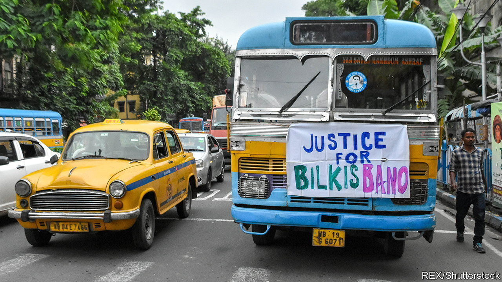
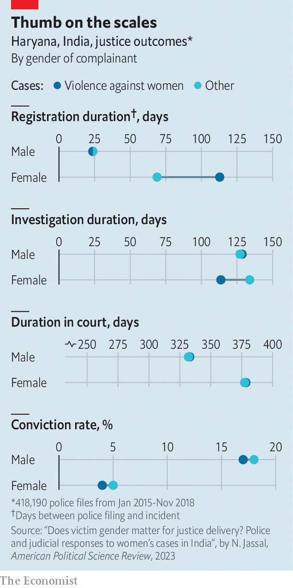

###### Thumb on the scales

# Women’s (in)justice in India 

##### A new study shows how the justice system penalises women 

 

> Jan 11th 2024 

 


After Bilkis Bano was raped during riots in Gujarat in 2002, it took India’s legal system six years to convict the Muslim woman’s assailants. Fourteen years into their life sentences, they were released by order of the state’s Hindu nationalist government. On January 8th the Supreme Court deemed that remission illegal. Indian justice is indeed tilted against women to an appalling degree—as a new study illustrates. By tracking 418,190 police complaints in Haryana, a northern state, between 2015 and 2018, it shows that complaints from women were likelier to be delayed and dismissed by the police than complaints from men. The disparities extend to the courts, where female-filed cases go most slowly. Defendants are less likely to be convicted when accused by a woman than a man.■


