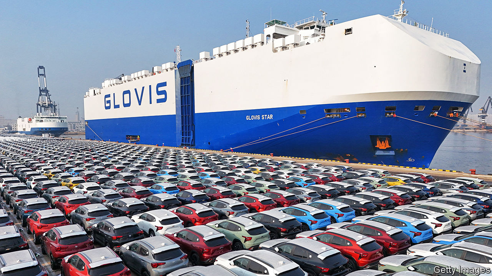
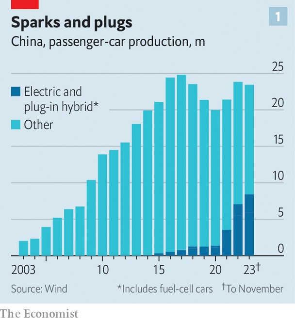
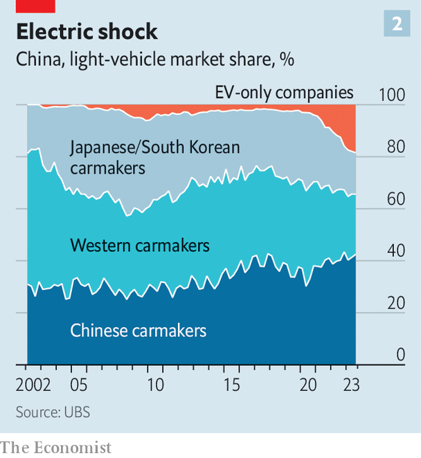
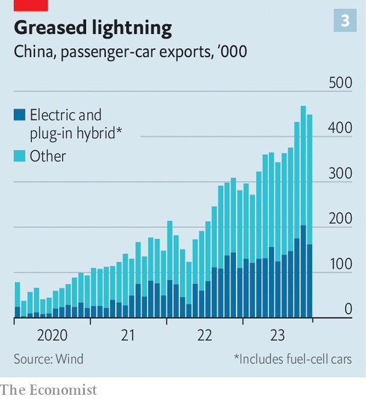
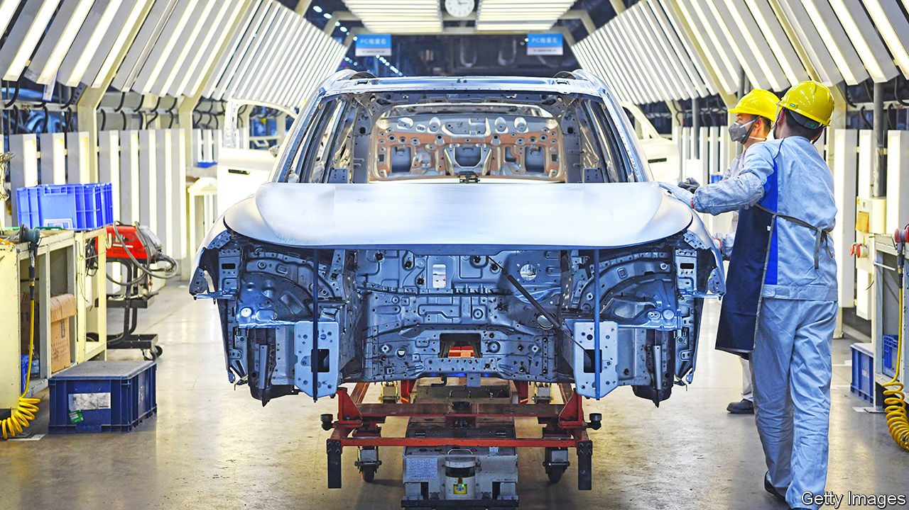

###### The car east

# Western firms are quaking as China’s electric-car industry speeds up 

##### Expertise in batteries and a vast domestic market give Chinese firms an edge 

 

> Jan 11th 2024 

IT TAKES THE ET5, an electric saloon from NIO, a Chinese carmaker founded in 2014, a mere four seconds to accelerate from a standstill to 100kph. That is more or less the same as the Porsche Carrera, a German petrol-powered sportscar beloved by adrenalin junkies. Chinese electric vehicles (evs) are setting new standards for speed—in terms both of how fast they go and of how fast they are spreading around the globe. Already China’s streets are clogged with them. And if Chinese manufacturers have their way, America’s and Europe’s soon will be, too. An industry used to a sedate cycle of marginal improvements is being upended at “China speed”, says Ralf Brandstätter, Volkswagen’s boss in the country. 

In 2023, Chinese industry groups claim, China overtook Japan to become the world’s biggest exporter of cars, in part because of surging sales of EVs. In the final quarter of 2023, BYD, a Chinese firm, surpassed Tesla as the world’s biggest manufacturer of purely battery-powered vehicles, selling 526,000 of them to the American firm’s 484,000. As the shift away from the internal-combustion engine (ice) gathers pace, established carmakers are beginning to worry that Chinese upstarts might run them off the road.

The anxiety is well-founded. Western firms’ expertise making ices counts for little in the electrical age. What is more, the Chinese government has hugely subsidised the ev industry. China dominates the manufacture of electric cars’ most critical component, batteries. And China’s vast domestic market allows local firms to benefit from economies of scale.

Chinese firms face some obstacles, too. For starters, many of the country’s new EV startups are not yet profitable, despite the generous handouts. As their exports increase, the Chinese government may balk at subsidising Western consumers as lavishly as it has Chinese ones. Countervailing subsidies and other protectionist measures are on the rise around the world. And fears that Chinese-made cars might somehow compromise the security of importing countries may also become an impediment to exports. All that notwithstanding, however, it seems all but certain that Chinese EVs will become a big presence on the world’s roads, just as Japanese and South Korean cars did before them.

BYD shows what China can do. A tech firm that once specialised in batteries, it began making cars in 2003—at first with limited success. Although it managed to become the world’s biggest manufacturer of electric buses, as recently as 2017 it sold only 420,000, mostly ICE, cars. Sales were falling. Last year, however, it sold 3m pure electric or plug-in hybrid vehicles—at a profit. It exports to over 70 countries and on December 22nd announced that it would build an ev factory in Hungary, to serve the European market from within. 

Roadkill

Firms like byd are frightening to foreign carmakers because China has the world’s most developed market for EVs, and local brands dominate it. That is not because foreign carmakers have no presence in the country—far from it. Until recently, firms like Volkswagen and BMW were thriving in China. Since the 1990s they have made and sold lots of cars there through joint ventures with local firms. As these joint ventures grew, China became the world’s biggest producer of cars in 2009. It also became the world’s biggest market and the biggest source of profits for many Western brands. Volkswagen Group, for instance, sold 3.2m cars in China in 2023, around a third of its global sales. 

 


In 2017 the government allowed Tesla to make cars in China without a local partner. It opened a factory in Shanghai in 2019. This was part of a concerted effort to promote the adoption of EVs, which have quickly become the fastest-growing element of China’s car industry (see chart 1). In November some 42% of car sales in China were either pure battery or hybrids. That is well ahead of both the EU, at 25% or so, and America, at just 10%. What is more, although the pace is slowing, Chinese EV sales are still growing fast: by 28% in the third quarter of 2023 compared with a year earlier, according to the China Association of Automobile Manufacturers. Most forecasters reckon that by 2030 some 80-90% of cars sold in China will be EVs. And China is now by far the biggest car market in the world, with about 22m passenger vehicles sold in 2022, compared with less than 13m in both America and Europe.

That is why it alarms foreign carmakers that Chinese brands are pre-eminent in local EV sales. The Chinese market as a whole remains roughly evenly split between foreign and domestic brands (see chart 2). But for EVs, the ratio is more like 80:20, according to UBS, a Swiss bank. As a result, Volkswagen’s market share in China has slumped, from nearly 20% in 2020 to 14% in 2023. Its share of EV sales is a puny 3%.

 


Chinese firms’ advantage stems partly from subsidies for local firms. Government handouts for electric and hybrid vehicles added up to $57bn in 2016-22, says AlixPartners, a consultancy. Rhodium Group, a research firm, estimates that between 2015 and 2020 BYD alone received $4.3bn via cheap loans and equity.

Perhaps just as important was $2.5bn in similar support for CATL, which in 2017 became the world’s biggest manufacturer of the lithium-ion batteries used in most EVs. All told, China now makes 70% of the world’s lithium-ion batteries. Purchase subsidies, which will be worth more than $4,000 a car this year, have also helped the EV industry. Protectionism has played a part, too: only cars with domestically made batteries are eligible for the purchase subsidies, a rule which in effect shut out Japanese and South Korean competition.

All this has helped build a vast local supply chain, which now benefits from economies of scale. VW reckons it cuts manufacturing costs by at least 30% by sourcing locally. Chinese-made “infotainment” systems for its cars, for example, are 34% cheaper than older versions bought abroad, even though they have 70% more computing power, says Ludger Lührmann, chief technology officer at VW’s new innovation centre in the city of Hefei.

Low costs mean low prices, which are also kept in check through furious competition. There are around 150 carmakers in China, including foreign brands, big state-owned companies and EV startups, all vying with one another for market share. Tesla recently initiated a price war, in an effort to sustain sales.

But Chinese EVs are not just cheap, they also enjoy superior technology in some respects. Analysts believe that one of the main ways that brands of EVs will differentiate themselves is by their software and styling. Here China has an edge, because its drivers are so much younger than Western buyers. They value sophisticated infotainment systems with first-rate sound and images. Research from Langston, a consultancy, suggests that they rank BYD and NIO higher on these measures than Western carmakers, even though they do not consider Chinese EVs safer, more reliable or more comfortable. 

As Pedro Pacheco of Gartner, another consultancy, points out, Chinese firms are also managed differently. They are less risk averse and move faster than foreign firms, quickly updating tech and introducing new models to keep customers interested. Treating new cars like consumer-tech products, such as smartphones, extends to ditching duds quickly. Li Auto now ceases production of new models in a matter of months if they do not sell well.

EV startups such as Li Auto, NIO and Xpeng were all founded by tech billionaires who, like Tesla’s Elon Musk, regard their firms as tech companies that happen to make cars. In fact, lots of Chinese tech firms are getting involved in the car industry. Whereas Apple has mulled such a venture long and indecisively, Xiaomi, a big Chinese smartphone-maker, unveiled its first vehicle in December (a fancy and expensive saloon). It plans to make cheaper models in future with the immodest goal of becoming one of the world’s top five carmakers in 15-20 years. Huawei, a telecoms firm, and Baidu, a search engine, have also teamed up with car firms to make vehicles.

Foreign carmakers, in contrast, are struggling to transform into Tesla-like software firms. They are used to the slower cycles of the ICE age. But firms that launch a new model every six or seven years cannot keep pace with buccaneering Chinese rivals, which move almost twice as fast. Foreign firms’ habit of “localising” global models with small adaptations for specific markets also results in cars that are far behind Chinese customers’ expectations.

Old bangers

As a result, foreign brands are losing an allure that allowed them to charge double or triple what a Chinese firm might ask for an ICE car. Naturally, they are trying to adapt. Most have long had R&amp;D outposts in China as well as other important locations such as Silicon Valley. VW’s facility in Hefei is one of its main global innovation centres, in part to keep up with the tech demands of Chinese buyers. 

Foreign firms are also forming new alliances with Chinese ones. VW agreed in July to acquire a 5% stake in Xpeng for $700m. Together they plan to develop two new electric SUVs by 2026, which may help VW regain some of the ground it has lost. It has also struck deals with Horizon Robotics, a Chinese software firm, and Gotion, a Chinese battery-maker. Stellantis (whose largest shareholder owns a stake in ) has had little presence in China since a joint venture to make Jeeps folded in 2022. But in October it signed a deal with Leapmotor to make and sell low-cost EVs outside China. 

Such is the drubbing foreign firms are receiving at the cheaper end of the market that they may all depart in the next five years, reckons Michael Dunne of Dunne Insights, a consultancy. The fancier German brands, BMW and Mercedes, and Lexus, Toyota’s upmarket arm, may hang on for longer. Dedicated new EV platforms, to replace ones shared with ICE models, will be introduced in the next few years, bringing better tech and lower costs. But some analysts see the market as a lost cause: Patrick Hummel of UBS suggests that, instead of throwing money at China to regain market share, firms should just cash in while they still can.

This grim outlook is especially troubling because, although China’s adoption of EVs has been rapid, the rest of the world is clearly headed in the same direction. The EU has banned sales of ICE cars from 2035. America is encouraging drivers to switch by offering lavish subsidies of its own. By 2035 EVs should account for perhaps 70% of global sales. That would amount to 60m-70m vehicles a year. Chinese firms are already looking to new markets. 

 


Europe is likely to become the next battleground. Chinese firms’ models, which are mostly small hatchbacks and SUVs, suit the continent’s motorists. Tariffs of 10% are relatively low and the Chinese already have a foothold. Geely, a big Chinese carmaker, owns several European brands, including Volvo, Lotus and Polestar (an EV-only spin-off from Volvo). It hopes its European expertise will help it sell Chinese-made evs from its Lynk&amp;Co and Zeekr brands. MG, which belongs to SAIC, a state-owned carmaker, is Europe’s best-selling pure-electric brand from China. Cars made by BYD, Great Wall Motors, NIO and Xpeng are on sale in a number of European countries. Other firms, such as HiPhi, are on the way. 

So far the influx is small. Around 40% of Chinese exports in 2023, some 2.2m cars, will have been evs reckons Canalys, a consultancy. Nonetheless, 9% of the purely battery-powered EVs sold in Europe in the first ten months of 2023 were made by Chinese firms, according to Schmidt Automotive, a data firm. Mass-market European firms such as Renault, Stellantis and VW are struggling to make smaller, cheaper EVs that can compete both with ICE equivalents and Chinese imports. VW’s ID.3 and Tesla’s Model 3 are both about 15% more expensive in Europe than BYD’s Seal, a midsized saloon that is bigger and arguably better. In China the Seal costs less than half what it does in Europe but is still profitable. Even taking into account shipping costs and tariffs, BYD could cut prices in Europe and still make money. Thanks to such arithmetic, UBS thinks Chinese carmakers’ market share in Europe could rise from 3% in 2022 to 20% in 2030. 

Chinese carmakers will face obstacles on their advance into Europe. Most of their brands are unknown to European consumers. Winning customers away from firms with a loyal following, such as BMW and Mercedes, will be especially tricky. Establishing a retail network, either through direct sales or dealers, takes time and money. So does setting up after-sale servicing.

These expensive tasks will be especially onerous for the many Chinese ev startups that are losing money. Fast introduction of new models has its downside. Costs have to be amortised over a much shorter period than is typical in the industry, says Mr Hummel. Bernstein, a broker, reckons that Li Auto might report a profit for 2023 but that NIO and Xpeng will lose money for the next few years. NIO has already had a state bail-out, is said to lose $35,000 per sale and in November said it would lay off 10% of its employees. (Although in December it secured $2.2bn from an investment fund from the United Arab Emirates.)

The consolidation of the industry that China’s government has long desired looks inevitable. In the long run, however, that should create a clutch of stronger firms, better able to compete internationally. Mr Hummel thinks China will eventually end up with 10-12 firms making over 1m cars, some of which will go global. 

Speedtraps

Chinese exporters may find that European governments put roadblocks in their way. In December France introduced a new subsidy scheme that favours cars made in Europe and Italy is considering doing the same. The European Commission initiated an investigation of state subsidies for Chinese car firms in October, which could lead to an increase in tariffs.

 


Yet these protectionist measures are unlikely to halt Chinese firms’ advance. Higher tariffs are not “live or die”, according to Lihong Qin, a co-founder of NIO. Europe’s carmakers are not baying for them. China remains a big market for most of them, and they worry about retaliatory measures. Moreover, cars exported from European firms’ factories in China would also be hit by higher tariffs. Even Stellantis, whose boss, Carlos Tavares, warns of a “terrible fight” with the Chinese and once loudly called for protection, is critical of the probe. It may be worried about the implications for its tie-up with Leapmotor.

Higher tariffs may also prompt more Chinese firms to start making cars in Europe. BYD is said to be planning at least one more factory in Europe in addition to the one in Hungary. Japanese and South Korean car firms started to thrive abroad only after they localised production. This strategy, argues Bernstein, not only makes it easier to cater to local tastes, but also “brings local governments and local defenders on-board”.

Even America’s efforts to slam the door on China’s car firms may not succeed. It levies tariffs of 27.5% on imported EVs and restricts purchase subsidies to vehicles that are made in America. But Chinese carmakers are making inroads in Mexico, a country with a free-trade agreement with America. Their market share has roared ahead, from 0.5% in 2016 to 20% today. NAFTA’s rules-of-origin requirements prevent vehicles made in China from being re-exported to the United States duty-free. But there is nothing to stop Chinese firms from building factories in Mexico. Several of them, including BYD, Geely and SAIC are nosing around for locations. As long as the putative factories used enough locally made parts, their output would escape America’s prohibitive tariffs. 

Again, building factories and setting up supply chains takes time. It took Japanese and South Korean carmakers decades to establish themselves in America and Europe and win the trust of local consumers. Chinese firms appear to be making faster progress. But whether they arrive at “China speed” or simply very quickly, Chinese cars are on their way. The monitors that are often fitted to new cars to detect if a driver is nodding off should be pinging urgently in Western carmakers’ boardrooms. ■

