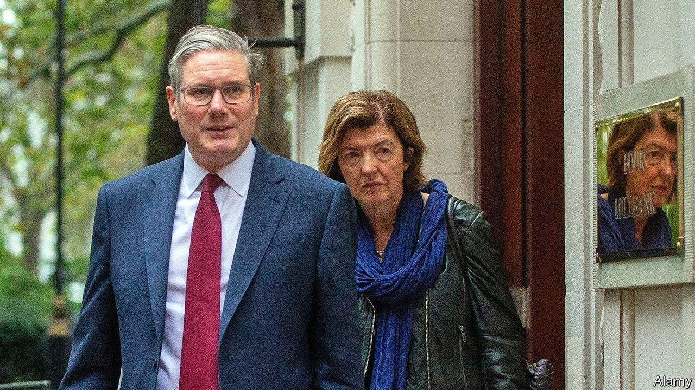

###### Hush-hush

# A typically British way to smooth handovers of power 

##### The Labour Party will soon begin “access talks” with the civil service 

 

> Jan 9th 2024 


Sir Keir Starmer will soon ask Rishi Sunak for permission for Labour shadow ministers to begin talking to civil servants to help them . In fact, the opposition leader may already have asked. The prime minister may so far have refused. No one is quite sure what is going on, which is often the case when it comes to matters of state in Britain. 

In many countries pre-election talks between opposition politicians and mandarins are established routines. Questions can be posed and plans tested. The idea is to make handovers of power smoother, especially when there is no formal transition period. In Britain, which takes exception to anything so dull as a written constitution, there is instead an awkward dance of hesitant approaches and furtive exchanges. 


Talks between the opposition and the civil service were first formally requested 60 years ago. Official minutes record that the then prime minister, Alec Douglas-Home, approved them on three conditions. They had to be “discreet”; they had to be conducted “on a factual basis”; and, above all, the prime minister had to “know nothing whatsoever” about them (despite already knowing about them). 

A precedent, the “Douglas-Home rules”, was established—contact should be allowed. But who, when and on what terms was not entirely clear. For a prime minister, the risk was that being seen to connive with the opposition damaged morale within his party. Opposition leaders fretted about appearing presumptuous. Everyone could at least agree that discretion was essential. As one private secretary opined: “This really is the opposite of ‘justice’: it perhaps ought to be done but it certainly mustn’t be seen.” 

That means lots of cloak-and-dagger arrangements. In 1996  summoned a succession of Sir Humphreys to a borrowed town house in Notting Hill. It also leaves room for petulance. Harold Wilson, a Labour prime minister, was accused of not sticking to the “rules”; after grudgingly allowing access talks before the election in 1970, he neurotically sought to track all contact between the civil service and the Tories. Mr Sunak reportedly grouses about the risk of officials “downing tools”. 

For civil servants, the process is awkward. The meetings are often useful. Shadow ministers can be tactfully warned about holes in their plans or in a department’s finances; officials can prepare for big reforms. But try too hard to impress the next boss, and the current one may find out. 

After long spells in opposition, politicians (some current Labour ones included) can also suspect civil servants have been captured by the other team, or simply not understand what officials are there for. In 1991 John Prescott, a Labour brawler, barrelled into one meeting fresh from a boozy award ceremony: “I know I’m pissed, but I first want to ask one question: why do I want some permanent cabinet secretary telling me things?”

Sir Keir has poached some expertise; , his chief of staff, was a wily Cabinet Office fixer. But if talks don’t start soon, warns Catherine Haddon of the Institute for Government, a think-tank, his team could find itself ill-prepared for office. Much silliness could be avoided, she says, if a prime minister agreed to clearer rules or let the top civil servant oversee things. But where would be the fun in that? ■


