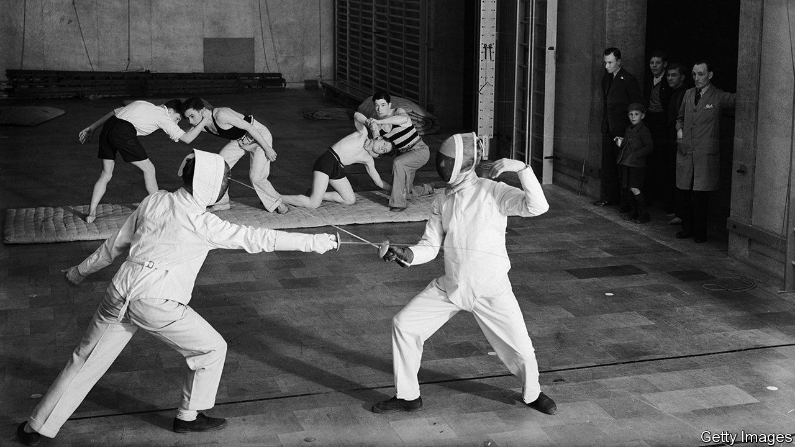
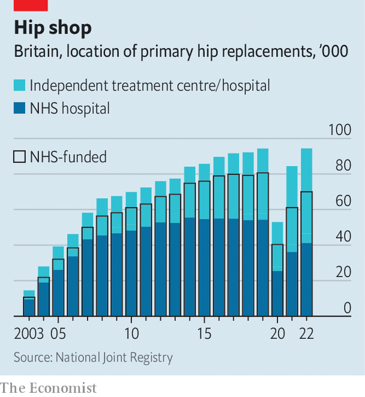

###### The Notional Health Service

# Britain’s health-care system looks rather as it did in the 1930s 

##### Gen Z is the age-group that makes most use of private providers 

 

> Jan 8th 2024 

ON JANUARY 9th junior doctors in England concluded six days of industrial action, the longest strike in the history of the National Health Service (NHS). The walkout, called as part of a dispute over wages, will have led to more pressure on Accident &amp; Emergency (A&amp;E) departments and to the cancellation of hundreds of thousands of hospital appointments. 

That will worsen a huge backlog of people waiting for treatment as a result of , delays caused by the covid-19 pandemic and other industrial action. Some 6.4m patients were already on NHS waiting lists before the latest strike; 42% of the treatments on the lists have a waiting time of more than 18 weeks. Britons are getting used to the NHS n when they need it. Indeed, health care in Britain is taking on some of the features of the interwar system that Aneurin Bevan, the Labour minister who helped found the NHS in 1948, sought to replace. 

 


Before the creation of the NHS, Britain relied on a patchwork of private and charitable providers for health care. The patchwork is back. “We are seeing the return of the mixed economy,” says Barry Doyle, a professor of health history at the University of Manchester. Private hospitals receive about a third of their funding from the NHS, which increasingly pays for them to carry out surgeries like cataract removals and joint replacements. Since covid, more hips have been replaced in private hospitals than NHS ones (see chart).

More patients are paying for their medical care directly. Older people with savings are increasingly willing to stump up to avoid long waiting times. The biggest source of revenue last year at Spire, the largest private hospital group in Britain by income, was from private medical insurance, which grew by 16% to £307m ($390m) in the first half of 2023 compared with the same period in 2022. Corporate health insurance is viewed as an important perk by employees. The NHS is not seen as the only option by Gen Z, the generation that makes most use of private health care: four in ten 18- to 24-year-olds have used the private sector for things such as appointments with doctors, scans and diagnostics. 

The health system is also relying more on community and voluntary networks. In the 1930s contributory schemes run by working people funded convalescent homes, surgical equipment and dental care. Today on Teesside, stroke rehabilitation and speech therapy are informally carried out by volunteers with ties to local working men’s clubs. In Brent, one of London’s poorest boroughs, a mosque has recently converted its annex into a health centre that conducts cancer screenings and diabetes checks. 

Community projects which take a preventive approach to health are back in vogue. The Pioneer Health Centre, better known as the “Peckham experiment”, was a membership club in south-east London in the interwar years which promoted community, exercise and nutritious food. It was shut by the NHS in 1950 because the scheme was not focused on the treatment of disease and was not open to all (families paid a small fee). Now the NHS increasingly embraces programmes to keep people healthy and out of hospital. In Greater Manchester HMR Circle, a paid membership club for the over-50s, is funded by the NHS to combat loneliness, a problem linked to serious health conditions. 

A much uglier similarity to the pre-NHS system is that more people are going . Eight in ten children are unable to register with an NHS dentist. A private knee-replacement procedure would cost a worker earning the median wage five months’ salary; for most people, the only option is to wait. 

Life is, of course, much better for the vast majority of Britons than it was before the NHS. In November patients made 2.2m visits to A&amp;E and 31m to general practitioners, as Britain’s family doctors are known. It is still a point of pride to most Britons that they can do so without having to worry about a medical bill. Yet the NHS treatment backlog is predicted to take at least a decade to clear fully. The need for community-based health is more and more apparent. And new health-care habits are forming among wealthier and younger Britons. It’s not the 1930s again. But the echoes of the past are getting louder. ■


