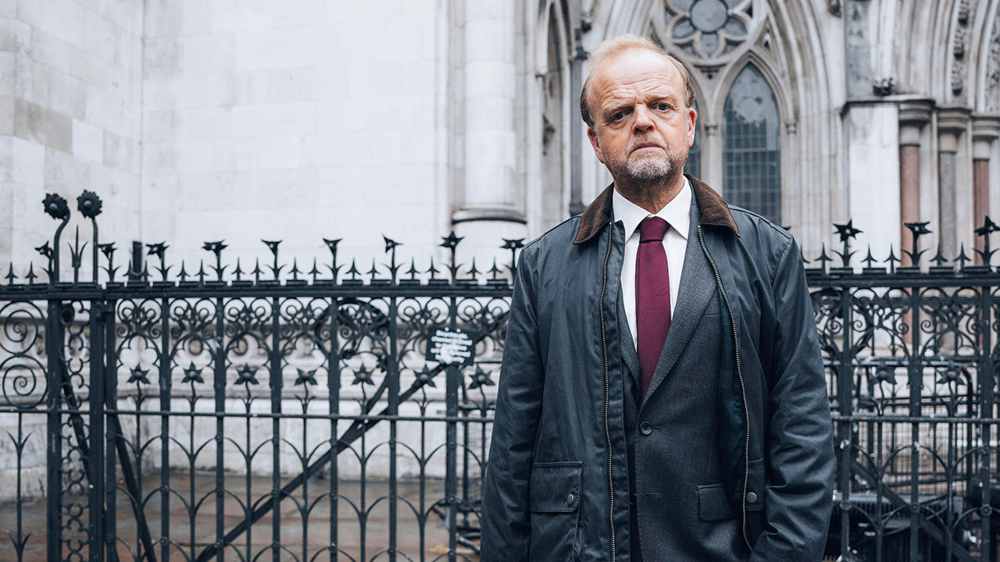

###### Justice in the mail

# Britain’s worst miscarriage of justice sparks outrage at last 

##### A TV drama shines a spotlight on a Post Office scandal that has been known about for years 

 

> Jan 9th 2024 

“WE’VE JUST got to trust in the British justice system and everything will be all right.” So says a wretched Lee Castleton (whose character is played by Will Mellor) in “Mr Bates v The Post Office”, a new ITV drama about hundreds of sub-postmasters who were wrongfully convicted in an accounting scandal between 1999 and 2015. British justice did not make everything all right for Mr Castleton. Far from it. 

In 2004, when “Horizon”, a new accounting system operated by Fujitsu, a Japanese technology firm, showed a loss of £25,859 ($47,397) at Mr Castleton’s branch in Bridlington, Yorkshire, the Post Office told him to make up the shortfall. He refused; it later became clear that faulty software had generated errors which he was unable to correct. Mr Castleton took his case to court. A judge ordered him to pay costs of £321,000, which bankrupted him.

His was one of several hundred cases between 1999 and 2015 in which sub-postmasters were wrongly accused. More than 700 were convicted of crimes including fraud and theft; hundreds more were sued in civil litigation. Many were made bankrupt. Four committed suicide. The Criminal Cases Review Commission (CCRC), an independent review body, has described the scandal as “the most widespread miscarriage of justice” it has ever seen. 

It has also gone on much too long. Only 93 victims have had their convictions overturned, and according to the CCRC, hundreds of sub-postmasters have still not come forward to appeal. The drama’s graphic portrayal of how hardworking Britons, many of them beloved figures in their communities, were falsely accused, and then unable to clear their names for years, has caused public outrage. 

That, in turn, has triggered a panicked response. On January 9th, Paula Vennells, who had been chief executive of the Post Office for much of the period during which sub-postmasters were hounded, said she would return her cbe, an honour awarded to her in 2019. On January 10th Rishi Sunak, the prime minister, said the government would pass a new law allowing those wrongly convicted to be “swiftly exonerated and compensated”. 

Mr Sunak’s move is contentious. Such decisions ordinarily belong to the courts. Critics say that the government is violating an important constitutional principle—the independence of the judiciary—in response to public fury. And the law risks exonerating some people who may have done something wrong. Kevin Hollinrake, the postal minister, said it was not known whether “90% or 80% or 70%” of convicted sub-postmasters were innocent. But he also spelled out the need to move fast and not let a larger injustice go uncorrected. 

In one respect the scale of the reaction to the TV drama is surprising. The scandal, in all its dreadful detail, has been known about for two decades, thanks largely to the eponymous Mr Bates (Alan, a former sub-postmaster from Wales, played by Toby Jones, pictured, in the drama.) He first reported his concerns to , a magazine, in 2004. , a satirical news magazine, and the BBC have also covered the story assiduously. 

State institutions have responded, if not with alacrity. In 2020 the Metropolitan Police launched an investigation (no one has yet been arrested); that same year the government established a public inquiry, led by Sir Wyn Williams, a former high court justice. In December the House of Commons passed a new law designed to speed up compensation payments.

But a dramatisation has kicked the establishment into high gear, and not for the first time. In 1966, for example, “Cathy Come Home”, a film about a young couple’s descent into homelessness, is credited with changing attitudes to that problem. The sheer scale of the Post Office case, allied to the unpromising raw ingredients of misfiring accounting software, may have made it hard for people to grasp. By humanising the plight of Mr Castleton and others, “Mr Bates” has brought home the suffering of ordinary individuals.

Peculiarly enraging aspects to this story have fuelled the anger. The use of private prosecutions, which need not involve the police or the Crown Prosecution Service, seems to have enabled the Post Office to bully sub-postmasters into admitting they were guilty when they were not. The Post Office still has managerial, though not legal, control of the appeals process. 

The government is reviewing the rules around private prosecutions. In the short term it hopes that a mass exoneration will salve public anger. Criminologists sometimes talk about “signal crimes”, incidents that change people’s beliefs about their security. Mr Sunak thinks a “signal verdict” is needed to shore up confidence in the system that let Mr Castleton and others down so badly. Ideally, Britain’s courts would do their job without interference; facilitating a large group appeal might have been best. But doing nothing was not an option. ■


