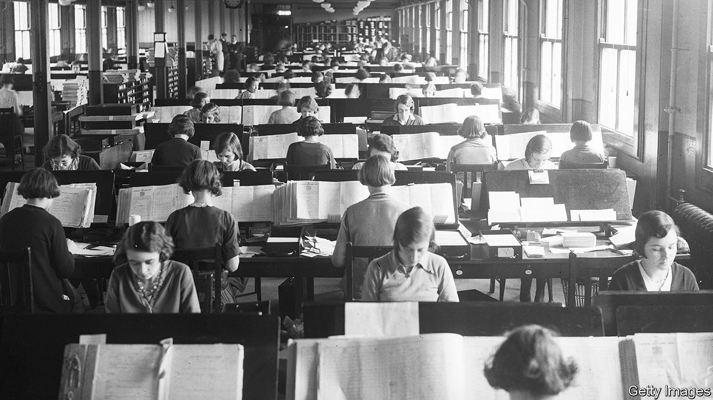

###### This sectored isle

# Counting Britain’s beauties and leech-bleeders 

##### A tour of the country’s statistical past and a debate over its future 

 

> Jan 10th 2024 

By the start of the 20th century statisticians had mapped where some of the drunkest people in Britain were (Swansea, take a bow) as well as the most criminal (ditto). They had chronicled the sanitary state of London’s West End (filthy) and its reading habits (also, at times, filthy). They knew more about Ramsbottom than anyone could wish to. But they didn’t know where the hottest women in Britain lived. 

In 1908 Francis Galton—a noted polymath and inventor, but not a noted feminist—came up with a solution to this lamentable omission. He created a simple tool to record female attractiveness quickly. About his person he would carry a piece of paper divided into three and “a needle mounted as a pricker”. Then, when he saw a woman, he would “prick holes, unseen” in the relevant part of the paper depending on whether she was “attractive, indifferent, or repellent”. To sort Britain’s women by looks all that was needed was a map, the device and a bit of a prick. Galton was just the man. (London ranked top, he reckoned, and Aberdeen last.) 

The question of how to count things is again in the air. The census, which has taken place since 1841, is under review; the government is due this year to decide whether to keep it or bin it. Depending on your point of view, a decision to get rid of the census would either chime nicely with the country’s history as a statistical innovator—or betray it.

The mania for quantification and analysis took off in the 19th century. The word “statistics” has its roots in the German word for the state; governments might rule people whose lives were nasty, brutish and short, but from the 1820s onwards they wanted to know precisely how nasty, how brutish and how short. And so they started collecting data on births and deaths (“vital statistics”). The fashion spread. Soon Charles Babbage was counting drunks in London and Florence Nightingale was counting corpses in Crimea. Others studied everything from the mortality rates of amputees (not low) to the literacy of criminals in Newcastle-upon-Tyne (not high).

British society “moved from speculation to evidence”, says Professor Lawrence Goldman, emeritus fellow of St Peter’s College, Oxford. In 1843 a prospectus was published for a new newspaper called . Among the 14 attractions it promised readers was “Twelfth…Price currents and statistics of the week.” “Figures of speech”, gloated one Victorian, were being challenged with “figures of arithmetic”. 

Between the 1880s and 1940s British mathematicians put all these data to use, developing a range of tools to measure correlation, regression and statistical significance. Every drug, every medical study, every scientific paper—they almost certainly rely on British statistical innovations from this period. Galton himself developed the concept of standard deviation, pioneered use of the questionnaire and coined the phrase “nature versus nurture”. This history is dark as well as dazzling, since several enthusiasts for statistics were also evangelists for another new discipline. The ever-inventive Galton coined a name for that, too: “eugenics”. 

Some found the march of data disturbing for other reasons. Trying to capture experience in statistical tables was, argued one critic, like trying to catch human life in a cobweb: it slipped through. The character of “Gradgrind” in Charles Dickens’s “Hard Times” parodied the number-crunchers. Thomas Carlyle railed that “men are grown mechanical in head and in heart”. An early attempt to hold a census was rejected by Parliament; performing headcounts was the habit of cattle farmers and (worse) Frenchmen. But in the end there was no contest. On the evening of June 6th 1841 the first modern British census began. 

It has run once a decade, with the exception of 1941, ever since. Each census documents history and, inadvertently, makes it. The first census noted that in Britain 571 people worked as fork-makers and 74 as leech-bleeders. The 1911 census, which was boycotted by suffragettes, records the address of Emily Davison, one of them, as “found hiding in crypt of Westminster Hall, Westminster”. The 1991 version recorded ethnicity for the first time;  broke new ground with a question about gender identity. 

Now, though, the entire census is under review. The arguments in favour of getting rid of it are clear: ten years is a long time to wait to find out how many people live in Basingstoke. Better to use administrative data—from the NHS, from schools—to paint an up-to-date picture. The census is costly. It is also fallible. In 2011, 176,632 people put their religion as “Jedi knight”. 

Advocates of the census are just as clear. Using administrative data might work but it is unproven. The census is imperfect. But it has caught names and numbers, leech-bleeders and changing mores, and a suffragette hiding in a cupboard. End the census, and the statistical cobweb—fragile, inadequate, but there—will be broken. ■


