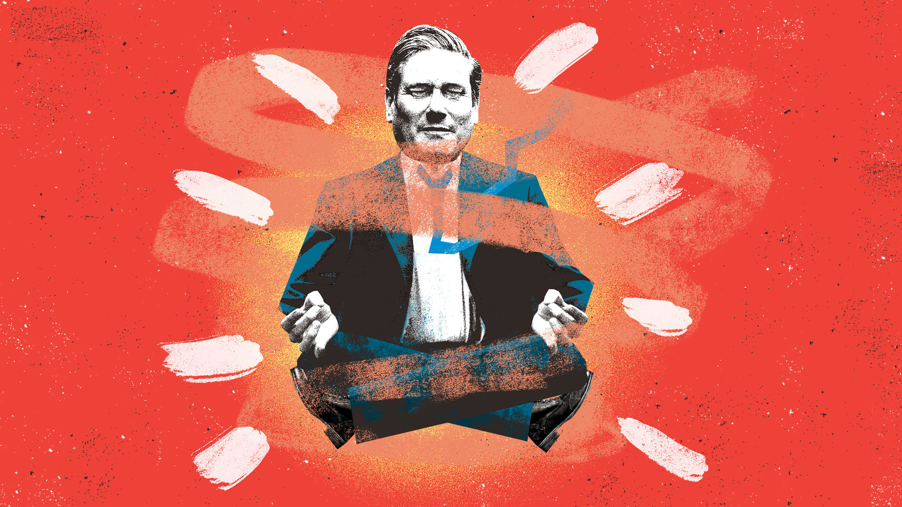

###### Bagehot

# Keir Starmer, Reform UK and Britain’s populist paradox 

##### A country ripe for the radical right is on course to elect a centrist who wants a quieter politics 

 

> Jan 11th 2024 

OPPOSITION leaders usually dream of entering Downing Street to the roars and bellows of a triumphant crowd. According to , the arrival of a new Labour government after the next general election will sound more like the start of a yoga class. There will be “a collective breathing out,” he said in a speech on January 4th. “A burden lifted. And then, the space for a more hopeful look forward.” Fourteen years of Conservative government will end not with a bang but an 

Call it Britain’s populist paradox. Across Europe—in Austria, France, Germany, Italy and the Netherlands—radical-right parties are in fine fettle. Many draw inspiration from Donald Trump, who has a remarkably good chance of returning to the White House. Britain is on a different trajectory. A Conservative Party which has often echoed the policies, rhetoric and tropes of what academics call “national populism” is on course for an electoral defeat, and possibly a calamitous one. Instead, the country is likely to elect Labour under Sir Keir, a stiff social democrat who offers a worthy recipe of restored institutions, fiscal rectitude, diligent public service and healed social divisions. 


That is a puzzle. Forces that feed the radical right—depressed living standards, high immigration and mistrust of elites—proliferate in Britain. Real wages will be no higher by the end of the year than they were in 2006, according to a paper by the Resolution Foundation, a think-tank, published in December. Britons voted to limit migration in the Brexit referendum of 2016; instead it has surged, to a net 745,000 in 2022. Just 9% of Britons say they trust politicians to tell the truth, according to Ipsos, a pollster; that is the lowest score since it began asking the question in 1983. 

This sounds like fertile ground for Reform UK, a right-wing outfit co-founded by Nigel Farage (and formerly known as the Brexit Party), that is led by Richard Tice, an ex-property developer. Reform UK has seen an uptick in the polls, to 11%, according to . But it is part of a fight between conservative elites for the future of the right rather than a popular movement that slices through established party lines, as Brexit and Mr Trump did. It draws almost entirely from Tory ranks: some 20% of the Conservatives’ 2019 voters say they will support Reform, against just 2% of Labour’s. 

Mr Tice has cast his outfit in neo-Thatcherite colours: he denounces the governing “Consocialists” and calls for deep cuts to tax, government spending and regulation to stimulate Britain’s sluggish economy. The aim is to exploit the gulf between the Conservative Party’s self-image as the party of low taxes and low immigration and its record in office. Mr Sunak’s warnings that Mr Tice will only help the Labour Party are met by Reformers with a shrug: splitting the right is the point. They hope the Tories suffer an electoral calamity, the worse the better, and then split between moderates and right-wingers. Reform UK would then challenge the rump party to be the true voice of British conservatism. The next election “will be a punishment-beating from which they can’t come back in their current form”, says one party figure.

This is not a strategy with mass appeal. Whereas the UK Independence Party (UKIP), which Mr Farage once led, routinely polled second place in by-elections in the years before the EU referendum, Reform UK has not met the 5% threshold to keep its deposit in ten of the 11 contests it has entered since 2022. The reason is largely its small-state agenda—a return to UKIP’s fusty roots, which Mr Farage had to disguise as he wooed working-class voters in poor towns who wanted higher spending. (Reform UK’s stint as a lockdown-sceptic outfit flopped among an electorate that rather liked the slap of the covid-19 state.) For now Reform UK looks more like a virtual movement than a popular one: it has a scant presence on local councils and Mr Tice relies on regular slots on Talk TV and , right-leaning channels that are increasingly influential among conservatives. This will change only if Mr Farage—who can still pack out pubs and theatres—returns to the front line. 

Namaste Labour

Sir Keir, meanwhile, understands Mr Farage’s old voters better than the caricatures of him as a Europhile, metropolitan human-rights fanatic allow. Leaders are shaped by what preceded them: Sir Tony Blair by Thatcherism, David Cameron by Blairism and Sir Keir by the Brexit years. His party is refitted around what Labour wonks term “hero voters”—the older, white working classes in Brexit-leaning seats. Labour is now sceptical of globalisation; it venerates blue-collar work over white-collar jobs; it is authoritarian on crime; it denounces Westminster as endemically self-interested and sleazy. Sir Keir’s speeches are peppered with words like class, family, work, respect, security, resilience, duty, service and country. (Absent: equality, freedom, openness.) Whenever he talks of Brexit, he sounds rather like Charles de Gaulle addressing the French Algerians: ““ 

Sir Keir’s promise of yoga-class politics is also astute. The problem with populism and nationalism, Sir Keir said in his speech, is that “it needs your full attention. It needs you constantly focusing on this week’s common enemy. And that’s exhausting, isn’t it?” His promise for a politics that “treads a little lighter on all of our lives” sounds like a repudiation of the past decade. But it also harnesses the desire for security and a more parochial politics. Recall that the Vote Leave campaign pitched Brexit not as a risky adventure but as “the safer option” than staying in a crisis-ridden EU, and as a means to get more money for the National Health Service. Note how, three years later, Boris Johnson’s promise to “Get Brexit Done” was sold not as a continuation of the constitutional battle but as a way for bored voters to “end the argument, stop the chaos” and hire more nurses and police officers. Sir Keir’s post-populist pitch is a bet that British voters want to hear less from their politicians and to see more of their doctors. They always did. ■ 


