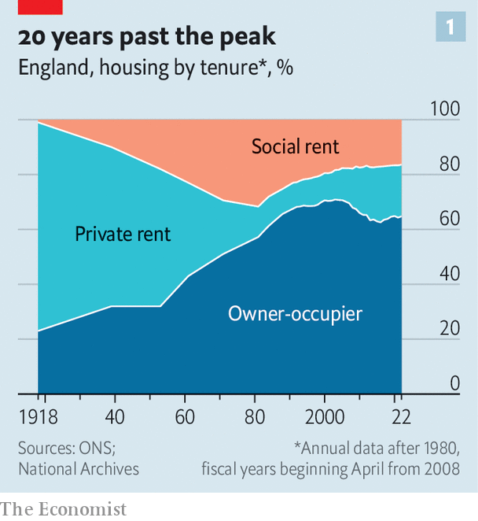
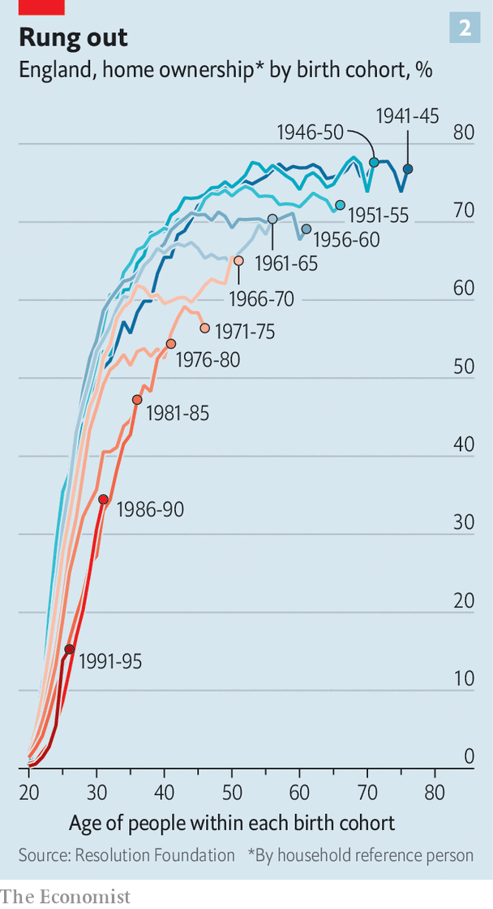
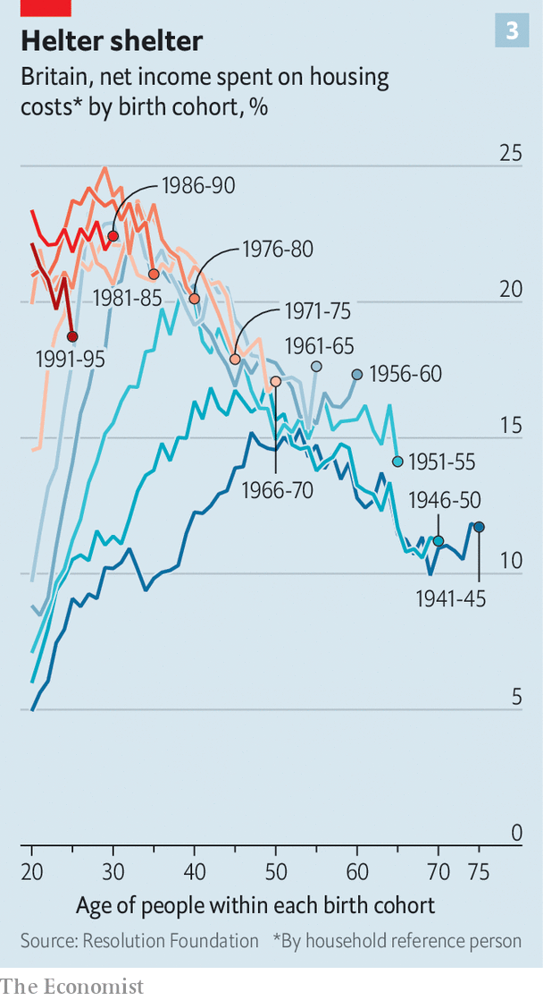

###### Rest in pieces

# The housing ladder, 1950-2005 

##### A redundant metaphor is blinding British policymakers to big changes 

> Jan 11th 2024 


Politicians share with estate agents a tendency to stretch the truth and skate over unpleasant details. The resemblance extends to home ownership itself, where one of the animating ideas of housing policy is more fiction than truth. Ask a politician from any major party about property and the words “housing ladder” will soon crop up. Both Rishi Sunak, the prime minister, and Sir Keir Starmer, Labour’s leader, are keen to tell voters how they will help young people get onto its first rung.

The ladder is deeply embedded into British thinking. On its most narrow definition, it is usually taken to mean the idea of first-time buyers purchasing a modest dwelling (a flat, say) and then trading up to something larger as their incomes grow and their housing equity increases. More broadly, the metaphor reflects Britons’ general aspiration to residential-property ownership. The , by this way of thinking, is a waiting room that people spend some time in before progressing to owning their own home. Getting onto the ladder—and avoiding property snakes associated with unemployment or divorce—is a natural stage in life.

 


The problem for Britain’s policymakers is that the facts do not fit this fable. Home ownership peaked almost 20 years ago. Between 1961 and 2001 the proportion of owner-occupied English housing rose from just over 40% to just under 70%. Since then it has fallen (see chart 1). 

The ratio of house prices to earnings in Britain, according to the Office for National Statistics, is now over eight, compared with a norm of closer to four for most of the 1950s to 1990s. Just getting onto the first rung of the ladder is much harder as a result. Only around a third of younger Britons now own their home at the age of 30, compared with more than half of earlier generations at that same age (see chart 2). 

 


Even those who do make it onto the ladder are less likely to trade up than in the past. A 2017 report for the Council of Mortgage Lenders, a trade body, found that movement by existing home owners had been declining for three decades as affordability and borrowing constraints limited the ability to “trade up”. 

The housing ladder, in other words, is an idea that is around two decades out of date. It existed as a result of a particular set of economic and policy circumstances which lasted from the 1950s until the early 2000s. And whatever Britain’s politicians might desire, those circumstances are unlikely to return. 

The first factor that made the ladder possible was generally falling interest rates and wider access to mortgage finance. Mortgage availability was liberalised in the 1970s and 1980s; banks were happy to lend ever larger multiples of salaries and at ever higher loan-to-value ratios. At the aggregate level, the ratio of household debt to income—the bulk of which is mortgage lending—rose from under 60% in the late 1960s to a peak of over 180% in 2007. This was the era of now-failed mortgage lenders such as Northern Rock happily offering 130% loan-to-value mortgages to new buyers. Those days are long gone, primarily as a result of tighter financial regulation. 

A second factor was the sale of council-owned housing to existing tenants at discounted prices, which began in earnest in the 1980s under the Right to Buy scheme. Around a tenth of Britain’s housing stock was transferred from state ownership to private hands over the course of little more than a decade. That, though, was a one-time trick. Policymakers from both main parties now say they are keen to put up more houses. Talk of  to increase English house-building to 300,000 new units a year is welcome. But the most optimistic analysts believe that even a decade of building at such levels would reduce house prices by only around 10%; the house-price-to-earnings ratio would still be around seven. 

An ageing population also plays a role in the supply of housing. Older Britons, those more likely to have benefited from the housing boom of previous decades, are living for longer than they did a few decades ago. And a home owner in their 30s is twice as likely to move as a home owner in their 50s. Houses do not cycle back onto the market as quickly as they once did. 

Britain’s politicians may struggle to recognise it, therefore, but the nature of the British housing market has changed fundamentally. The private rental market is no longer a waiting room; for many people it is the destination. In 2001 fewer than one in ten Britons rented privately; . That has important implications for housing policy. Rather than fretting about owner-occupation, for example, a modern housing agenda would be much more concerned about professionalising the rented sector. The British market is unusually fragmented; the typical landlord owns two or three properties, and the single largest institution has a market share of just 0.2%. Encouraging larger entities into the rental sector would make sense, among other things. 

The removal of the ladder has wider implications, too. Take monetary policy. In the early 1990s almost 45% of British households had a mortgage compared with 30% today. The mortgage market has conventionally been a major part of the transmission mechanism through which changes in the Bank of England’s base rate have fed into consumer behaviour. In a world with a structurally smaller mortgage market more pain has to be concentrated on a smaller number of households to get the same effect.

 


The changing shape of the housing market also poses an underappreciated long-term fiscal risk for the government. Britain’s welfare system is built on the implicit assumption that pensioners will either have paid off their mortgages and own their homes by the time they retire or will be living in subsidised social housing. In 2021 there were almost 1.2m private-sector tenants in England aged between 45 and 64, a rise of 70% on a decade before. As they begin to retire over the coming decade their incomes will fall but their housing costs will not. The result will be a large rise in pensioner poverty, a large rise in the housing-benefit bill as the government subsidises their housing costs, or, most probably, some combination of the two.

The housing ladder may have died two decades ago but its allure as a metaphor remains. That continues to blind Britain’s politicians and voters to the reality of the property market. Rather than harking back to a bygone age, Britain’s politicians need to accept that there is more to housing than home ownership. ■


