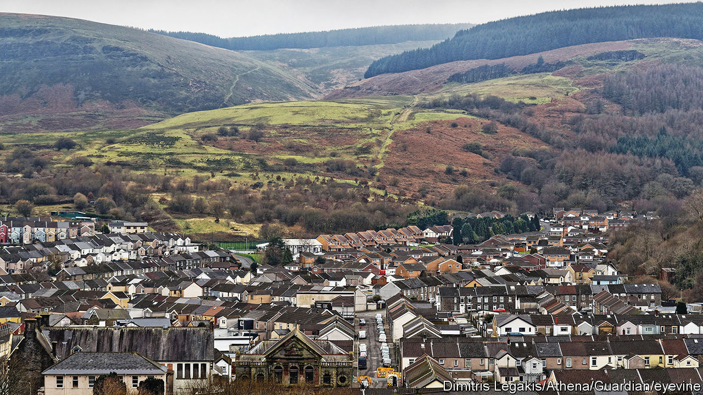

###### Cymrunavia

# Wales wants to be more like Scandinavia 

##### Easier said than done 

 

> Jan 11th 2024 

Visit the Senedd, the Welsh parliament, and the feel is modern and European. The roof is a giant parasol of undulating timber, propped up by thin steel columns. Glass walls mean the building is bathed in light. The circular , or debating chamber, was designed to be “less confrontational“ than the opposing benches in Westminster, says a tour guide. 

When Britain’s devolved parliaments were established 25 years ago, one hope was that their differences would create a “policy laboratory”. Ideas could be tested; good ones would spread. That has not quite happened. Wales has made itself into a Petri dish for progressivism, but the experiment has so far fallen short.

As a small country with bleak but beautiful landscapes, a strange-sounding language and a tightly knit population, it is natural that Wales should look to Scandinavia for policy inspiration. Mark Drakeford, the outgoing Labour first minister, is fond of social-democratic ideas; he opposes “marketised” public services and has championed a basic income for care leavers (adults who spent time in care as a child). There is talk of a four-day week in parts of the public sector. By 2026 Wales plans to have fully proportional elections.

Yet aspirations to create a Nordic outpost west of the Severn remain just that. That is partly because the country’s problems are entrenched. Hit by the decline of coal and other industries, GDP per person is more than a quarter below the level in England. More than a fifth of the population is over 65, the highest proportion within the four nations. Around 60% of adults are overweight or obese. Becoming Scandinavian is harder when you are poor, ageing and unhealthy. 

But it is also because the Senedd is relatively enfeebled. It has no control over policing, justice or welfare. Its ability to pass laws has been constrained; even Labour governments in Westminster have preferred to hoard power. It struggles to raise much tax. With most of his budget pre-committed to public services, Mr Drakeford lacks “fiscal firepower”, says the Institute for Welsh Affairs, a think-tank. 

Mr Drakeford, a former social-policy professor, enthuses about the basic-income pilot, for example. Under the scheme, around 600 care leavers were given £1,250 ($1,590) a month after tax with no strings attached, in the hope that more would begin studies or find work. It was an innovative attempt to help the most disadvantaged navigate early adulthood. But it will be scrapped to save money. 

Welsh politicians have shown a commendable willingness to grasp nettles. The Senedd is working on ways to reform council tax, an outdated, regressive system that other British politicians have been too cowardly to fix. Yet other sensible ideas have been poorly executed. A plan to make 20mph (32kmph) speed limits the default for built-up areas, in order to reduce traffic deaths, has had a bumpy start after the Welsh government and local authorities failed to establish which roads should be exempt. And some proposals look idealistic. Doctors and nurses might like a four-day week but almost a quarter of the population is on an NHS waiting list. The Welsh government chose not to ring-fence NHS spending between 2012 and 2016, as happened in England, in order to protect other areas (“the bin collections are amazing”, notes one English émigré).

There is another problem with the idea of devolution as a policy lab. Wales and Scotland like to learn from one another but neither likes to mimic their bigger neighbour. That reflects old enmities: Welsh officials joke that they would “rather learn from Venezuela than the English”. Winning at devolved politics and keeping nationalists at bay also requires emphasising differences, says Richard Wyn Jones of Cardiff University. That lesson was grasped more quickly in Wales, where Labour has held power by distancing itself from the party in Westminster, than in Scotland. It is hard for ideas to spread when there is not much appetite to copy them. ■


