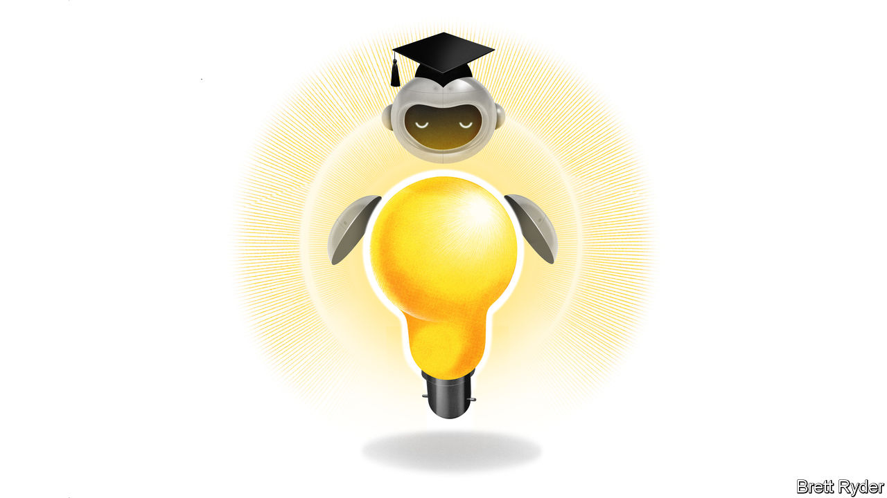

###### Schumpeter

# AI can transform education for the better 

##### Meet the companies trying to make it happen 

 

> Jan 11th 2024 

AS PUPILS AND students return to classrooms and lecture halls for the new year, it is striking to reflect on how little education has changed in recent decades. Laptops and interactive whiteboards hardly constitute disruption. Many parents bewildered by how their children shop or socialise would be unruffled by how they are taught. The sector remains a digital laggard: American schools and universities spend around 2% and 5% of their budgets, respectively, on technology, compared with 8% for the average American company. Techies have long coveted a bigger share of the $6trn the world spends each year on education.

When the pandemic forced schools and universities to shut down, the moment for a digital offensive seemed nigh. Students flocked to online learning platforms to plug gaps left by stilted Zoom classes. The market value of Chegg, a provider of online tutoring, jumped from $5bn at the start of 2020 to $12bn a year later. Byju’s, an Indian peer, soared to a private valuation of $22bn in March 2022 as it snapped up other providers across the world. Global venture-capital investment in education-related startups jumped from $7bn in 2019 to $20bn in 2021, according to Crunchbase, a data provider. 

Then, once covid was brought to heel, classes resumed much as before. By the end of 2022 Chegg’s market value had slumped back to $3bn. Early last year investment firms including BlackRock and Prosus started marking down the value of their stakes in Byju’s as its losses mounted. “In hindsight we grew a bit too big a bit too fast,” admits Divya Gokulnath, the company’s co-founder.

If the pandemic couldn’t overcome the education sector’s resistance to digital disruption, can artificial intelligence? ChatGPT-like generative AI, which can converse cleverly on a wide variety of subjects, certainly looks the part. So much so that educationalists began to panic that students would use it to cheat on essays and homework. In January 2023 New York City banned ChatGPT from public schools. Increasingly, however, it is generating excitement as a means to provide personalised tutoring to students and speed up tedious tasks such as marking. By May New York had let the bot back into classrooms.

Learners, for their part, are embracing the technology. Two-fifths of undergraduates surveyed last year by Chegg reported using an AI chatbot to help them with their studies, with half of those using it daily. Indeed, the technology’s popularity has raised awkward questions for companies like Chegg, whose share price plunged last May after Dan Rosensweig, its chief executive, told investors it was losing customers to ChatGPT. Yet there are good reasons to believe that education specialists who harness AI will eventually prevail over generalists such as OpenAI, the maker of ChatGPT, and other tech firms eyeing the education business.

For one, AI chatbots have a bad habit of spouting nonsense, an unhelpful trait in an educational context. “Students want content from trusted providers,” argues Kate Edwards, chief pedagogist at Pearson, a textbook publisher. The company has not allowed ChatGPT and other AIs to ingest its material, but has instead used the content to train its own models, which it is embedding into its suite of learning apps. Rivals including McGraw Hill are taking a similar approach. Chegg has likewise developed its own AI bot that it has trained on its ample dataset of questions and answers.

What is more, as Chegg’s Mr Rosensweig argues, teaching is not merely about giving students an answer, but about presenting it in a way that helps them learn. Understanding pedagogy thus gives education specialists an edge. Pearson has designed its AI tools to engage students by breaking complex topics down, testing their understanding and providing quick feedback, says Ms Edwards. Byju’s is incorporating “forgetting curves” for students into the design of its AI tutoring tools, refreshing their memories at personalised intervals. Chatbots must also be tailored to different age groups, to avoid either bamboozling or infantilising students.

Specialists that have already forged relationships with risk-averse educational institutions will have the added advantage of being able to embed AI into otherwise familiar products. Anthology, a maker of education software, has incorporated generative-AI features into its Blackboard Learn program to help teachers speedily create course outlines, rubrics and tests. Established suppliers are also better placed to instruct teachers on how to make use of AI’s capabilities.

AI for effort

Bringing AI to education will not be easy. Although teachers have endured a covid-induced crash course in education technology, many are still behind the learning curve. Less than a fifth of British educators surveyed by Pearson last year reported receiving training on digital learning tools. Tight budgets at many institutions will make selling new technology an uphill battle. AI sceptics will have to be won over, and new AI-powered tools may be needed to catch AI-powered cheating. Thorny questions will inevitably arise as to what all this means for the jobs of teachers: their attention may need to shift towards motivating students and instructing them on how to best work with AI tools. “We owe the industry answers on how to harness this technology,” declares Bruce Dahlgren, boss of Anthology.

If those answers can be provided, it is not just companies like Mr Dahlgren’s that stand to benefit. An influential paper from 1984 by Benjamin Bloom, an educational psychologist, found that one-to-one tutoring both improved the average academic performance of students and reduced the variance between them. AI could at last make individual tutors viable for the many. With the learning of students, especially those from poorer households, set back by the upheaval of the pandemic, such a development would certainly deserve top marks. ■


