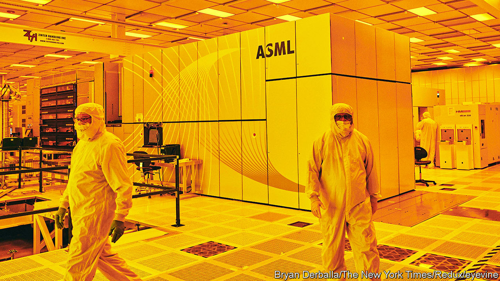
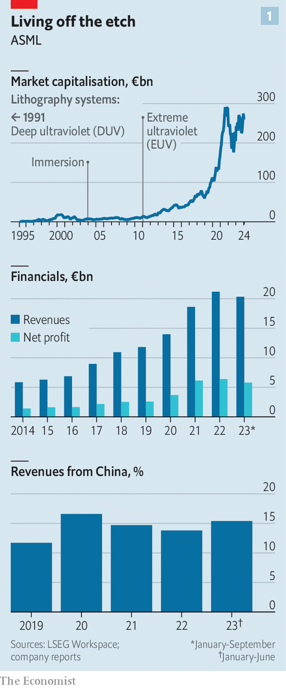
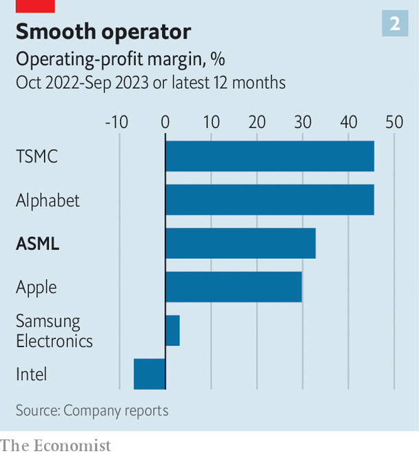

###### Silicon lowlands

# Does Europe at last have an answer to Silicon Valley? 

##### ASML, a mighty Dutch tech firm, is at the heart of a critical supply chain 

 

> Jan 8th 2024 

TEN TIMES a second an object shaped like a thick pizza box and holding a silicon wafer takes off three times faster than a manned rocket. For a few milliseconds it moves at a constant speed before being halted abruptly with astonishing precision—within a single atom of its target. This is not a high-energy physics experiment. It is the latest lithography machine dreamed up by ASML, a manufacturer of c, to project nanoscopic chip patterns onto silicon wafers. On January 5th , an American semiconductor giant, became the first proud owner of this technical marvel’s initial components for assembly at its .

 


Like the outwardly unassuming machine, its Dutch maker is full of surprises. The company’s market value has quadrupled in the past five years, to €260bn ($285bn), making it Europe’s most valuable technology firm (see chart 1). Between 2012 and 2022 its sales and net profit both rose roughly four-fold, to €21bn and €6bn, respectively. In late 2023 ASML’s operating margin exceeded 34%, staggering for a hardware business and more than that of Apple, the world’s biggest maker of consumer electronics (see chart 2).

Such stellar performance, which is set to shine brightly again when ASML reports quarterly results on January 24th, is now routine. The firm holds a monopoly on a key link in the world’s most critical supply chain: without its kit it is next to impossible to make cutting-edge chips that go into smartphones and data centres where artificial intelligence (AI) is trained. With global semiconductor sales forecast to double to $1.3trn by 2032, every big country and every big chipmaker wants ASML’s gear. The company has become so important in the Sino-American techno-tussle that, as it recently emerged, America’s government pressed ASML to cancel planned deliveries of even its older machines to China. 

 


Yet ASML’s spectacular success is also underpinned by two other, less obvious factors. The company has created a network of suppliers and technology partners that may be the closest thing Europe has to Silicon Valley. And its business model ingeniously combines hardware with software and data. These unsung elements of ASML’s success challenge the notion that the old continent is incapable of developing a successful digital platform. 

ASML’s complex machines perform a simple task. They project chip blueprints onto photosensitive silicon wafers. In 1986, when its first model was delivered, individual transistors measured micrometres and its kit was almost like a glorified photocopier, explains Marc Hijink, a Dutch journalist and author of “Focus—How ASML Conquered the Chip World”, a new book. Today, with transistors shrunk by a factor of a thousand, ASML lithography gear is possibly the most sophisticated equipment ever sold commercially. 

ASML and its partners pulled off this incredible shrinking trick with engineering that has a science-fiction ring to it. The process starts with powerful lasers incinerating droplets of molten tin, each no thicker than a fifth of a human hair and travelling at more than 250kph. This produces extremely short-wavelength light (extreme ultraviolet, or EUV, in the jargon) which is then reflected by a set of mirrors so smooth that the biggest imperfection is no bigger than the distance grass can grow in a millisecond. To make all this worth a chipmaker’s while—the latest model costs more than $300m—and expose enough chips, the object that holds the wafer, called a “table”, has to accelerate faster than a rocket and come to a stop at exactly the right spot.

To get an idea of what it takes to build such a device, pay a visit to a nondescript factory in Neukölln, a neighbourhood of Berlin. This is where ASML makes, among other things, “mirror blocks”, the main part of a wafer table. These are sturdy pieces of a special ceramic material, a square 8cm thick and measuring about 50cm on each side. Some get polished, measured, repolished, remeasured and so on, for nearly a year—until they are exactly the right shape, including allowances for the fact that they will sag by a few nanometres once installed.

The factory is emblematic of the company’s unusual network of suppliers. Although its owner, Berliner Glas, was acquired by ASML in 2020, it lives halfway between being an independent company and a unit of the Dutch parent. Something similar is true of the 800 or so mostly European firms that help put together ASML’s machines. ASML owns stakes in only a few of them. Yet their interdependence makes them act like a single organisation.

ASML outsources over 90% of what it costs to build one of its marvels and directly employs less than half the estimated 100,000 people the feat requires. This is partly because of its history. When it was spun out of Philips, a Dutch electronics giant, in 1984, ASML seemed stillborn. Its idea to build a “silicon stepper”, the original name of the chip-copying machine, was promising. But it had not much else going for it, in particular no production lines. It instead relied on specialist suppliers, many of them also former Philips units, such as VDL, a contract manufacturer.

The outsourcing is also a function of technology. The different parts of a lithography machine are so cutting-edge that doing it all could overwhelm one firm. “You have to decide where you add the most value and let others do the rest,” says a former ASML insider. Semiconductor economics, too, favours not doing everything yourself. The industry is prone to booms and busts, because demand moves up and down more quickly than chipmakers can install capacity. Prices rise and fall as shortages turn to gluts. Manufacturers of chipmaking gear are exposed to the same cycle. That makes owning all the assets risky; better to shift some risk to suppliers, who can limit it by catering to customers working to different business cycles.

The required hyper-specialisation prevents the risk-reducing double sourcing that is prevalent in many other industries. ​​In the case of ASML, technical demands are so high and production volumes so low (it shipped 317 machines in 2022) that it would be uneconomical to manage several suppliers for a single part even if they could be found. For such crucial components as lasers and mirrors, which are made by Trumpf and Zeiss, two German firms, respectively, it is impossible. Wayne Allan, who is in charge of sourcing on ASML’s board, talks of “co-dependency”.

The upshot is that ASML mostly limits itself to being the system’s architect. It decides who does what, defines the interfaces between the main parts of its machines (“modules”) and carries out research and development. This set-up makes it easier to test the pieces and transport the machines (shipping the latest model to Intel involved 250 crates and 13 containers). It also gives suppliers more freedom, including to experiment with novel technologies.

It all works because ASML has cultivated a culture of trust and transparency while preserving elements of competition. Suppliers are not squeezed to the last penny. Quite the opposite: “We need them to stay healthy,” says Mr Allan. Information flows freely throughout the network, particularly between ASML, Trumpf and Zeiss. Engineering teams from different firms work together. Patents are shared, as are some financial data and, sometimes, profits. “At meetings you can’t tell who is from which firm,” reports a former Zeiss executive.

At the same time, many suppliers compete with each other indirectly, for instance providing similar parts for different generations of ASML’s machines. If a supplier runs into trouble, ASML dispatches a rapid intervention force, sometimes even if such help is not welcome. As a last resort, ASML can buy a supplier, as it did with Berliner Glas. 

It is this loosely coupled structure that allowed ASML to outcompete more vertically integrated rivals, reckons Willy Shih of Harvard Business School. Nikon and Canon, two Japanese firms which once led the market for lithography machines, never managed to commercialise EUV kit. (Canon is trying to stage a return with “nanoimprint” lithography, which physically stamps chip designs onto wafers.)

ASML is now entrenching this dominance by complementing its hardware with software and data. When real rockets take off, their trajectory is wobbly and needs to be smoothed out by a guidance computer, which collects data to predict and adapt their course. A wafer table in a lithography machine is similarly likely to miss the mark at first. The same is true of the rest of the device. It is only with the help of lots of data and machine learning, a type of AI, that they can be fine-tuned—and made more accurate. This is rapidly turning ASML into an AI platform.

Once Intel gets all the modules for its new machine, it will take about two weeks to put the thing together. Adapting it to its new location will take a few months. Bits may have moved in transport, gravity may be slightly different in Oregon from the Netherlands and other kit nearby may create interference. Tests will collect data and trigger adjustments. “We have thousands of knobs we can turn to put it into a perfect state,” says Jos Benschop, who is in charge of technology at ASML.

ASML also uses the data from one machine to turn the knobs of others. Of the roughly 5,500 devices it has sold since its founding 39 years ago, 95% are still in operation and many send data home to headquarters. That will make its products even better, leading to more chipmaking, which generates even more data—and so on, in a “flywheel” more typically associated with digital services such as internet search. Even if Canon, Nikon or a Chinese competitor finally managed to build EUV machines as powerful as ASML’s, it would not be able to catch up with the Dutch firm, argues Pierre Ferragu of New Street Research, a firm of analysts. “It’s mathematically impossible, as long as ASML keeps collecting data from all the installed base.”

If rivals cannot topple ASML, can anything? Maybe physics. Even with the best AI, you can’t shrink transistors for ever (certainly not in a commercially viable way). If technical requirements become too otherworldly the supplier network may unravel. Or maybe economics. Chipmakers may recoil at ASML’s data hunger, which extends to other linked devices in their factories. Some are pushing back against its digital expansion, insiders say.

Then there is geopolitics. ASML’s share price dipped after news broke about the cancelled deliveries to China. The worry is less over lower sales; ASML cannot build its machines fast enough anyway. Of greater concern is the risk that strict export controls could in time push China to build its own chipmaking-gear industry. That could one day threaten ASML’s position at the centre of the sector. For the time being, though, the company’s network and its network effects remain indomitable. Who said Europe couldn’t do tech? ■


