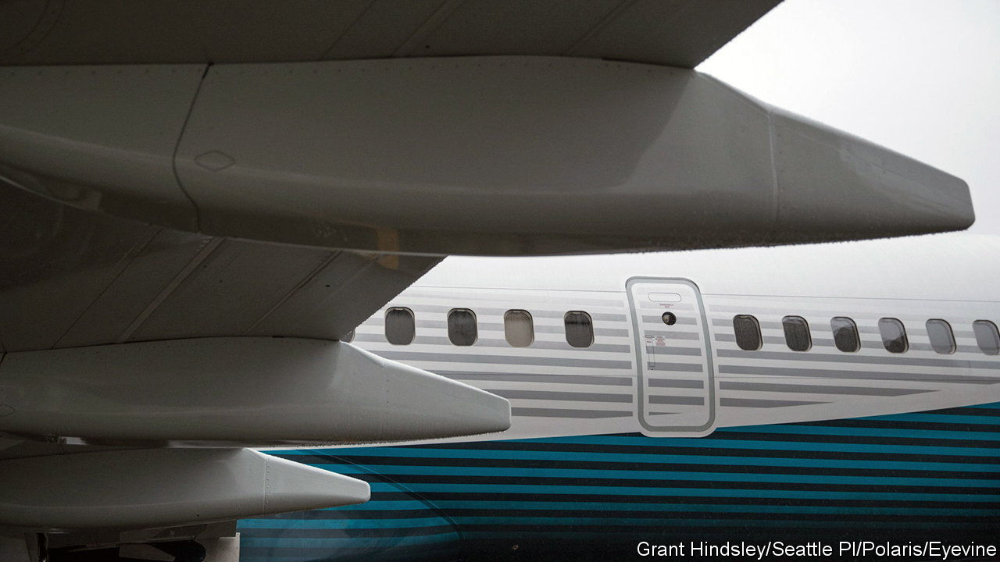
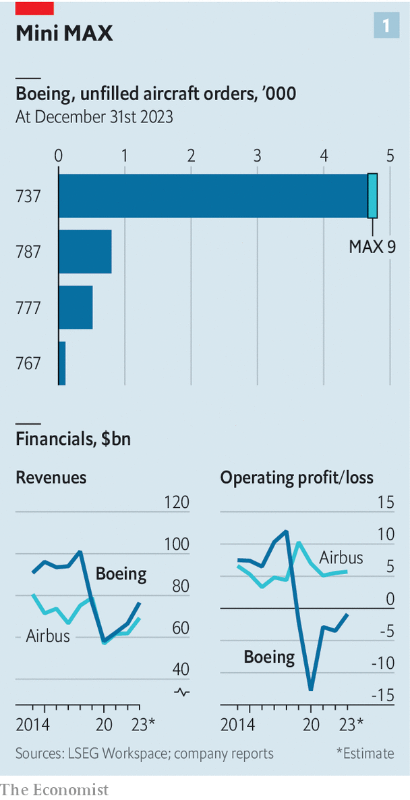
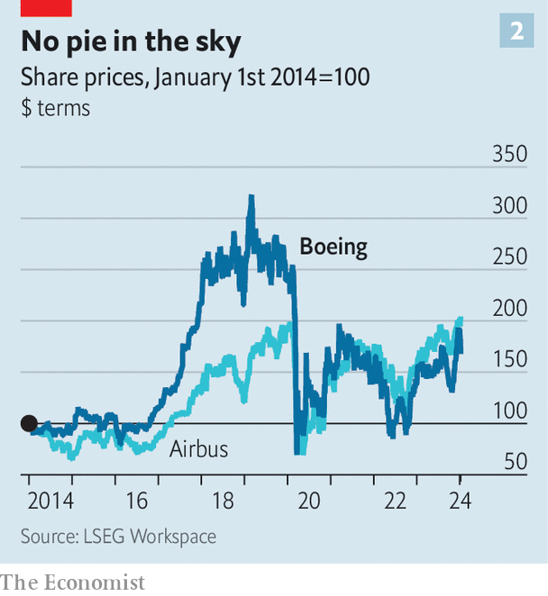

###### Can’t exit emergency

# Faulty door plugs open old wounds at Boeing 

##### The American planemaker’s image takes another hit 

 

> Jan 9th 2024 

NERVOUS TRAVELLERS will break out in a cold sweat to see pictures of a gaping hole in the fuselage of an Alaska Airlines Boeing 737 MAX 9, blown out at 15,000 feet (4,600 metres) after the plane had taken off over Oregon on January 5th. Nervous investors will have the same reaction to the share prices of Boeing and Spirit AeroSystems, a firm spun off by the planemaker in 2005. Spirit manufactured the fuselage and the failing part, a plug in the airframe where some MAX 9 models can have an emergency exit. The two companies’ market value plunged by 8% and 11%, respectively, following the incident.

Miraculously, no one was seriously injured; had the aircraft rapidly depressurised at a higher altitude the outcome could have been worse. The precise cause of the malfunction remains unclear. The plane, delivered to Alaska Airlines on November 11th, was brand-new. Similar unused emergency exits were installed on a previous version of the 737 without problems. 

 


Regulators around the world have grounded the entire fleet of MAX 9s with the same door plug, pending inspections to ensure their airworthiness. Early indications suggested a one-off manufacturing problem originating at Spirit. But on January 8th United Airlines said that preliminary examinations had identified other planes with “installation issues” connected with the door, such as “bolts that needed additional tightening”. This indicates a “pattern of poor workmanship” at Spirit over which Boeing should have had better oversight, says Bernstein, a broker.

Thankfully for Boeing, its airline customers and their passengers, fastening the loose bolt should not be too difficult. The MAX 9, a larger version of Boeing’s short-haul workhorse, makes up just over 15% of all 737 MAXes in service, and an even smaller share of unfilled orders (see chart 1). Only four out of five of the existing MAX 9 fleet, or 171 aircraft in all, have the unused exits. The bigger problem for Boeing is that the episode reinforces the impression that it has lost its way. 

The descent of America’s once high-flying aerospace champion began in October 2018, when a 737 MAX crashed in Indonesia. Five months later the same model crashed in Ethiopia. Both disasters were linked to problems with flight-control software and led to the grounding of the entire 737 MAX fleet for 20 months while the software was fixed. Boeing paid around $20bn in fines and compensation. Critics alleged that the company was paying too much attention to returning money to shareholders and not enough to engineering. A new chief executive brought in at the start of 2020 to salvage Boeing’s image, Dave Calhoun, promised to return the firm to its roots of technical excellence.

The door drama is only the latest sign that Mr Calhoun’s task remains incomplete. Deliveries of Boeing’s long-haul 787 Dreamliner have been suspended several times in the past few years because of quality-control problems. In April 2023 the company said it would have to fix the vertical stabilisers on 737s in production at Spirit and in storage. Although it was not a safety risk, the defect put another dent in Boeing’s reputation. Another knock came in August, when the planemaker said it would need to correct improperly drilled holes in part of the pressurised cabin of 165 737 MAXes assembled by Spirit. Ironing out manufacturing niggles is one reason that deliveries of Boeing’s 777X, another long-haul jet, will begin only in 2025, six years behind schedule. 

 


The 777x delay alone has set the company back at least $8bn in extra costs. The close call over Oregon will pile on more, by forcing it to spruce up production processes. Boeing has not turned an annual profit since 2018. It lags behind its European arch-rival, Airbus, in orders for short-haul jets by 4,800 to 7,300. It is struggling to rehire skilled workers laid off during the covid-19 lull as it tries to increase production of the 737 MAX from 38 a month to 50 by 2025-26, in order to meet strong demand from airlines dealing with a surge in post-pandemic “revenge” flying. 

Some of Boeing’s woes on Mr Calhoun’s watch were beyond his control. Soon after he took over at the start of 2020, covid sent the industry into a tailspin. Both Boeing and Airbus lost roughly half their market capitalisation between March and autumn of that year. But whereas Airbus shares are now trading at an all-time high, Boeing’s are worth half what they were at their peak in early 2019 (see chart 2). If the American planemaker is to soar again, Mr Calhoun will need not just to respond to problems but also to stop any new ones emerging. ■


