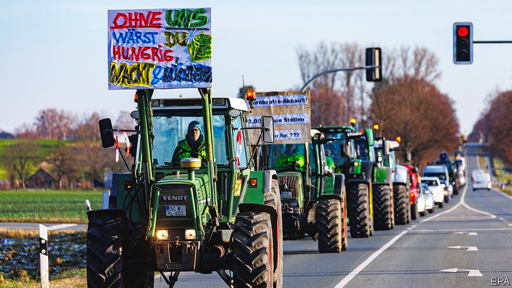

###### Labour’s love lost

# German farmers and train drivers are scaring the country’s bosses 

##### The country’s industrial relations are being tested like never before 

 

> Jan 11th 2024 

In GERMany, where workers and bosses run many companies jointly, a big strike is unusual. A wave of big strikes is almost unheard of. Right now the country of “co-determination” is simultaneously facing an eight-day “action week” by irate farmers, who blocked roads with tractors, a three-day strike of railway workers and, to top it off, a looming strike of doctors, who already closed surgeries between Christmas and New Year’s Day. This  (pitchfork mob), as some have taken to calling it, will test Germany’s harmonious labour relations in the year to come. 

The protests were ostensibly set off by the government’s decision to end subsidies for diesel fuel used in agriculture and to cut an exemption from car tax for farm vehicles. These measures pushed farmers over the edge. It also mobilised other angry workers, already straining under the pressure of inflation, recession and the government’s self-imposed austerity. On January 9th drivers of freight and passenger trains at Deutsche Bahn, the national railway, began a strike over working hours and pay. 

In an effort to defuse the tension with the farmers, the government agreed to a gradual removal of the diesel subsidy over three years and to keeping the exemption from the car tax. The farmers pooh-poohed the concessions as insufficient. On January 4th an aggressive group of them prevented Robert Habeck, the economy minister, from disembarking from a ferry on his return from a family holiday. If the train drivers are similarly unimpressed, that could prove expensive for German business, reckons IW Köln, a think-tank. The rail strike could cost businesses €100m ($110m) a day if it forced them to interrupt production. The car, chemical and steel industries, Germany’s biggest, are especially reliant on rail transport. 

The workers’ mood is increasingly angry. “Appeals are circulating with fantasies of revolution,” warned Mr Habeck. The far-right Alternative for Germany party is doing its best to fan the grievances. In Dresden the Free Saxons, another far-right group, infiltrated the farmers’ protest calling for the “extinction of the traffic light” (as the governing coalition of the Social Democrats, Free Democrats and Greens is referred to because of their party colours). 

Thomas Puls of IW Köln fears that the strikes will harm the image of Germany as a place for business. Local bosses are already fretting about a German version of the  protests in France in 2018, which culminated in yellow-jacketed demonstrators torching cars on the Champs-Elysées and the police stepping in with tear gas. Jochen Kopelke, head of Germany’s police union, warned in an interview with , a daily, that the farmers were probably “just the start of an enormous wave of protest this year”. Germany was the only big economy to shrink in 2023, and the year ended on an especially sour note, with an unexpected drop in business confidence in December. This year is shaping up to be even tougher. ■


