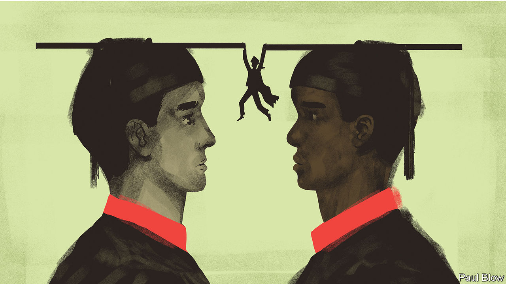

###### Negative spillovers

# Is Harvard Business School too woke? 

##### HBS is a case study in the problems with DEI 

 

> Jan 10th 2024 

It has been an inhospitable winter in Boston. Following the resignation of Claudine Gay as president of Harvard University on January 2nd, her interim replacement said he could not recall “a period of comparable tension” at the institution. Ms Gay was ousted after a plagiarism scandal erupted over her academic work. But her position had been precarious for months; some donors were upset that she seemed to tolerate students’ antisemitic outbursts. For conservatives, Ms Gay, who was Harvard’s first black and second female president, was also a symbol of liberal elites’ fixation on diversity, equity and inclusion (DEI).

The ostensibly hard-headed sorts who attend Harvard’s management school, and that school’s ties to harder-headed corporate America, might be expected to insulate it from wider campus convulsions. Not quite. Businesses too are facing a DEI reckoning. As a consequence, Harvard Business School (HBS) is facing pressure on two fronts.

Students at HBS are the holders of the winning tickets in the lottery of American capitalism. On average, they arrive with five years of work experience, nearly half of them from prestigious consulting or financial firms. Two years of study for the 115-year-old institution’s MBA degree all but guarantee a comfortable professional perch. Some do much better still. The fortunes of HBS alumni have helped build the school’s reputation and, thanks to their generous donations, stock its coffers (combined with annual income from MBA tuition fees, executive education, a publishing business and online courses, in 2022 the school made $966m in revenue).

After the murder of George Floyd, a black man, by a police officer in May 2020 HBS underwent a self-examination typical of other American institutions at the time. “What we could agree on is that the experience of black students at the school, as they reported upon graduation, was not quite the same as white students’. There was a deficit,” says Robert Kaplan, a faculty member involved in the review. HBS’s approach to DEI has since resembled that of corporate America—and of the rest of Harvard. In 2021 it hired a chief diversity-and-inclusion officer and tried to increase the diversity of the student body and faculty.

Bringing DEI into the business-school classroom has been more controversial. Compared with the rest of the university, HBS faculty are probably less woke. The pressure for more DEI came mostly from students, recounts a professor. And if the aim of management education is even partly to simulate the challenges faced by grown-up executives, it is hard to imagine a curriculum ignoring such issues entirely. America’s demography is changing, and so are employees’ expectations about what their workplace ought to look like. The current backlash against DEI policies requires bosses to be far more thoughtful about how they approach them. It is requiring the same of business schools. That is easier said than done.

MBA students at HBS are taught using the “case method”. Classes ask students to put themselves in the shoes of bosses facing a specific problem. Since 2020 students have complained that those shoes do not fit. The result has been a significant increase in the ethnic and gender diversity of the case “protagonists”. But, as one faculty member notes, “the idea that you would be studying a chief financial officer doing a discounted-cashflow model, substitute a white man for a black woman, and then high-five all around is ridiculous.” 

HBS made a course called “inclusion” compulsory for first-year MBA students in the academic year of 2021-22. A version of it, which focused heavily on race and gender, had previously been optional; “We heard from the students that you’re teaching the course to the people that don’t need it,” says a faculty member with knowledge of the course. But many students and staff felt the new course lacked rigour and, partly because it was taught to a single group of 1,000 people, discouraged discussion. 

Echoing worries about free speech on other campuses, professors whisper that conservative and religious students feel less able to speak up more generally. The view is supported by the results of a student survey shown to faculty last year. Shortly after the attacks on Israel on October 7th and the invasion of Gaza, Bill Ackman’s comments about the war and Harvard’s campus politics caused some HBS students to lobby the school to disinvite the billionaire investor (and HBS graduate) from appearing on campus as a “protagonist” in a case about his hedge fund.

As in boardrooms, HBS’s thinking on DEI is in flux. The inclusion course was first redesigned, to less damning reviews, then shelved. In June 2023 Francesca Gino, one of its architects, was put on unpaid administrative leave after accusations of fraud in her work (she has filed a lawsuit against Harvard University alleging breach of contract and gender-based discrimination). In the end, Mr Ackman did visit. Like America Inc, HBS is learning to walk the DEI tightrope—the hard way. ■


