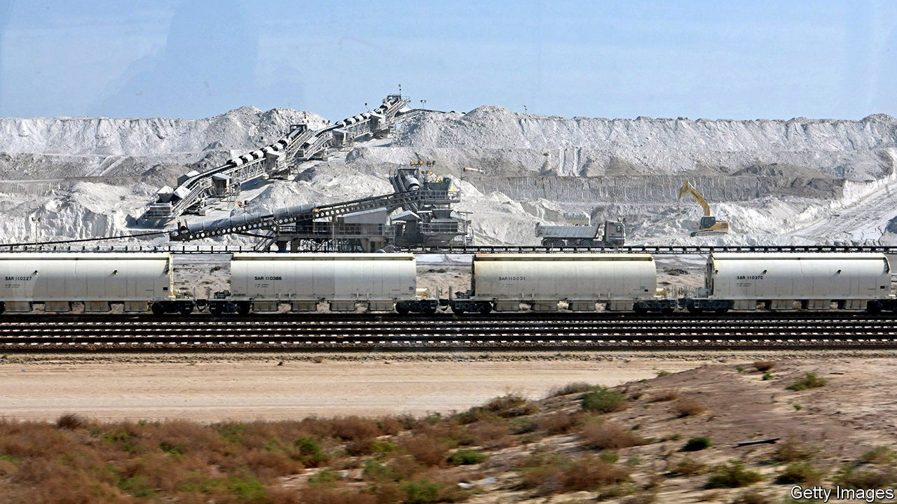

###### The other Saudi gold

# Saudi Arabia wants to be the Saudi Arabia of minerals 

##### The kingdom plans to be digging up plenty more than oil 

 

> Jan 11th 2024 

IN WA’AD AL-SHAMAL, 1,200km north of Riyadh, the Saudi capital, phosphate is extracted and bathed in chemicals to turn it into an acid. From there it is shipped 1,500km east by rail to the port of Ras Al-Khair. The stuff is then made into fertiliser or its precursor, ammonia, and sails west to Brazil, south to Africa and east to India and Bangladesh, where it ends up with farmers who, according to Ma’aden, the state mining firm which runs the project, grow 10% of the world’s food. The venture is vast. Its sales and domestic investment are equivalent to about 2% of the kingdom’s non-oil GDP. Another similar one will soon start shipping the equivalent of another 1%. 

Phosphate is not the only mineral resource Saudi Arabia is eyeing to fuel its post-oil future. On January 10th the government revised its estimate of the value of its buried mineral wealth from $1.3trn to $2.5trn. This includes deposits of gold, copper and zinc. By the standards of Saudi oil riches, worth perhaps $20trn at today’s prices, that looks modest. By any other measure, it is gargantuan. 

Muhammad bin Salman, the kingdom’s crown prince and de facto ruler, wants the country to become as indispensable for minerals, including those needed for the energy transition, as it is today for black gold. He intends to achieve this without embracing the resource nationalism that has gripped other countries, from America to Chile and China. Intrigued, mining bosses and ministers from around 80 countries had assembled in Riyadh as we published this, for the country’s Future Minerals Forum. As if to prove its commitment to openness, the kingdom has signed agreements both with Russia and with America’s Export-Import Bank. It expects deals worth $20bn to be sealed at the event.

Part of the strategy looks abroad. Saudi Arabia has set up Manara Minerals, a venture backed by Ma’aden and the Saudi sovereign wealth fund. Manara will invest up to $15bn in stakes in foreign mines. Last year it paid close to $3bn for a 10% stake in the base metals business of Vale, a Brazilian mining giant. The Saudis are “putting their money where their mouth is,” says Eduardo Bartolomeo, Vale’s boss. 

The bigger bet, as the phosphate complex in Wa’ad Al-Shamal shows, is domestic. Saudi Arabia is pitching itself as an investment destination (the campaign includes ads in such unlikely places as the London Underground). In the past few years it has formed a new ministry for industry and mineral resources, waived duties on imported machinery and raw materials, reduced licence fees and royalties, offered state support for salaries and subsidised rents. It has also replaced an arcane mining law with one more like the investor-friendly codes in Australia, Botswana and Canada. Licences that took years to secure are now handed out in two months.

The result has been a sharp rise in active licences—to around 2,300, a fifth more than two years ago. About 700 of these are for exploration. Some are going to foreigners. Medium-sized or specialist outsiders such as Barrick Gold and Eurasian Resources Group have received licences to explore or have partnerships with Ma’aden. “I would rather have 50% of something than 100% of nothing,” says Robert Wilt, Ma’aden’s chief executive. 

“To draw big players in, Saudi Arabia will need big discoveries,” says Mark Bristow, boss of Barrick Gold. To that end it is investing over $180m in incentives for exploration. The Saudi Industrial Development Fund, a government vehicle, offers to finance up to three-quarters of project costs. The kingdom is also bankrolling a $200m effort to map its geology and create a database of resources, on top of $500m it spent on an earlier survey. Ma’aden is doing more prospecting, too, Mr Wilt says. 

The government is also training a cadre of geoscientists and engineers. Such professionals are in short supply not just in Saudi Arabia but everywhere. No amount of money can get you all the people you need today, says John Bradford of the Colorado School of Mines. To ensure Saudi Arabia can get them tomorrow, it has teamed up with American think-tanks in mining research and is working with Mr Bradford’s institution to create training programmes. In November Ma’aden endowed a new undergraduate degree in mining science and engineering at King Fahd University of Petroleum and Minerals.

The princely plan may misfire. Abroad, it could run into the sort of resource nationalism it itself eschews. Partners in Africa, bruised by decades of outsiders shipping off resources without boosting development, insist that this time benefits trickle down to their economies. A partnership with Saudi Arabia must be “not just extracting the ore and taking it away”, says Henry Dele Alake, Nigeria’s solid-minerals minister. It would require investments in Nigerian processing and factories.

At home, Prince Muhammad’s short timelines are, sceptical executives note, at odds with those typical of prospecting, mine development and mining education, all of which take years. Unlike phosphate deposits, metal ores from deeper underground are harder to extract quickly. A harsh summer shuts down work for safety reasons, halting projects for three or four months a year. Little has been done to realise Saudi Arabia’s potential in power-hungry processing and refining, where it could excel thanks to plentiful energy. 

Last, turning the Saudi vision into reality requires a radical shift among the world’s miners. In an unpredictable world, many prefer to shovel profits to shareholders rather than into risky new projects. To change this, the prince will need all his powers of persuasion. ■


