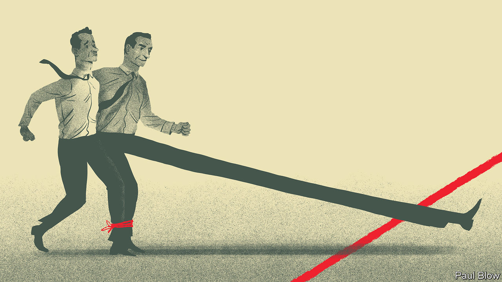

###### Bartleby

# When your colleagues are also your rivals 

##### How managers should balance competition and co-operation 

 

> Jan 11th 2024 

The modern company exalts both competition and co-operation. Competition is the defining feature of markets; inside organisations, too, employees compete for limited resources. Sometimes that contest is obvious, as when performance is openly ranked or there is a race for a specific job. Sometimes it is left unspoken: there is only so much money to go round and only so many promotion opportunities on offer. Either way, competition is always there.

Yet the reason firms exist is to co-ordinate the activities of many actors in pursuit of common goals. Departments and teams are expected to work together. Collaborative behaviour is usually celebrated. Companies dole out awards for the most helpful co-workers, not the Macbeth prize for the colleague most likely to murder you in your sleep. 

Rivalry and teamwork can go together nicely. A paper published in 2022 by Eric VanEpps of the University of Utah, Einav Hart of George Mason University and Maurice Schweitzer of the University of Pennsylvania looked at the best way to handle an old conundrum. To make a good impression on the higher-ups, you need to highlight your own achievements. But bragging about how great you are is not a recipe for being liked. A strategy of taking the credit for some things and doling out praise to colleagues for others resolved this problem. 

It is not easy for managers to strike the right balance between encouraging contests and collaboration. (You just need to hear the word “co-opetition” to know how ugly things can get.) Competition can spur more effort but it can also have unintended consequences. 

A recent study by Eddy Cardinaels of Tilburg University and Christoph Feichter of the Vienna University of Economics and Business asked supervisors to use a forced performance-ranking system to assess workers’ creativity. Forced rankings require managers to assign employees to given places on a scale: if there are ten workers, say, then one must come top and one must come tenth. This approach just stressed everyone out—a bit like bellowing “relax” in someone’s face. People tried harder but they also became less creative. 

In a literature review published in 2020 Gavin Kilduff of the Stern School of Business at New York University, Blythe Rosikiewicz of West Chester University and Christopher To of Rutgers University concluded that competition is more likely to backfire when people feel threatened: for example, when the costs of losing are high or when people are competing against others known to be better at the task in question. But even when the stakes are low, explicit competition can backfire. 

In an experiment conducted by Jeffrey Carpenter of Middlebury College and his co-authors in 2007, participants were asked to stuff envelopes. When people were paid a bonus for stuffing the most envelopes, they worked harder than if they got a flat per-envelope fee. But when they were also given a chance to sabotage their peers to get ahead, the (correct) expectation that they themselves would be sabotaged made people work less hard than if they had got piece-rate pay. 

Such behaviour arises because many people—and many of them men, since women tend to be less taken by the prospect of all-out competition—like winning for its own sake. This organic aspect to competition also shows up in rivalries between individuals. Workers tend naturally to benchmark themselves against their peers in the race for status and seniority; they don’t need an excuse.

These specific rivalries can be especially motivating. A paper from 2018 by Adam Galinsky and Brian Pike of Columbia Business School and Mr Kilduff found that teams in a range of American sports performed better the year after an intense rival did well in tournaments. In another study, Lisa Ordóñez of the University of Arizona and Messrs Kilduff, Schweitzer and To analysed American-football games and found that teams were more likely to take risky on-field decisions against fierce rivals. Particular opponents encourage greater risk-taking than generic competition, at least if you are a very large man in tights. 

All of which argues for a restrained approach to encouraging competition. Balance individual incentives with group ones. If you are going to rate performance, make sure the measures are clear, objective and fair. Think about when risk-taking is more desirable (sales, say) and less desirable (clinical trials). By their nature organisations crackle with competitiveness. Adding a bit of fuel to the fire can be fine. Spraying petrol everywhere is unnecessary. ■


