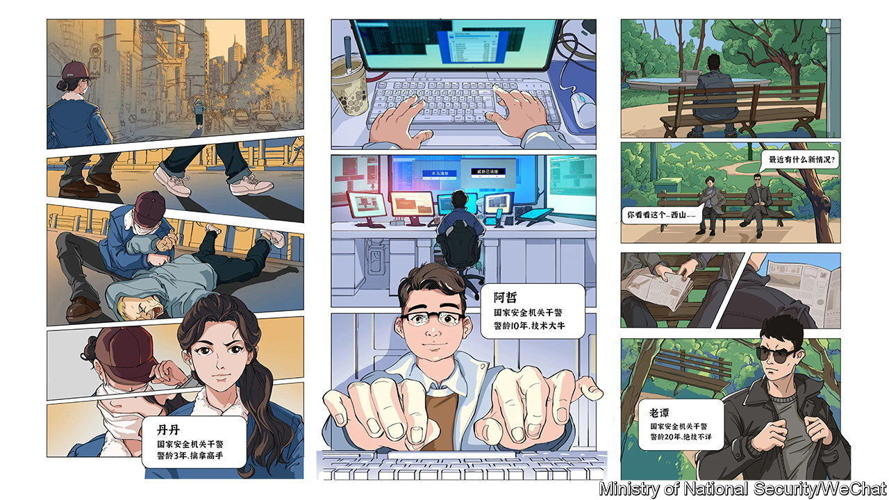

###### No laughing matter

# A comical effort by China’s intelligence agency 

##### Will a new cartoon convince people to look out for spies? 

 

> Jan 11th 2024 

FOREIGN SPIES are lurking everywhere! So says the Chinese government. Officials were ruffled by the CIA’s claim, made last year, that it was rebuilding its spy networks in China a decade after most of its sources disappeared. But China’s reaction seems defined more by paranoia than vigilance. The national intelligence agency, the Ministry of State Security (MSS), wants the entire population to be on the lookout for spies.

To improve public awareness, the ministry has launched an online comic strip called “Shenyin Special Investigation Squad”. It will feature heart-pounding action, say China’s spooks. The first instalment, released on January 7th, shows the capture and interrogation of a blond-haired man, seemingly foreign, who is suspected of breaking the country’s counter-espionage law. 

It also introduces the members of the Shenyin team. Among them are a tech geek named A Zhe (he wears glasses and enjoys bubble tea) and a martial-arts whizz named Dan Dan (she is a long-haired police officer). An agent named Lao Tan has 20 years of experience in the field of security and an unspecified set of skills (one imagines they are very particular, a nightmare for certain people). 

The first instalment ends with the team investigating suspicious activity in the Xishan mining area. According to the MSS, the story is inspired by actual counter-espionage cases.

The intelligence agency is working hard to help “the seeds of national security to take root and sprout” in the minds of young people. Last year it joined WeChat, a popular messaging app, where it shares stories of devious foreign spies at work. Now it is creating comics. But such propaganda efforts, with their predictable themes and lack of subtlety, are usually met with indifference—or even derision—from the intended audience. 

Still, the comic strip serves a purpose, reinforcing the impression that any interaction between Chinese people and foreigners will be viewed with suspicion by the government. Last year it expanded the counter-espionage law, banning the transfer of information related to security and national interests, which it did not define. The European Chamber of Commerce in China cited uncertainty over the scope of the law as one reason why its members were losing confidence in China’s business environment. 

Other moves by the government have added to the febrile atmosphere. In 2015 officials set up a hotline that ordinary citizens could use to report their suspicions. Some local governments offer big rewards for tips on espionage cases. China established an annual National Security Education Day years ago. Though, according to the MSS, publication of the comic was timed to coincide with Police Day on January 10th.

To some Chinese, the comic is a worthwhile piece of propaganda. One of the country’s best-known nationalist commentators, Hu Xijin, wrote on social media that the security services should speak more about the threat of espionage and highlight the cases they’ve cracked. But he also warned that they shouldn’t go too far, lest China cut itself off from the world. That, he said, “would be like not eating for fear of choking”.■


