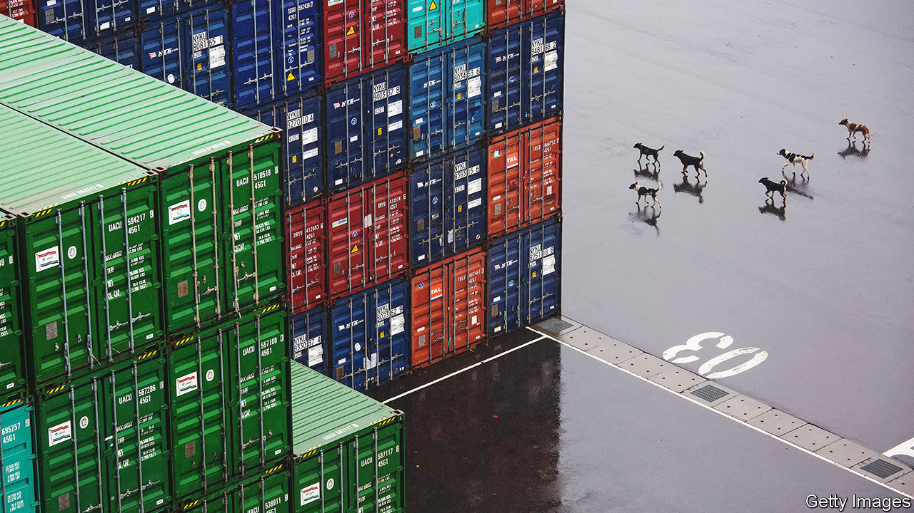
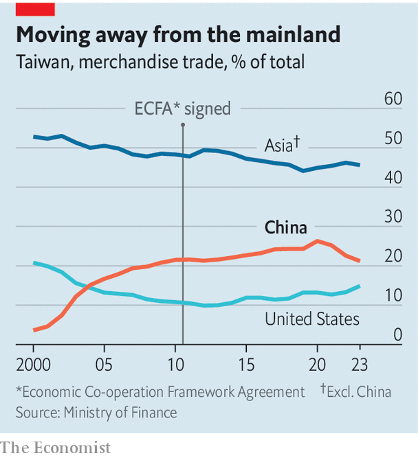

###### Trading threats

# China heaps pressure on Taiwan ahead of a big election 

##### Choose our favoured candidate or suffer the consequences, hints the mainland 

 

> Jan 10th 2024 

THERE IS no doubt which party the Chinese government favours in Taiwan’s presidential and legislative elections on January 13th. Officials in Beijing see the ruling Democratic Progressive Party (DPP), which takes a defiant stance towards China, as a gang of separatists standing in the way of Taiwan’s unification with the mainland. The Kuomintang (KMT) party, on the other hand, is much more friendly towards China. The island faces a choice between “prosperity and recession” and between “peace and war”, say Chinese officials.

The people of Taiwan see things differently. They want neither recession nor war, but according to opinion polls, a plurality favours Lai Ching-te, the DPP’s candidate, to be their next president (the rest of the vote is split between Hou Yu-ih of the KMT and Ko Wen-je of the Taiwan People’s Party). China is not happy. On January 1st it reimposed tariffs on 12 petrochemical products that had been covered under a cross-strait trade deal, the Economic Co-operation Framework Agreement (ECFA).


In the days ahead of recent Taiwanese elections China acted with restraint, fearing that any use of the stick might cause voters to flock to the DPP. Voters have done so anyway. Tsai Ing-wen of the DPP won the last two presidential elections (term limits now require her to step down). So this year China has changed tactics. Though it accuses the DPP of hyping the threat of war for electoral gain, China has been sending warplanes over the Taiwan Strait and spreading disinformation on the island. The new trade restrictions seem aimed at showing Taiwan the economic consequences of electing the DPP.

The ECFA, signed in 2010, is one of many economic carrots offered by China to past KMT governments in the hope of bringing Taiwan closer to the mainland. By far the most significant, the deal covers 539 Taiwanese products and 267 Chinese goods, along with a range of services, while outlining a path to a full free-trade agreement. The DPP opposed it at the time, seeing it as a step towards unification. (An argument over the deal even led to a fight in the legislature.) Since coming to power, though, the party has not scrapped it.

But it has also not engaged in negotiations with China to lower trade barriers erected by previous Taiwanese governments (these aimed to protect small and medium-sized businesses). China insists that the reimposition of tariffs on petrochemical products was in response to those barriers, which it expected to be lifted. Chinese officials, though, have undercut their own argument by saying that any negotiation over trade issues must begin with the DPP’s recognition of the “1992 consensus”, an agreement between the mainland and the KMT government at the time that there is “one China” with multiple interpretations. Ms Tsai does not accept that there is such a consensus and has called on China to refrain from using the ECFA as a political weapon. She wants the dispute resolved at the World Trade Organisation.

 


So far China’s actions are having little economic impact. The 12 restricted items account for a tiny proportion of Taiwan’s total exports to China. But things could get worse. China is mulling whether to do away with other portions of the ECFA—and perhaps the whole thing. 

That would be in keeping with a trend. For years the economic ties between Taiwan and the mainland have been fraying. For most of the past decade China was the top destination for Taiwanese investment, but that is not the case today. The island’s trade with China, as a percentage of its total, is also shrinking (see chart). 

Still, China remains Taiwan’s biggest export market. Messrs Hou and Ko therefore hope to build on the ECFA. Mr Lai is not interested. He wants to do more to lessen Taiwan’s reliance on the Chinese market. If he wins, the two economies will probably move further apart, while the prospects of peaceful unification dim. ■


