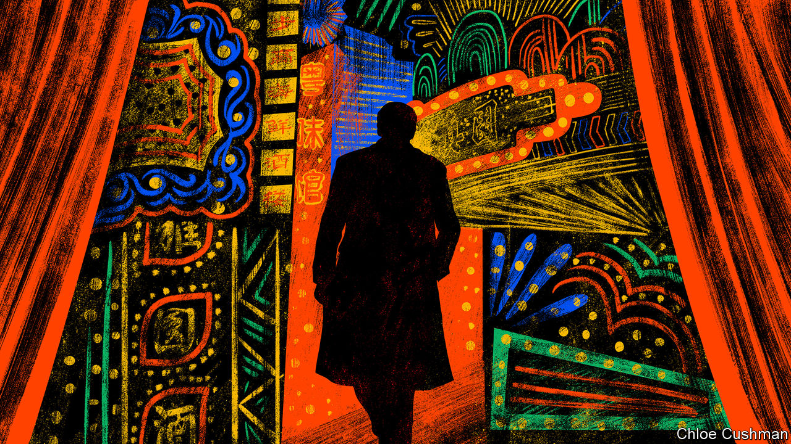

###### Chaguan

# Nostalgia for China’s boom years drives a TV hit 

##### A drama series presents 1990s capitalists as heroes, not villains 

 

> Jan 11th 2024 

CHINA CENTRAL TELEVISION, the flagship network of the country’s propaganda machine, has a new hit on its hands. “Blossoms Shanghai”, a big-budget melodrama in 30 parts, has enjoyed huge audiences since its first episode aired on December 27th. The show’s success—boosted by approving coverage in official and commercial media outlets—is at once unexpected and revealing. It is a surprise because its heroes are swashbuckling capitalists in the Shanghai of the early 1990s. A hard-living bunch, they cut deals, swap stock tips and scheme against rivals over an endless succession of boozy late-night banquets, filmed in demonic shades of black, gold and red. It is all a far cry from the prim, flag-waving dramas that have become the norm on state tv during Xi Jinping’s rule. Typically, such series depict crime-fighting police officers, Communist Party officials toiling to serve the masses, brave Chinese soldiers or other model citizens.

Enthusiasm for the drama, the first TV series to be directed by Wong Kar-wai, a pillar of Hong Kong’s film industry, sheds light on the Chinese public’s mood. Much praise for the show has a distinctly backward-looking feel to it. Online, fans share their memories of boom years when ordinary Chinese could transform their fates with a lot of luck, good connections and hard work. 

At the same time, the show’s endorsement by government media is revealing about the hopes and fears of the country’s rulers. This official embrace is rather tactical and forward-looking. Boosterish coverage of the drama is in line with a broader campaign by party leaders to cheer up Chinese consumers, whose post-pandemic caution is one reason why the economy is in a funk. Party newspapers credit the drama with sparking a measurable surge in Shanghai hotel and restaurant bookings. Arguably, a show whose stars are heroic entrepreneurs also aligns with current official efforts to reassure China’s private sector. Business types have been battered by heavy-handed regulation in recent years and left feeling generally unloved.

The hero is A Bao, a former factory worker shown making and almost losing a fortune on the stockmarket and in domestic and foreign trade. He is guided by an old man whose counsel runs from business strategy to the right cut for a three-piece suit. (“It has to be British-woven, pure wool,” the sage sternly instructs a local tailor, summoned to make A Bao a new wardrobe.) The drama, adapted from a novel by Jin Yucheng, portrays capitalism as something between a test of nerves, a cruel game and a form of madness, capable of inducing a frenzy in consumers and investors alike. Characters cheat one another and commit suicide when ruined. Yet time and again the survivors are drawn to feast together at the same few restaurants, to plot and show off and drink. In contrast with the real 1990s, official corruption is nowhere to be seen. Indeed, the only important character with a public-sector job (at Shanghai’s agency for foreign trade) is a paragon of honesty who uses her savings to repay businessmen for gifts they offer her. 

To learn more about the show’s success, Chaguan caught a fast train to Shanghai and headed to Huanghe Road, a street of restaurants and Art Deco mansions from the 1930s where much of the drama is set. He found a throng of fans taking photographs and filming themselves for social media, over the shrill, electronic whistles of police officers controlling crowds and directing traffic. 

Chinese public opinion is rarely monolithic, and responses to the drama divided along lines of home town, age and social class. Locals are happy that the whole series was filmed in Shanghai dialect, with a second version dubbed into Mandarin for nationwide release. Several Shanghainese pensioners shared strong views about the drama’s realism, or lack of it. Back in the 1990s a lot of business was done over dinner, agreed an old man who worked in Shanghai’s finance sector. But overall the series is a “fantasy”, he scowled. “Those who went into the stockmarket and business were the rare bold ones. Most people worked in factories.”

Three older women taking pictures had dressed for a fine dinner, though it was noon. They recalled neon signs that lit up Huanghe Road in those boom years. “Many businessmen gathered here, with their huge mobile phones,” remembered one of the women. The trio were not among them. They were assigned jobs in a state-owned textile factory and stayed there until retirement. Modern life offers more choices but more pressure, they declared. In their telling, the series brings the Shanghai of their youth back to life. “But what use is nostalgia?” asked the same woman.

Nostalgia as a veiled form of complaint

The sharpest opinions came from middle-aged fans, some of whom carried small dogs or trailed bored-looking husbands. The early years of China’s “reform and opening” era were a time of hope, filled with new experiences, said a 50-year-old woman. She sighed: “We were lucky that we were born in a good age.” In her view, life is very different now, and more stressful. Asked why, she replied that it is “hard to talk openly” about this. “There are so many reasons, political factors, among many others.”

Young fans sounded more wistful than cross. For two female students, a lesson of the series is that there were more opportunities to move up in the world in the 1990s than now. A 25-year-old man had travelled from Hangzhou, an hour away by train, to take pictures of Huanghe Road. The series may inspire some viewers to start businesses, he enthused. Alas, capitalism is all about timing, he went on. Some may feel they have missed their moment.

Still, China’s entrepreneurs should not become cocky about being cast as on-screen heroes. “Blossoms Shanghai” may be a runaway success, but at moments in early January the most-watched show on state TV was a documentary series about officials corrupted by business interests. Back when China first embraced market reforms, party leaders declared: “To get rich is glorious.” In the Xi era, the lure of money remains distinctly dangerous. ■


