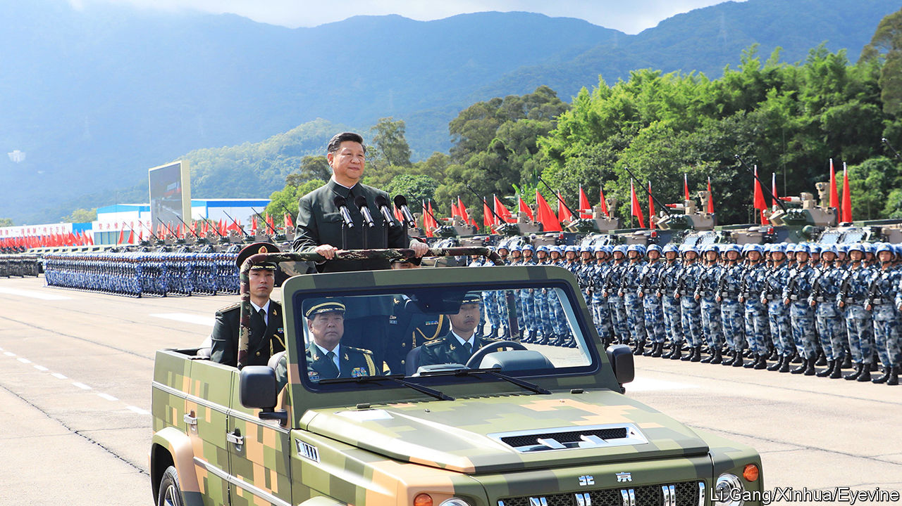

###### Getting soft

# Xi Jinping is struggling to stamp out graft in the PLA 

##### How will it affect China’s fighting ability? 

 

> Jan 11th 2024 

Most online commentators in China support Russia’s invasion of Ukraine. At the same time they criticise Russia’s failure to achieve a swift victory. They accuse the West of prolonging the conflict by supporting Ukraine’s army, but also fault Russia for its military weakness. Corruption has crippled its fighting ability, they often conclude, despite all its spending in recent years on better kit. It is taboo in China to cast aspersions on the war-readiness of the People’s Liberation Army (PLA). But amid reports that it is also struggling with graft as it splurges on new weaponry, there may be good reason for it, too, to worry.

China gives little detail of corruption in its armed forces, beyond—occasionally—highlighting a few egregious cases. It has offered no explanation for a purge of generals that began months ago and is widely believed to involve dishonest dealings. On January 10th a three-day annual meeting in Beijing of anti-corruption chiefs ended as usual with no public mention of military matters, such as the ousting last year of the defence minister, General Li Shangfu. He has not been seen in public since August (it was not until December that his successor, Admiral Dong Jun, was named). Yet this appears to be the biggest graft-related shake-up in the PLA in years. 

In the past, the country’s leader, Xi Jinping, has openly fretted about the impact of corruption on the PLA’s combat skills. “When I see materials reflecting these issues, I feel deep disgust and often can’t help but slam the table,” he said in 2014 during his first big campaign against officers on the take. “These problems have reached a point where they must be resolved urgently,” he went on. “If the army is corrupt, it can’t fight.” In 2018 the Communist Party declared a “crushing victory” in its war against graft in all domains. But it was far from total: the campaign remains “grim and complex”, Mr Xi said at the just-concluded gathering in the capital. That has been a common official refrain since the purported triumph was achieved. 

Within the PLA the war has reignited. According to Bloomberg, an American news service, the purge has toppled more than a dozen senior military officials in the past six months. They mainly belonged to the PLA Rocket Force, which is responsible for the country’s arsenal of land-based conventional and strategic missiles, and the Equipment Development Department, which procures and tests weaponry. Quoting unspecified people familiar with assessments by American spooks, Bloomberg says corruption in the Rocket Force and defence industries “is so extensive that US officials now believe Xi is less likely to contemplate major military action in the coming years than would otherwise have been the case”.

If so, that may be good news for Taiwan, which will hold  on January 13th. Tensions may rise should the presidential front-runner, Lai Ching-te, win. He is viewed by China, which claims the island, as a staunch believer in Taiwan’s perpetual separation from the mainland. But come what may, American officials believe that Mr Xi has ordered the Chinese armed forces to be capable of invading Taiwan by 2027, the centenary of the PLA’s founding. 

He is not expected to relax in that effort. State media suggest that a milestone will be reached this year with sea trials of China’s third aircraft-carrier, the —the country’s largest such vessel as well as the first one entirely of Chinese design. But if Mr Xi believes that corruption is truly rife in the PLA, he may think twice about sending it on such a hugely ambitious mission, especially given the difficulties faced by Russia’s army. It had a lot more fighting experience than China’s when it invaded Ukraine. China has not fought a war since a brief one with Vietnam in 1979. 

Ready, aim, fired

In a war with Taiwan, the Rocket Force would play a big role, both in mounting missile attacks against the island and in trying to keep America at bay. The recent purge began in July with the replacement of its commander, General Li Yuchao, his number two, General Liu Guangbin, and the force’s political commissar, General Xu Zhongbo. A former deputy commander of the force, General Zhang Zhenzhong, was also dismissed. In December nine senior officers were expelled from the country’s rubber-stamp legislature, the National People’s Congress. They included Generals Li and Zhang as well as three others linked to the Rocket Force. 

The reasons are obscure. It is widely speculated that possible wrongdoing has included the leaking of secrets about the force as well as corruption. Bloomberg, citing the American intelligence, says graft in the Rocket Force has led to missiles being filled with water instead of fuel and the malfunctioning of lids covering missile silos in western China. 

When Mr Xi took power in 2012, the armed forces were rife with corruption. Senior military posts were being sold for hefty sums. They were worth it: holders could rake in money, such as by taking bribes from military contractors or doing deals with private businesses involving PLA land. Mr Xi was ferocious in his attacks on the PLA’s corrupt “tigers”. Dozens of generals were purged, among them two retired ones who had served as the most senior uniformed officials in the army, Guo Boxiong and Xu Caihou. Mr Guo is now serving a life sentence. Xu died of cancer before a trial could get under way. It is striking that, after so much effort by Mr Xi to clean up the PLA, high-level graft persists.

Mr Xi’s shake-up of the armed forces has included raising the status of its anti-corruption agency. In 2016 the PLA’s graft-busters began copying the way their civilian counterparts operate by sending teams into military units to look for corruption. Mr Xi has also stepped up political education among the troops, hoping that earnest study of Xi Jinping Thought on Strengthening the Military, as his teachings are officially known, would help improve their behaviour. Stay absolutely loyal to Mr Xi and the party is the essence of soldiers’ frequent study sessions. (Whether these time-consuming classes get in the way of training men to fight is something Mr Xi appears not to question.) 

There is little sign that recent ill-discipline involves any direct challenge to his leadership. With his round-up of generals a decade ago, Mr Xi seems to have stifled potential opposition to his rule from within the armed forces. Many of those officers appeared to have been singled out because of their loyalty to his predecessors, whom he viewed as rivals. 

But Mr Xi is still troubled by what he sees as potential threats to his rule. In his speech at the anti-graft meeting, he said that “breaking free from the historical cycle” should be viewed as a “strategic goal”. This was a reference to one of his preoccupations: the fall of great empires as a result of rot. “Throughout history, many armies with remarkable military achievements ultimately fell victim to corruption and were brought down. This must serve as a warning,” said a screed on Mr Xi’s military thinking that was published last year on the defence ministry’s website. It is clear that some officers are not studying their textbooks hard enough. ■


