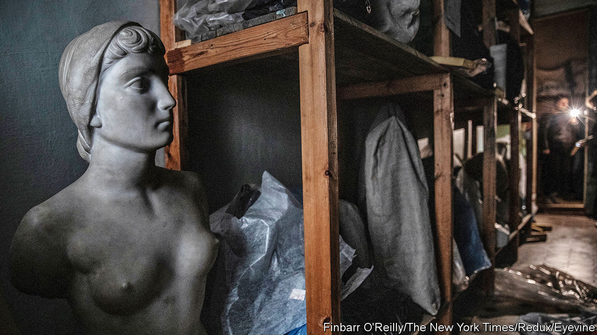

###### Treasure quest

# Inside the hunt for Ukraine’s stolen art 

##### Unless Ukraine wins the war, there is no way to recover what Russia has looted 

 

> Jan 5th 2024 

ON AN UNSEASONABLY warm day in October, the silence outside broken by birdsong and artillery fire, Olga Goncharova sat in her office on the ground floor of the Kherson Regional Museum, a bulletproof vest wrapped around the back of her chair, the windows covered with plywood, and cursed the Russians. “They’re vandals, the people who did this,” she said.

Ms Goncharova escaped from Kherson, in southern Ukraine, in the spring of 2022, shortly after Russian troops poured into the city. By the time she returned, in November that year, . The Russians had evacuated to the other bank of the Dnieper river, from which they have been  ever since. Ms Goncharova wept when she entered the museum where she had worked for over two decades. “There was broken glass everywhere,” she says. “They had torn some of the exhibits out.” 


In fact Russian officials, assisted by local collaborators and the museum’s then-director, had removed more than 28,000 artefacts, loaded them onto lorries and shipped them to Crimea, illegally annexed by Russia in 2014. Gone were the ancient coins, the Greek sculptures, the Scythian jewellery, a precious Bukhara sabre—and even the hard drives containing the museum’s catalogue. Three decades ago, Ms Goncharova says, the museum recovered a collection of Gothic bronzes looted by German occupiers during the second world war. Now the Russians have stolen them. 

Since Russia’s full-scale invasion began in February 2022, the loss of life and suffering in Ukraine has been great. Many of its museums have been plundered, too. The country’s ministry of culture estimates that over 480,000 artworks have fallen into Russian hands. At least 38 museums, home to nearly 1.5m works, have been damaged or destroyed.

Ukrainian officials have also sent a number of collections to other parts of Europe to protect them from Russian bombs. These include dozens of Ukrainian paintings from the early 20th century, on display at the Royal Museums of Fine Arts in Brussels before travelling to Vienna and London. When the evacuated treasures will return to Ukraine is unclear. 


Artists have not been spared either. Ms Goncharova points to a painting of dried flowers and pottery that hangs opposite her desk. The artist, Vyacheslav Mashnytskyi, from Kherson, went missing after Russian troops turned up at his riverside dacha and requisitioned his boat. Friends who stopped by the house days later found traces of blood. Mr Mashnytskyi has not been heard from since.

Putting a price on the stolen works is nearly impossible, since only a fraction had been appraised for insurance purposes. Last April the UN estimated that the war had caused $2.6bn-worth of damage to Ukraine’s cultural heritage. That now seems to be a conservative figure. Tracking what the Russians have looted is also a headache. Many Ukrainian museums, especially smaller regional ones, had relied on paper catalogues, often outdated or incomplete, says Mariana Tomyn, an official at the culture ministry. Some of those catalogues have now gone. Efforts to digitise inventories, which began only three years ago, have taken on a new urgency.

Ukraine will seek redress. Prosecutors in Kyiv are investigating Russian officials and Ukrainians involved in the plunder. Mrs Tomyn is working on a new restitution law and the overhaul of an outdated one on the protection of cultural heritage. And since late October a special army unit has begun to monitor damage to cultural sites. But there is little hope of recovering what the occupiers have stolen. Russian officials will ship Ukrainian collections stored in Crimea to Russia if Ukraine retakes the peninsula, says Vyacheslav Baranov, an archaeologist at Ukraine’s National Academy of Sciences.

There have been some breakthroughs. On November 26th, after a long court battle, hundreds of historical treasures from Crimea were returned to Ukraine from the Netherlands. The collection, which includes Scythian gold carvings from the fourth century BC, had been on display at the Allard Pierson Museum in Amsterdam in 2014. Russia demanded the return of the objects to the Crimean museums which had loaned them. The Dutch supreme court ruled in 2021 that they belonged in Ukraine. 

They are not the only ones to make their way back. At the Lavra museum complex in Kyiv, Maksym Ostapenko slowly unwraps a bundle of white packing paper. Out of it emerges a Bronze Age battle-axe. Another bundle yields a sixth-century Khazar sword. In the summer of 2022 the weapons, plus a few other objects probably destined for America’s antiquities market, surfaced at John F. Kennedy airport. The American authorities sent them back to Ukraine a year later. Most were probably excavated illegally in southern Ukraine, near Crimea, says Mr Ostapenko, the museum’s director, or discovered by Russian troops digging trenches. Such archaeological looting has thrived in the occupied territories, he adds. “The damage done to cultural heritage is immeasurable.”

Across the street from Kherson’s regional museum sits the city’s art museum. It was under renovation when Russia invaded; some of the staff told the new authorities that its collection had been transported north. It was actually being stored in the basement and eventually the Russians found out, thanks to local informers, including the ex-director of the regional museum. By the time the Ukrainians recaptured the city, the Russians had made off with about 10,000 of the museum’s 14,000 works, including paintings by Ilya Repin and Oleksii Shovkunenko, the artist after whom the museum is named, and religious icons. They left behind some sculptures which were too heavy to move (pictured), says Ihor Rusol, an employee, plus a few portraits of Lenin.

Last summer museum officials concluded, from photos and videos online, that some of the stolen art was being stored at the Tavrida museum in Simferopol, in occupied Crimea. Reached by telephone, the Tavrida’s director, Andrei Malgin, acknowledges that the Kherson collection is held in his museum. Mr Malgin, who was placed under sanctions by the EU in June for his role in the plunder, says the works were moved “for safekeeping”. 

Inside the empty basement of Kherson’s art museum, Mr Rusol says he expects no gestures of goodwill from the Russians. “There is only one thing,” he says, Ukraine can do to ensure that the city’s stolen art returns home: “Win the war.” ■


