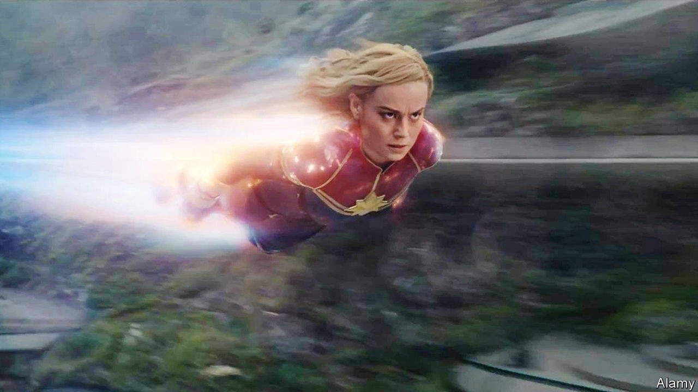
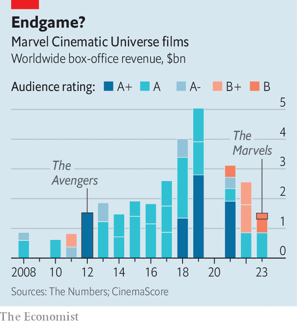

###### Superhero films

# Marvel seems to be losing its powers 

##### The world’s mightiest movie franchise looks increasingly fragile 

 

> Jan 11th 2024 

In “The Avengers” (2012) Nick Fury (Samuel L. Jackson), a spy, described heroes as “an old-fashioned notion”. Certainly the film’s characters, including Captain America and Iron Man, were not novel, first appearing in comic books published in the mid-20th century. But if the idea was old, the excitement around superheroes had been renewed. “The Avengers” became the first Marvel movie to make more than $1bn at the global box office.

When Fury’s words were used in the trailer for “The Marvels” (2023, pictured), however, they took on a different tone. Heroes may seem antiquated, he argued, but “the world can still use them”. If it was an attempt to convince the viewer, it did not work. Released in November, “The Marvels”, the 33rd instalment in the Marvel Cinematic Universe (mcu), made around $200m at the box office. It became the poorest-performing MCU film to date, and will probably lose money.

 


Nor was “The Marvels” a one-off disappointment. “ and the Wasp: Quantumania” also underperformed. According to CinemaScore, an audience-rating benchmark, of the past eight MCU films, five have scored B+ or worse (see chart). Fans complain of dull characters, sloppy writing and amateurish special effects. 

Marvel productions on the small screen have not fared much better. Recent MCU television series on Disney+, including “Secret Invasion”, about Fury’s character, have been poorly reviewed and, estimates suggest, little watched. It does not bode well for the shows due to be released in the coming months. 

The decline is surprising: for a long time, the Marvel brand seemed invincible. Disney  in 2009 and it became a prized asset. The 23 movies released between 2008 and 2019 grossed almost $23bn in total, making Marvel the largest  in history. 

Marvel kept standards high even as it increased production. The company released 2.75 films, on average, in 2016-19, up from 1.2 in 2008-13. Of those 23 movies, only one ranked lower than A- on CinemaScore. Three films received an A+, awarded to fewer than 100 of over 4,000 films measured since 1979.  (2018) even became the first comic-book adaptation to be nominated for Best Picture at the Oscars.

Marvel pioneered an innovative “cinematic universe” model, in which plotlines and characters were shared across films. As Marvel’s universe grew, its competitors tried, and failed, to emulate its success. DC Comics—which owns Batman, Superman and set up, and recently scrapped, its “Extended Universe”. Warner Bros has turned the Harry Potter franchise into a . Universal twice tried to launch a “Dark Universe” of monsters such as Dracula and the Mummy, but both attempts failed after a single release. Efforts to build out Robin Hood and his merry men (Lionsgate), Power Rangers (also Lionsgate) and King Arthur and his round table (Warner Bros) all faltered.

By the early 2020s the MCU seemed set for further dominance. In 2019 Disney acquired 20th Century Fox, which held the rights to characters including the X-Men and the Fantastic Four. The launch of Disney+ that year made it easier for fans to keep up with the ever-expanding MCU and enabled the franchise to tell new stories in a . But instead of developing its position in pop culture, Marvel has struggled creatively and financially. 

Disney insiders suggest several causes for the slump. One is to do with personnel. Several trusted writers and directors have moved on. Many of the actors playing the most popular superheroes left the mcu after “Avengers: Endgame” in 2019, and , the star of “Black Panther”, died in 2020. Last month Disney fired Jonathan Majors after he was found guilty of assaulting and harassing his then-girlfriend. The actor played the villain at the heart of the “Multiverse Saga”, the story which would connect the films released between 2021 and 2027. 

Another reason is to do with geopolitics. The first 23 films were all released in China, the world’s , but between 2020 and 2022, none was. (China did not give a clear reason why, but it was probably building up its domestic film industry.) Though this de facto ban is now over, cinematic universes are hard to understand when audiences have missed several entries. Making matters worse, Disney+ is not available in China, so fans cannot watch the TV entries.

Yet part of the problem is of Marvel’s own making. Since 2021 the MCU has released an average of 3.3 films and 3.7 television series every year—a rate that seems to strain audiences, internal creative teams and special-effects departments. For prospective viewers hoping to watch a new title, 33 films and 11 seasons of television is simply too much homework. The focus on the “”, which draws on films predating the existing cinematic universe, aggravates this issue.

Audiences may yet tire of superheroes much as they tired of Westerns in the late 1960s. But for now, the genre goes on. The third “Guardians of the Galaxy” film grossed $846m, making it the fourth-highest-grossing film of 2023, and received an A rating on CinemaScore. “Spider-Man: Across the Spiderverse”, an animated film by Sony, was also among the most popular films last year. 

Bob Iger, Disney’s CEO, who initiated Marvel’s expansion, has said the franchise can return to its former glory by slowing the pace of production. “I’ve always felt that quantity can be actually a negative when it comes to quality. And I think that’s exactly what happened. We lost some focus.” He, and Marvel’s many fans, will be holding out for the heroes. ■


