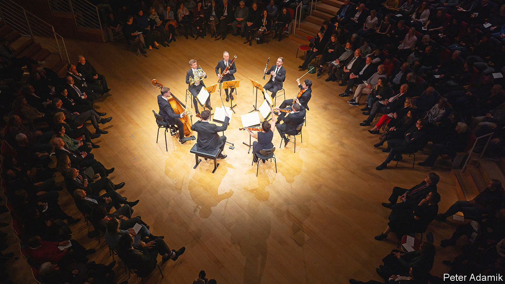

###### Classical music and conflict

# Two Arab-Israeli musical initiatives reckon with the war in Gaza 

##### Their co-founder, Daniel Barenboim, is determined to play on 

 

> Jan 11th 2024 

These days it is relatively rare to see Daniel Barenboim perform. The Israeli-Argentine conductor and pianist, now 81 years old, has reduced his public commitments because of a neurological condition. Yet some events demand an appearance. On January 19th he is scheduled to conduct a concert by the students of the , a conservatoire he opened in Berlin in 2016.

Such occasions are not only meaningful because of Mr Barenboim’s health. They have taken on political poignancy, too. The academy’s students largely come from the Middle East, and include both Israelis and Palestinians. The institution aims to foster understanding and intellectual curiosity alongside musical ability: as well as learning to master their instruments, students take lessons in history, literature and philosophy. The academy’s faculty includes not only renowned musicians, but also experts on constitutional theory,  and post-colonial literature. 

The idea for the academy grew out of the West-Eastern Divan Orchestra, an ensemble that Mr Barenboim founded in 1999 , an American-Palestinian academic. The orchestra similarly brings together Arab and Israeli musicians in the hope that playing together can encourage dialogue across the region’s cultural and political divisions. In the nearly 25 years since it was established, the orchestra has won global acclaim and regularly tours internationally. 

Mr Barenboim has long had a knack for the symbolic. In 2001 he conducted extracts from “Tristan and Isolde”, an opera by , during a concert with the Berlin Staatskapelle in Jerusalem. That defied an informal Israeli ban on performances of the antisemitic German composer’s music, famously loved by Adolf Hitler, and sparked furious debate about free expression and Israel’s modern identity. In 2005 Mr Barenboim led a concert with the West-Eastern Divan Orchestra in Ramallah, a city in the West Bank. He was later granted a Palestinian passport in recognition of his work fostering cultural ties between Israel and its Arab neighbours. 

The Israel-Hamas war has sharpened the focus of the Barenboim-Said Academy and West-Eastern Divan Orchestra. In an essay published after , in which 1,200 people, most of them Israeli civilians, were killed, Mr Barenboim wrote of the need to offer alternative perspectives to those who are “attracted to extremism”. Music-making could play only a small role in reconciliation, but it still had “immense value” in helping people see the humanity of their enemies. 

The conductor has acknowledged that some consider his perspective, and his work, naive. For many, music dwindles into insignificance amid so much suffering. (The total death toll in Gaza exceeds 23,000, according to the Hamas-run health ministry; women and children make up a large proportion.) The war, detractors argue, is evidence of the failure of these kinds of projects. When hatred leads to bloodshed, the argument goes, what good is a disciplined string section? 

Both the academy and the orchestra are deeply affected by the conflict. Yet its consequences are especially obvious at the academy, says its dean, Michael Barenboim, who is also concertmaster of the West-Eastern Divan Orchestra (and its co-founder’s son). Members of the professional orchestra meet intermittently for performances, but the conservatoire’s students work together every day. 

Rather than withdraw into an echo chamber with like-minded individuals, students are forced to interact with peers who may have a very different perspective on the region’s politics. The younger Mr Barenboim says that some students prefer to reflect on those differences alone, while others want to . Overall, though, he is struck by their continued commitment to the project’s values of co-operation and dialogue. 

The orchestra’s professional players have also continued to perform together since war broke out. In November some gave chamber concerts in Britain, Germany and Hong Kong under the banner of the West-Eastern Divan Ensemble, an offshoot of the main group. Such occasions remain principally about the music: in London the ensemble played works by Mendelssohn and Elliott Carter, an American avant-garde composer. Yet the decision to play in public is still a telling gesture.

Those involved do not pretend that performing quartets or symphonies can play a meaningful role in diplomacy. Mr Barenboim has said that music can only “change things on a small scale. On a large scale, it is up to politics.” The logic of the initiatives lies in their ability to act as alternative models of engagement. The younger Mr Barenboim likens them to a controlled scientific experiment: they show that if you change how people meet, they may treat each other differently. ■


