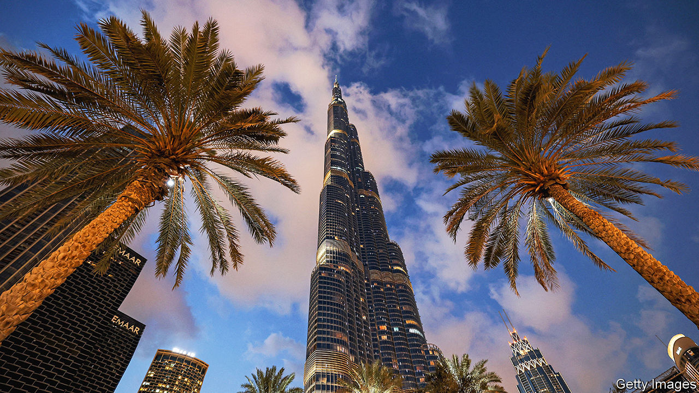

###### Mighty minnows

# What adroit small countries can teach the rest of the world 

##### Armen Sarkissian, a former president of Armenia, looks at Botswana, Ireland and Qatar, among others 

 

> Jan 11th 2024 

By Armen Sarkissian. 

IT WAS A perilous moment. At a reception during a visit to Britain by  in the 1980s, a young Soviet researcher from Cambridge University faced an astute question from . “Young man,” the prime minister asked, “do you feel Armenian or do you feel ‘Soviet’?” How to respond without either betraying his treasured ethnic roots or appearing publicly disloyal to the Soviet state, within earshot of the spies in Gorbachev’s entourage? “I am of course Armenian,” Armen Sarkissian replied, adding that he was a grateful Soviet citizen who had received an excellent education back home.

That is the sort of agile diplomacy that Mr Sarkissian admires in small states. Born into a giant country, the Soviet Union, Mr Sarkissian went on to be prime minister and more recently president of a small one, . Having achieved remarkable success against the odds, he is intrigued by small states that have done so too, and the lessons they may hold for the rest of the world. His portraits of several of these countries, peppered with personal anecdotes, are compelling case studies. 

They are a varied bunch. From inauspicious beginnings  became one of the world’s most successful city-states, thanks to the far-sighted leadership of Lee Kuan Yew.  is “a diamond in the rough”, as Mr Sarkissian puts it, “a model of economic prudence and efficient governance in Africa”. A trio of European countries make it into his collection: Switzerland, which has made a virtue out of neutrality; Ireland, formidably well-connected as well as “compassionate, open and global”; and impressively pragmatic Estonia, which has changed beyond recognition since its Soviet days to become a pioneer of simplified taxation and e-government.

The Middle East has the most intriguing cluster of small-state stars. Qatar has made the most of its gas and of the security that comes from hosting a big American air base, while hedging its bets in foreign policy (it recently played a role in hostage and prisoner swaps between Israel and Hamas, for example). The  (pictured) punches above its weight as a logistics hub with the help of streamlined decision-making and clever investments. Mr Sarkissian is impressed by the skilled lobbying and economic ingenuity of Israel, the “startup nation”—though now engulfed in a —which, like Armenia, has a traumatic history and a global diaspora. 

Yet Armenia itself has not managed to match Israel’s economic prowess, as Mr Sarkissian shows. It has failed to make the most of its diaspora. Internal arguments and short-termism mean that it has ended up with a “no-model model”. Merely being a small state is no guarantee of success.

So what are the lessons from the adept ones? Their paramount preoccupation is survival. They recognise their vulnerabilities and invest in the future. Mr Sarkissian suggests that the essential ingredients include a strong sense of identity, a national mission, strategic purpose and effective leadership. With these, he argues, small states “can navigate the complex challenges of the 21st century in smarter ways than the traditional great powers”. 

Maybe so, but can “a club” of such states really help spread ideas and promote partnerships and peace, let alone save the world, as Mr Sarkissian grandly claims? It is perhaps not surprising that his efforts to promote the idea have encountered resistance—and not just because of the entrenched interests of larger states and established groupings. With its diverse members, such a club risks being contentious: the “symphony of elements” that characterises the dynamic minnows could easily become cacophonous. Besides, a club suggests an aspiration to bigness. Yet as Mr Sarkissian persuasively describes, the beauty is being small. ■


