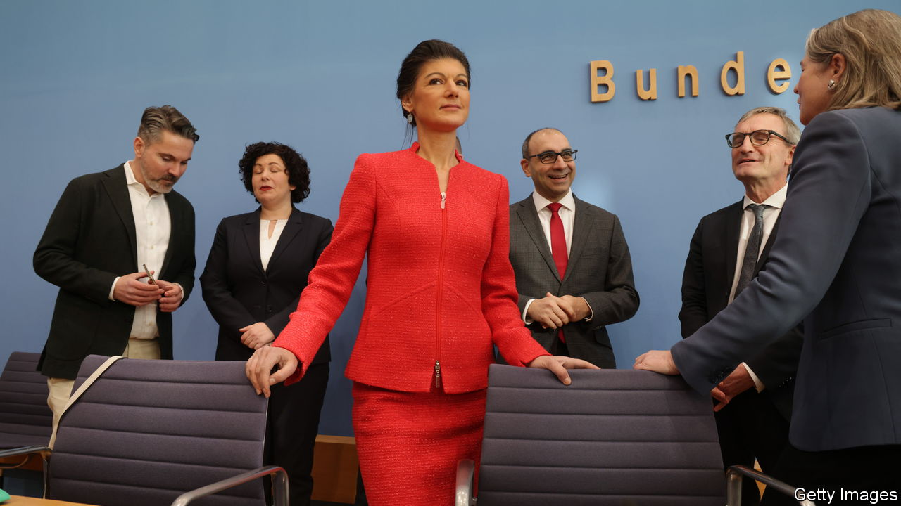

###### Red, black and kaleidoscopic

# Germany’s new party on the far left may eat into the far right 

##### Sahra Wagenknecht enters the fray 

 

> Jan 11th 2024 

The new year has not started well for Germany’s ruling “traffic-light” coalition, nor indeed for traffic. On January 8th angry farmers blocked autobahns across the country, even as train drivers called a national strike. As statisticians revealed grim final numbers for 2023—such as a 3.1% real-terms fall in retail sales from 2022—pollsters unsurprisingly found that 82% of Germans are dissatisfied with the government. A survey measuring confidence in the office of the chancellor detected a vertiginous 55-point plunge between late 2020, when Angela Merkel still reigned, and now under Olaf Scholz. 

Yet one person’s bad luck may prove another’s chance. Consider the case of Sahra Wagenknecht. The 54-year-old left-wing populist chose January 8th as the date to launch her new party. Right now the Sahra Wagenknecht Alliance for Reason and Fairness (BSW is the shortened German acronym), looks minuscule, with only ten MPs in the 736-seat Bundestag. Yet it stands to profit both from Mr Scholz’s distress and from fortuitous timing. 

Ms Wagenknecht, who in October quit Germany’s main leftist party, Die Linke, leans to the left of the government on social spending and in reluctance to support Ukraine, but to its right in seeking sharp curbs on immigration. That combination resounds with an increasingly frustrated electorate. A survey of voters who would consider voting for the BSW found 40% cited disappointment with other parties as the top reason, 28% Ms Wagenknecht’s charms and 25% the issue of immigration. 

Two big political opportunities also loom for the BSW. German voters tend to take elections to the European Parliament less seriously than national ones, and see them as a chance to experiment. The vote is set for June, giving the novel party six months to campaign. In September three eastern states will hold elections. Former East Germany happens to be where the ruling coalition is most disliked. 

It helps that Ms Wagenknecht is herself an easterner. Brought up in East Berlin, she remained a communist through the fall of the Wall and university, where she studied economics and philosophy. Her poise, precise diction and relentless scorn heaped on the government score strongly in a region made anxious by high inflation, relative poverty, fear of immigrants and a sense of alienation from the elite. Many East Germans share Ms Wagenknecht’s suspicion of the West and blame Ukraine, not Russia, for “provoking” a war for its own survival.

Those same impulses have boosted another relatively new outsider, the hard-right Alternative for Germany (AfD), into second place in popularity, with a projected 22% of votes in a national election. Although the two parties ostensibly occupy opposite political poles, some pundits believe Ms Wagenknecht could draw more voters away from the AfD than from mainstream parties such as Mr Scholz’s Social Democrats. One survey found 55% of AfD supporters, and 40% in Die Linke, would consider voting for the BSW. Far fewer in other parties said they might switch. 

Undercut by Ms Wagenknecht, Die Linke looks close to falling under the 5% threshold. Yet it is too soon for right-wingers to cheer. Hans-Georg Maassen, a former head of German intelligence who heads a hard-right splinter in the opposition Christian Democratic Union, the flagship of German conservatism, now wants to set up his own party. Meanwhile the Free Democrats, a small right-of-centre partner in the traffic-light coalition, also flounder near the 5% threshold. By the time of the next national election, in 2025, the upstart BSW may look less a minnow among sharks than one among many fish. ■


