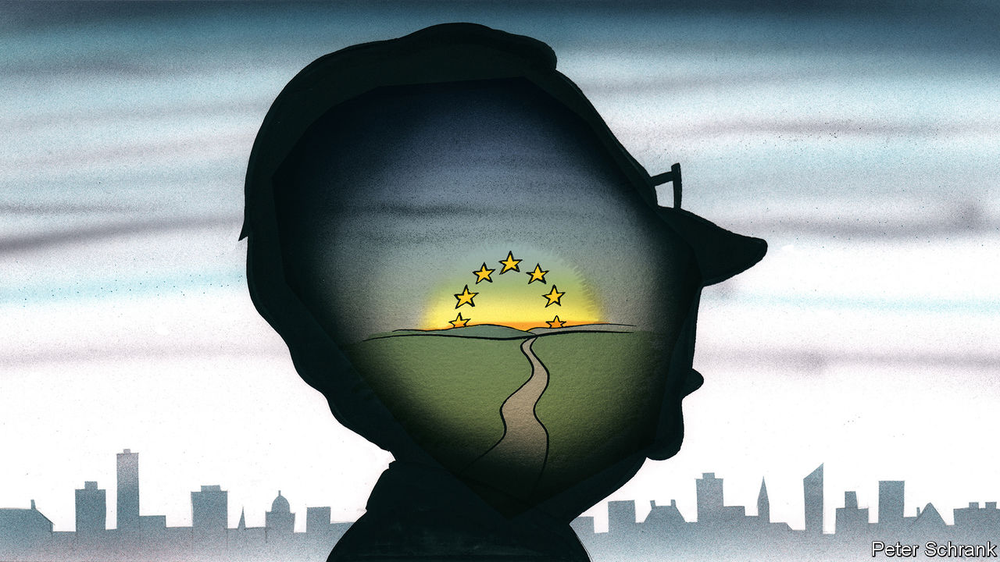

###### Charlemagne

# How the spirit of Jacques Delors might be rekindled 

##### As the EU mourns, what would Jacques do? 

 

> Jan 11th 2024 

American evangelicals don bracelets adorned with the letters WWJD, “What would Jesus do”? EU officials, faithful to a calling of a different sort, have of late been pondering their own WWJD: “What would Jacques do?” The death of Jacques Delors on December 27th has had many in Brussels wondering how to recapture the aura of the messianic president of the European Commission from 1985 to 1995. In just a decade the Frenchman bequeathed to Europeans the single market, then laid the grounds for the euro and passport-free travel among other federalising milestones. After a national homage in Paris on January 5th, words once uttered by this latter-day founding father of the EU are being recited, psalm-like, to guide today’s euro-disciples. What would it take to recreate the conditions that got Europe lurching forward together?

A big part of rebooting Delorsism is to realise it was only partly the result of Mr Delors’s undoubted political talents. A chief ingredient of his success was the way Europe was at the time. A generation of national leaders who grew up through the second world war—notably François Mitterrand in France and Helmut Kohl in Germany—had reached their political apogee by the mid-1980s, and had a sense that their legacy should include banishing Europe’s ugly nationalisms. Tepid growth in the 1970s had given a glimpse of Europe’s future irrelevance if it failed to jolt itself onto a different track. Seizing the moment, Mr Delors cajoled national governments into giving up vetoes, particularly when it came to some economic matters, thus bringing down barriers between countries. He convincingly explained how a little loss of sovereignty could result in a lot of economic gain. 

The single market remains the EU’s greatest achievement. What is the  that could recapture the Delorsian spirit? Spooked by revanchist Russia or flaky America, some today talk of a European army. That is likely to prove trickier than harmonising regulations for cars and chemicals. A bigger EU budget, beyond the tiny 1% or so of GDP it spends now, is for Brussels to demand but national capitals to agree to; scrimping northerners, led by Germany, are unlikely to stump up more money soon. The Green Deal, which involves overhauling the European economy to meet carbon imperatives, is vital stuff, much of it agreed on at EU level, but exacerbates the caricature of Brussels as a dispenser of red tape.

Returning to a Delorsian age would be easier if three developments since his time were to be reversed. The first is the idea that “more Europe” is the answer to every challenge the continent faces. This was not the Frenchman’s approach. Though he personified a powerful Brussels (a bit too powerful, Britain’s Margaret Thatcher came to believe), he aimed for a “federation of nation states” and, after he left office, he opposed the idea of an EU constitution. Sometimes doing less centrally might mean doing better, especially since the EU has more than twice as many members today as in Mr Delors’s time.

The second idea to be scrapped is that Brussels gains democratic legitimacy if its institutions are politicised. Mr Delors, a former central-bank official who straddled left and right, showed that pragmatism trumps ideology when it comes to crafting a common way forward. The advent of a “political commission” in Brussels, its top jobs doled out to reflect the result of European elections, has muddled its mission as guardian of the European treaties. Better to assume that legitimacy will come from elected national leaders, who meet every few weeks in Brussels anyway. 

The third misguided development is having two figureheads at the EU: the president of the commission, as Mr Delors once was, and since 2009 the president of the European Council, who chairs meetings of EU leaders. The endlessly self-promoting current incumbent of the second role, Charles Michel, has announced he will step down early. Reuniting the two positions would be an intriguing idea. It might give, for example, a clear “Mrs Europe” mandate to Mr Delors’s current heir, Ursula von der Leyen, thus far the exalted Frenchman’s most capable successor at the commission. Failing that, finding a competent but discreet grandee willing to eschew the limelight to chair meetings of EU leaders would be preferable. How about Mario Draghi, the former head of the European Central Bank, later the prime minister of Italy?

Jacques of all trades

The simplest homage to Mr Delors would be to reboot his beloved single market. It has suffered of late. The commission has turned a blind eye to flagrant breaches of the principle of a level playing-field as national governments have subsidised favoured companies with not one rebuke from Brussels, in the name of competing with China or America. A report by another former Italian prime minister, Enrico Letta, will soon propose ways to reinvigorate the single market, before Mr Draghi himself will suggest how to improve the EU economy. Just enforcing the single-market rules as they were devised would be a good start.

If Delorsism carries a lesson, it is to debunk the notion that Europe can only ever progress through catastrophe. Thanks to a much-used quote by Jean Monnet, a true founding father of the EU, that “Europe will be forged in crisis”, it is too often assumed that only calamity can create the political space for new schemes to emerge. Wolfgang Schäuble, the German finance minister at the time of the euro-zone crisis, who died just before Mr Delors (and is less fondly remembered, at least in southern Europe, where he was seen as a skinflint), once echoed Monnet, saying that “We can only achieve a political union if we have a crisis.” This progress-through-tribulation has been the  of the von der Leyen commission, dogged by covid-19 (which resulted in a huge pot of jointly borrowed money) and war in Ukraine (for which EU funding to buy arms was made available). If no fresh calamities befall Europe, it should still be remembered that there was once a leader who knew how to forge ahead without them. ■


