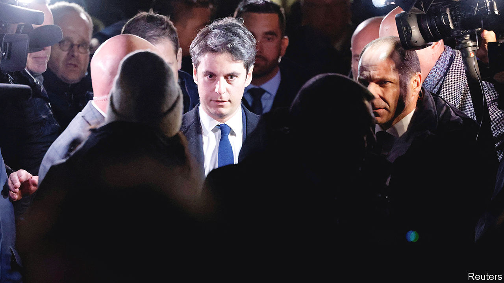

###### Meet a mini-Macron

# The president appoints modern France’s youngest prime minister 

##### Can the 34-year-old Gabriel Attal revive Emmanuel Macron’s fortunes? 

 

> Jan 9th 2024 

A constitutional perk enjoyed by modern French presidents is the right to dump their prime minister when in need of a fresh start. So Emmanuel Macron’s decision on January 8th to eject Elisabeth Borne, after little over 18 months in the job, was abrupt but not that surprising. Far more so was her replacement: Gabriel Attal, the 34-year-old education minister. Mr Attal will become France’s youngest modern prime minister.

The decision, announced on January 9th, is an attempt by Mr Macron to reset his troubled second term. Mr Attal is a daring rather than a safe choice, and one that carries its own risks. The education minister is younger than Mr Macron was when he first won election to the presidency in 2017, at the age of 39. Even Laurent Fabius, the youngest modern French prime minister to date, was 37 when nominated. It marks a distinct rejuvenation of French politics. Jordan Bardella, who is leading  at elections to the European Parliament in June, is 28. Mr Macron and Mr Attal have a combined age lower than that of America’s Joe Biden.

Youth in Mr Attal’s case does not mean inexperience, but this has been crammed into a short and rapid ascent. Mr Attal was also briefly budget minister, and was the government spokesman when his ease in public debates first made him a household name. In 2022 he was re-elected as a deputy. Mr Attal also happens to be openly gay, having made this public in 2018.

Politically, Mr Attal is a sort of mini-Macron, and was an early recruit to Mr Macron’s original political party, En Marche. Like his boss, Mr Attal hails from the moderate social-democratic left. He served as an adviser to the health minister under François Hollande, then the Socialist president. Also like Mr Macron in his early days, Mr Attal combines this with an appeal to the political right. As education minister Mr Attal won praise for banning in schools the wearing of the , a long Muslim robe, under French secular rules. In this respect, after three technocratic or right-leaning prime ministers, Mr Macron’s new appointee marks the return of his former hallmark centrist stamp.

Above all, Mr Attal brings the popularity that Mr Macron’s current team is sorely lacking. A poll in December made Mr Attal the most popular French politician, with a rating of 40%, 13 points above that for Mr Macron, and ahead of both Ms Le Pen (37%) and Mr Bardella (36%). In a snap poll taken after Mr Attal’s nomination, his approval rating leapt to 56%. The president will be hoping that this will inject some enthusiasm ahead of the , and help to reduce the crushing poll lead currently held by National Rally. The campaign may well turn into a duel between Mr Attal and Mr Bardella, a pair who represent the next political generation.

The trouble for Mr Macron, however, is that no amount of youthful energy and public charm will change the underlying problem: how to continue to reform France and take difficult decisions while running a minority government. Nor will Mr Attal’s nomination render a coalition with any opposition party any more likely. Jean-Luc Mélenchon, the leader of the left-wing opposition party Unsubmissive France, was scathing: “The presidential monarch governs alone with his court.”

Faced with an unruly opposition, the diligent Ms Borne did what she could. But the president wants to turn the page on a difficult year, marked by protests, summer riots and parliamentary chaos over an immigration bill. For the first time Mr Macron, who is constitutionally barred from running for a third term in 2027, seems to be contemplating his succession. In appointing Mr Attal, says an adviser, he is not anointing an heir. But he is trying to promote a new generation to secure the future of his centrist political movement.

It is nonetheless a gamble, not least because Mr Attal may well steal the president’s limelight. His nomination will also irk other potential centrist successors. And under the fifth republic only two ex-prime ministers, Georges Pompidou and Jacques Chirac, have gone on to win the presidency—neither of them straight from the top government job. ■


