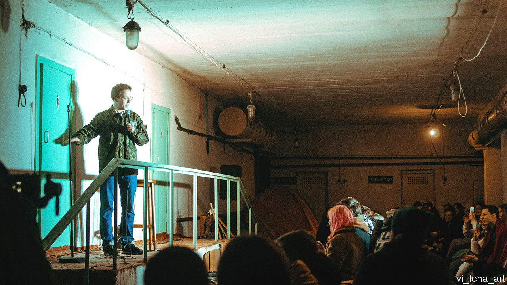

###### Laughter and fear

# Ukrainian stand-up comedy has seen a renaissance during the war 

##### But where should performers draw the line? 

 

> Jan 6th 2024 

Looking back, it was undoubtedly reckless. Russian tanks still menaced neighbouring towns. Locals were missing, dead or being held and tortured. And if Russian troops did manage to enter Sumy, just 30km from the eastern border, they would surely have no trouble identifying the ringleader. But for Felix Redka (pictured), a local comedian, organising a stand-up show on the 24th day of the Russian occupation of Sumy was more than just an act of defiance. It was fun. “When else would I have the opportunity to do stand-up in a nuclear bunker?” he says. 

Mr Redka’s gig in March 2022, watched by 150 nervous locals in real time and millions of online viewers since, marked a watershed. Anton Zhytlove, a comedian and businessman in Kyiv, says the gig gave an “emotional charge” to others still sheltering underground. “We didn’t know if we could joke or not,” he says. “Felix showed us a way to resist.” In the weeks that followed, Ukrainian stand-up comedy boomed. Mr Zhytlove will open his third new venue in Kyiv later this month, one of at least six in the capital alone. Belief, more than cashflow, is what is powering the Ukrainian expansion, he says. “It is also the best way to ensure you get a gig.”

Stand-up comedy was a thing in Ukraine long before the full-scale invasion. A circuit of sorts had developed by the late 2010s. But back then the business was dominated by touring Russian comics, mostly backed by Kremlin-financed TV companies. The market for local comics was more limited. “I had an average audience of about four,” recalls Mr Redka. But the invasion inverted the market. Ukrainian audiences began to demand Ukrainian comedians. And they discovered a group of artists who were more than capable of performing. Now the best of them perform to audiences of 1,500 or more. 

The language of comedy also changed. Before the war, most stand-up was performed in Russian. Now the genre is almost exclusively Ukrainian-language. Switching was not just a matter of principle, says Efim Konstantinovsky, a comedian hailing from Russian-speaking Dnipro. The market began to insist on it. 

Comedians have plenty of common experience to tap into: curfews, air alerts, friends and relatives on the front. “Comedians are like rats: we survive any disaster and are the first to emerge from tragedy,” says Vasyl Byduck, an absurdist performer. He says comedy offers support to Ukrainians, giving them a way to make fun of even the most horrific things. “We have a fancy phone app that tells you when the Russian missiles are about to land. You can even change the voice of the warnings. You can have Marge Simpson telling you you’re about to die.” 

Many of the jokes can appear harsh to an outsider. Dead Russian soldiers are a controversial recurring theme. “I don’t think that a dead Russian is ok,” counters Nastya Zukhvala, perhaps the most prominent woman in the new wave. “A dead Russian for me is not ok. It’s very good actually.” But war has also created no-go areas even for the most cynical of performers. Ukrainians can easily be triggered, says Mr Konstantinovsky. “I don’t let myself make many jokes about soldiers.” 

Mr Byduck thinks one rule is having an intimate knowledge of the subject. He would never make a joke about amputations, he suggests. But he has tried to make humour out of the personal tragedy of a relative who went missing in action last year, presumed dead. “Stand-up works best when you have personal experience to share, however tragic.” 

Ms Zukhvala, whose husband is serving at the front, says the war has proved there are few subjects that Ukrainians cannot deal with through humour. The problem is often the contrary: it is difficult to find material that is dramatic enough for Ukrainians to find funny. “A run-of-the-mill missile attack is no longer enough for us,” she jokes. “We have to go nuclear. The other day I remember waking up from explosions and being taken aback by this big, bright light. I thought, this is it! Perhaps I’m already in heaven? Then I realised, no, Nastya—that’s just the sunrise.” ■


