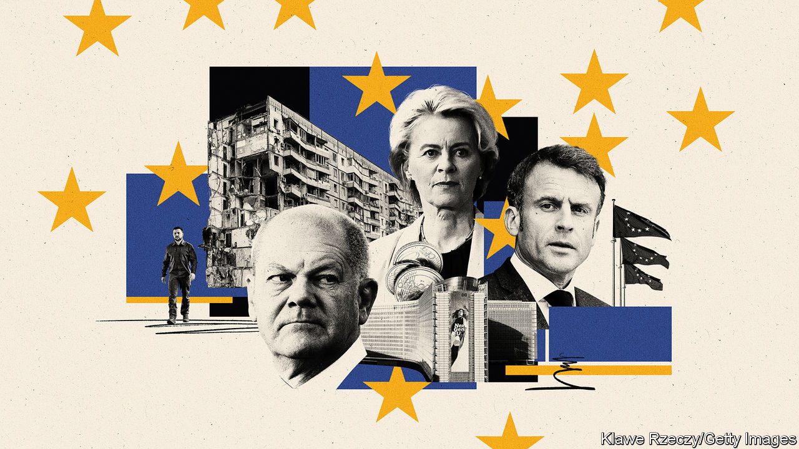
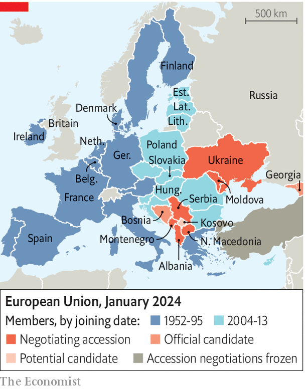

###### A new pecking order

# Who is in charge of Europe? 

##### The East is up, Germany is down, Britain is out 

 

> Jan 8th 2024 

Football is a game where “twenty-two men chase a ball for 90 minutes and at the end, the Germans always win,” quipped Gary Lineker, an English player. For decades the European project had similarly predictable dynamics: whether composed of six countries or 12 or 27, member states chased compromises until whatever had been stitched up by France and Germany was accepted by all. But the old model of dominance by its two biggest members has long been creaking. As Europe faces up to repeated crises a new, more fluid geography of power is taking shape.

Three years of pandemic, then war in Ukraine, have helped recast the EU. This includes shifting the balance of who matters. Defence and , once dormant policy areas, are now priorities—giving a new voice to Ukraine’s neighbours in central Europe. The rise of China, and the prospect of resurgent Trumpism in America, has caused the EU to rethink its economic arrangements—often along statist French lines. Climate imperatives have reinforced the value of taking action at a collective level—an approach favoured by the EU’s quasi-federal institutions in Brussels. And from Finland to France, populists on the hard right are gaining influence ahead of European Parliament elections in June.

Angela Merkel was the continent’s undoubted leader. Her successor as German chancellor, Olaf Scholz, has not taken on her mantle. Many looked to Emmanuel Macron to seize it, not least the French president himself. But he faces an increasingly fraught political situation at home, which on January 8th saw him fire his prime minister in the hope of a reboot. He cannot run for re-election in 2027, and his self-confident manner often grates among his fellow EU leaders. Germany and France carry unmatched authority when aligned. But they seldom are.

With no clear leadership, who matters these days depends on what is at stake. Take defence and security, issues at the front of everyone’s minds, seeing the situation in Ukraine and more recently the Middle East. After Russia’s invasion in February 2022, few looked to Germany for direction: it had let itself become hooked on Russian gas, and its armed forces were so  that Mr Scholz declared the need for a , a change in the spirit of the times. In contrast, countries in central Europe, led by Poland and the three Baltic states, felt vindicated after years of warning about the danger posed by Russia, their former overlord.

 


Their influence has been seen in two policy shifts. One is the EU itself paying for weapons to be sent to Ukraine, a first step into defence spending. The second is EU enlargement, which had previously been off the agenda; no country has joined since Croatia in 2013. Now nine candidates are in various stages of talks (see map). Most notable is Ukraine, whose cause was carried by central Europe despite initial reservations from France and Denmark; on December 14th EU leaders agreed to start formal accession talks. If and when the bloc expands to 36 countries—which will take years, if not decades—the centre of gravity will shift decisively eastward.

More broadly, the central Europeans now have enough heft to push back on ideas emanating from farther west. Chief among them is “strategic autonomy”, a shape-shifting concept pushed by Mr Macron. This holds that Europe should be able to act independently of others, for example by carrying more of the burden of defending itself. Policymakers in Poland or Slovakia find the security guarantees proffered by NATO—and thus America—far more convincing. French calls for EU armed forces to buy European (ie, often French) military kit have been largely ignored.

Still, for all the sway central Europe holds when it comes to Ukraine, its voice is scarcely heard when it comes to other bits of European policymaking. (The moral authority accumulated in Warsaw and Bratislava by helping Ukraine was somewhat dented after they closed their borders to its farm exports last April, irritating leaders in Kyiv.) For when it comes to economic policy, Europe is being made to think ever more in French terms. Here Mr Macron’s clarion call for strategic autonomy has proved far more potent. Driven by a long-standing distrust of globalisation—and new fears about supply chains that can be disrupted by pandemics or messy geopolitics—France wants the continent to be more self-sufficient. Tensions between America and China, as well as the prospect of a new Trump administration come 2025, have made other Europeans listen.

Mr Macron has pushed the notion that Europe has been “naive” in its dealings with the rest of the world, keeping its markets open when its trading partners have not: witness America with its protectionist green-transition plan, or China with outsize subsidies. EU rules banning national governments from coddling favoured industries were shelved during covid-19, and never snapped back. With a mantra of “Europe first”, politicians now wield more control over the shape of the economy. The French idea of Europe having an  was once taboo. Now it is the accepted approach.

France’s  impulses prevailed because its ideas filled the vacuum left by Britain, which voted to leave the EU in 2016 and finally exited four years later. Had it remained a member of the club, it would have foiled French plans with enthusiasm. Now the task is left to its erstwhile northern European allies, such as Denmark, Ireland or the Netherlands, as well as the commission in Brussels. But that loose alliance can merely water down French plans, not prevent them entirely.

Britain is not the only one not to be found at the EU’s top table. A more surprising absentee is Germany: Mr Scholz is seen as missing in action on the European scene. His tricky coalition including lefty Greens and free-market liberals has reduced his ability to cut deals in Brussels. “The German coalition moves slower than the debates within the EU,” rues a bigwig in Brussels. That has cost it influence.

Germany’s absence has often been France’s gain. Many EU decisions have a French tinge these days, for example the absence of any major new trade deals (abhorrent to French farmers) or a partial relaxation of European rules limiting budget deficits. But mostly the absence of German engagement stymies Mr Macron’s ambitions: federalist schemes hatched in Paris truly take flight only when counterparts in Berlin accede to them. Nobody thinks the poor chemistry between the chilly, northern Mr Scholz and the effervescently Europhile Mr Macron will soon improve.

Who else is there?

France might have sought helpful alliances. But there are few obvious places to look. Italy is led by Giorgia Meloni, whose hard-right populism makes dealing with the mainstream difficult. The Netherlands is losing its long-standing prime minister, Mark Rutte, perhaps in favour of Geert Wilders, an ideological ally of Ms Meloni. Spain’s chaotic politics have limited its appetite to sway European debate. The recently returned Donald Tusk in Poland is liberal and pro-EU, but is hobbled at home.

Perhaps the biggest beneficiary of this vacuum has been the EU’s centralised institutions in Brussels. Under the stewardship of Ursula von der Leyen, herself a German, since 2019 the European Commission, the EU’s executive arm, has accumulated more power than ever before. The 32,000-strong Brussels machine has long been a formidable regulatory force, as Silicon Valley barons have found over the years. But increasingly it has weighed in on matters of politics and geopolitics, too.

This started with covid-19, when governments asked the commission to oversee the procurement of vaccines for the entire bloc. An upshot of the pandemic-induced downturn was Next Generation EU, a €807bn ($890bn) recovery fund of loans and grants. The commission, by being in charge of its workings, has been able to steer the money in ways that match its own priorities. A good example is its plan to slash carbon emissions to net zero by 2050—an ambition officials in Brussels are far more enthusiastic about than many national politicians, who have to defend the policy to voters wary that the green agenda will further dent their purchasing power.

Having more discretion over EU money has given the commission fresh authority, dictating to member states how the cash should be spent. These powers can be used as a stick: Hungary and Poland have been deprived of money for hobbling the rule of law at home, for example in the way their courts are run. Viktor Orban, Hungary’s authoritarian leader, has been clamouring for around €30bn in suspended EU money. In Poland Mr Tusk campaigned in the autumn in part on his ability to unlock the EU funds that had been blocked due to his predecessor’s policies.

Is this the sign of a federal Europe rising, a European superstate in the making? To the likes of Hungary and Poland, it can feel like it. But there are limits to the powers of the commission. Part of Mrs von der Leyen’s influence stems from the fact she co-ordinates closely with national capitals, for example on sanctions against Russia. She can sway the debate, for example in Europe’s attitude to China, where she promoted a “de-risking” approach to trade, less confrontational than the “decoupling” suggested by America. Arguably she is the closest thing to a European leader these days. But her power still depends on others following her, even if, as expected, she is given a second term later this year. And Brussels still spends little more than 1% of the bloc’s total GDP.

Elections have a way of rejigging the European order, too. Populists have fared well in the Netherlands and Slovakia, not so in Poland and Spain. They are expected to gain ground in the European Parliament’s elections. The most powerful force in post-war Europe—a squishy consensus in favour of liberal values and the rule of law—may come under threat.

Once the Euro-elections are out of the way, attention will turn to those in America, still the chief guarantor of European security and the biggest contributor to Ukraine’s war effort. A Trump victory would be greeted with widespread horror. That votes cast an ocean away from Paris, Berlin or Warsaw will matter so much to Europe’s future will surely unleash arguments that the architecture of power there still has much evolving left to do. ■


