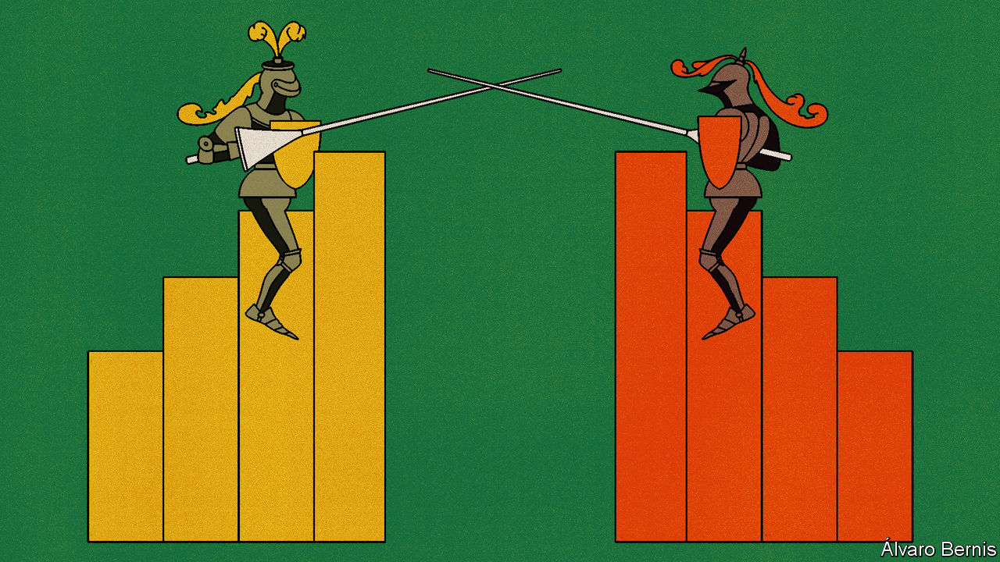

###### Free exchange

# Has Team Transitory really won America’s inflation debate? 

##### As prices cool, the battle heats up 

 

> Jan 10th 2024 

In late 2021 Jerome Powell, chairman of the Federal Reserve, called for the retirement of “transitory” as a description for the inflation afflicting America. The word had become a bugbear, having been taken by many to mean that the inflation which had bubbled up early in the year would fade away as supply shortages eased. As the months went by, not only were price increases accelerating, they were broadening out—from used cars to air fares, clothing, home furnishing and more. The economists who had warned that excessive stimulus and overheating demand, rather than production snarls, would make inflation a more serious problem seemed prescient. In the shorthand of the day, it looked as if “Team Persistent” had defeated “Team Transitory”.

Fast-forward to the present, and something strange has happened. The Fed, along with most other major central banks, has acted as if Team Persistent was right. It jacked up short-term interest rates from a floor of 0% to more than 5% in the space of 14 months. Sure enough, inflation has slowed sharply. But here is the odd thing: the opposite side of the debate is now celebrating. “We in Team Transitory can rightly claim victory,” declared Joseph Stiglitz, a Nobel prizewinner, in a recent essay.

What is going on? For starters, the term “transitory” was long misunderstood. The narrowest definition, and the one that investors and politicians latched onto, was a temporal one—namely, that inflation would recede as swiftly as it had emerged. Yet another way of thinking about it was that inflation would come to heel as the post-pandemic economy got back to normal, a process that has played out over the course of years, not months.

Moving beyond semantics, the nub of the debate today is whether recent disinflation is better explained by the tightening of monetary policy or the unsnarling of supply chains. If the former, that would reflect the vigilance of Team Persistent. If the latter, that would be a credit to the judgment of Team Transitory.

There is much to be said for the supply-side narrative. The main economic model for thinking about how interest rates affect inflation is the Phillips curve, which in its simplest form shows that inflation falls as unemployment rises. In recent decades the Phillips curve has been a troubled predictive tool, as there has been little correlation between unemployment and inflation. But given the surge in inflation after covid-19 struck, many economists once again turned to its insights. Most famously, Larry Summers, a former treasury secretary, argued in mid-2022 that unemployment might have to reach 10% in order to curb inflation. Instead, inflation has dissipated even while America’s unemployment rate has remained below 4%. No mass unemployment was needed after all—just as Team Transitory predicted.

Some have tried to rescue the Phillips curve by replacing unemployment with job vacancies. In this curve it was a fall in vacancies from record-high levels that delivered the labour-market cooling necessary for disinflation. Yet this explanation also comes up short, argues Mike Konczal of the Roosevelt Institute, a left-leaning think-tank. For inflation to have slowed as much as it has, the modified Phillips curve would have predicted an ultra-sharp fall in vacancies. And with 1.4 vacancies per unemployed worker, the American jobs market is still pretty tight. Again, this is closer to the immaculate disinflation of Team Transitory’s dreams.

Moreover, Mr Konczal points to evidence of the supply-side response that enabled this. Looking at 123 items that are part of the Fed’s preferred “core” measure of inflation, he finds that nearly three-quarters have experienced both declining prices and increasing real consumption, which suggests that the most potent factor in bringing about disinflation was a resumption of full-throttled production, not a pull-back in demand.

Nevertheless, the notion that Team Transitory was right all along leads to a perverse conclusion: that inflation would have melted away even without the Fed’s actions. This might have seemed credible if the Fed had merely fiddled with rates. It is much harder to believe that the most aggressive tightening of monetary policy in four decades was a sideshow. Many rate-sensitive sectors have been hit hard, even if American growth has been resilient. To give some examples: a decade-long upward march in new housing starts came to a sudden halt in mid-2022; car sales remain well below their pre-covid levels; fundraising by venture-capital firms slumped to a six-year low in 2023.

This leads to a counterfactual. If the Fed had not moved decisively, growth in America would have been even stronger and inflation even higher. One way to get at this is to craft a more elaborate Phillips curve, including the broader state of the economy and inflation expectations, and not just the labour market. This hardly settles the matter, since economists differ on what exactly should be included, but it does make for a more realistic model of the economy. Economists with Allianz, a German insurance giant, have done the calculations. They conclude that the Fed played a vital role. About 20% of the disinflation, in their analysis, can be chalked up to the power of monetary tightening in restraining demand. They attribute another 25% to anchored inflation expectations, or the belief that the Fed would not let inflation spiral out of control—a belief crucially reinforced by its tough tightening. The final 55%, they find, owes to the healing of supply chains.

Tallying the scores

The result is a draw between the teams when it comes to diagnosis: about half of inflation was indeed transitory. But what matters most is policy prescriptions. In the summer of 2021, believing inflation to be transitory, the Fed projected that interest rates would not need to rise until 2023, and even then to only 0.5-0.75%—a path that would have been disastrous. Boil the debate down to the question of how the Fed should have responded to the inflation outbreak, and Team Transitory lost fair and square. ■


