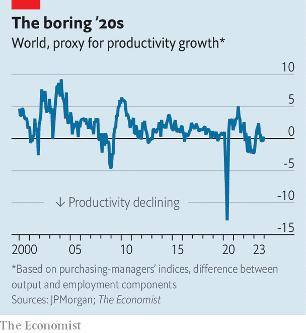

###### Doesn’t compute

# What happened to the artificial-intelligence investment boom? 

##### Perhaps AI is a busted flush. Perhaps the revolution will just take time 

 

> Jan 7th 2024 

Many economists believe that generative  is about to transform the global economy. A paper published last year by Ege Erdil and Tamay Besiroglu of Epoch, a research firm, argues that “explosive growth”, with gdp zooming upwards, is “plausible with ai capable of broadly substituting for human labour”. Erik Brynjolfsson of Stanford University has said that he expects ai “to power a productivity boom in the coming years”. 

For such an economic transformation to take place, firms need to spend big on software, communications, equipment and factories, enabling AI to slot into production processes. An investment boom was required to allow previous breakthroughs, such as  and the personal computer, to spread across the economy. From 1992 to 1999 American non-residential investment rose by 3% of gdp, for instance, driven in large part by spending on computer technologies. Yet so far there is little sign of an ai splurge. Across the world, capital expenditure by businesses (or “capex”) is remarkably weak. 

 


After sluggish growth in the years before the covid-19 pandemic, capex increased as lockdowns lifted (see chart). In early 2022 it was rising at an annualised rate of about 8% a year. A mood of techno-optimism had gripped some businesses, while others sought to firm up supply chains. Capex then slowed later the same year, owing to the effects of geopolitical uncertainty and higher interest rates. On the eve of the release of OpenAI’s GPT-4 in March 2023, global capex spending was growing at an annualised rate of about 3%. 

Today some companies are once again ramping up capex, to seize what they see as the enormous opportunity in ai. This year forecasters reckon that Microsoft’s spending (including on research and development) will probably rise by close to 20%. Nvidia’s is set to soar by upwards of 30%. “AI will be our biggest investment area in 2024, both in engineering and compute resources,” reported Mark Zuckerberg, Meta’s boss, at the end of last year.

Elsewhere, though, plans are more modest. Exclude firms driving the AI revolution, such as Microsoft and Nvidia, and those in the S&amp;P 500 are planning to lift capex by only around 2.5% in 2024—ie, by an amount in line with inflation. Across the economy as a whole, the situation is even bleaker. An American capex “tracker” produced by Goldman Sachs, a bank, offers a picture of businesses’ outlays, as well as hinting at future intentions. It is currently falling by 4% year on year. 

Surely, with the ai excitement, spending on information technologies is at least soaring? Not quite. In the third quarter of 2023 American firms’ investment in “information-processing equipment and software” fell by 0.4% year on year. 

 


Similar trends can be seen worldwide. According to national-accounts data for the oecd club of mostly rich countries, which go up to the third quarter of 2023, investment spending—including by governments—is growing more slowly than before the pandemic. A high-frequency measure of global capex from JPMorgan Chase, another bank, points to minimal growth. Weak capex helps explain why there is little sign of productivity growth, according to a real-time measure derived from surveys of purchasing managers. 

An official survey in Japan does point to sharply higher capex growth, after years of sluggishness. Yet this probably reflects factors specific to that country, such as corporate-governance reforms. In most places outside America the situation is rather less encouraging. A worsening outlook for the economy in Europe makes things difficult. Investment intentions of services firms in the European Union are less than half as ambitious as they were in early 2022. British businesses plan to raise capex by a mere 3% over the next year, compared with 10% when asked in early 2022. 

These trends suggest one of two things. The first is that generative AI is a busted flush. Big tech firms love the technology, but are going to struggle to find customers for the products and services that they have spent tens of billions of dollars developing. It would not be the first time in recent history that technologists have overestimated demand for new innovations. Think of the metaverse.

The second interpretation is less gloomy, and more plausible. Adoption of new general-purpose tech tends to take time. Return to the example of the personal computer. Microsoft released a groundbreaking operating system in 1995, but American firms only ramped up spending on software in the late 1990s. Although analysis by Goldman Sachs suggests that only 5% of chief executives expect AI to have a “significant impact” on their business within one to two years, 65% think it will have an impact in the next three to five. AI is still likely to change the economy, even if it will not do so immediately. ■


