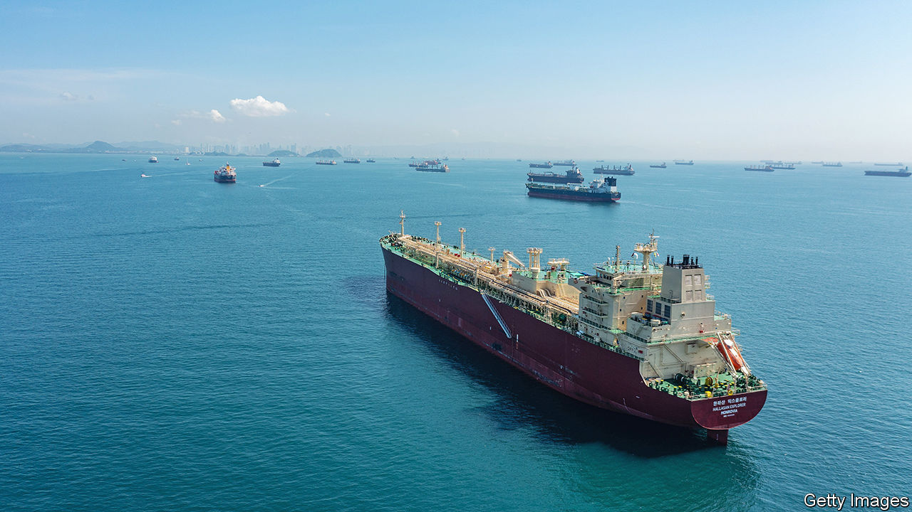

###### Bottle job

# Will spiking shipping costs cause inflation to surge? 

##### Disruption in the Suez and Panama canals is prompting concern 

 

> Jan 11th 2024 

When economists talk about bottlenecks, they typically refer to points in a supply chain that slow down production. The global economy is at present providing a rather literal example of the metaphor. It is as if someone has put a cork in the Suez and Panama canals.

In normal times, the canals carry about 10% and 5% of maritime global trade respectively. Now the  has capped the number of ships that may traverse its channel, owing to low water levels. Attacks by  on ships in the strait of Bab al-Mandab, part of the passage from the Indian Ocean to the Suez Canal, have prompted some of those travelling between Europe and Asia to take the longer route round Africa instead.

Given that the rich world at last appears to be defeating inflation, this is making policymakers nervous. Rising shipping prices from mid-2020 to early 2022 coincided with the surge of inflation in the first place. Their subsequent fall coincided with its decline. Since the Houthi attacks on ships began in November, prices have once again jumped. According to the Freightos Baltic Index (fbx) the cost of shipping a standard container rose by 93% in the week to January 9th. Drewry, a consultancy, notes that for the Shanghai to Rotterdam route, which would usually , the cost jumped by 114% to $3,577 over a similar period.

 


But a repeat of pandemic-era inflation is unlikely. The shipping snarl-up is not yet on the same scale as last time (see chart). Although the fbx is rising, it is only at a quarter of the peak reached in 2022. In September 2021 respondents to a survey of purchasing managers conducted by s&amp;p Global Ratings, a data provider, were 17 times more likely than the long-run average to say that shipping costs were contributing to higher prices. In the latest survey they were only three times more likely. 

Future surveys may well indicate more concern. Annual shipping contracts are typically agreed in March, notes Chris Rogers of S&amp;P, meaning that current rates do not reflect the true cost of transport. If disruption lasts until contracts are renegotiated this could swiftly change, he adds.

Ultimately, though, the inflationary impact of bottlenecks reflects the degree of mismatch between supply and demand. Economists at the annual meeting of the American Economic Association, held from January 5th to 7th in San Antonio, Texas, discussed a number of papers on this topic. According to one, presented by Oleg Itskhoki of the University of California, Los Angeles, price growth as a result of bottlenecks during covid-19 was more persistent in America than elsewhere. 

Other papers suggest why this was the case. One, outlined by Ana Maria Santacreu of the St Louis branch of the Federal Reserve, found that in countries where governments provided more fiscal stimulus, such as America, the post-pandemic reopening did less to alleviate supply-chain bottlenecks than elsewhere. “Supply constraints bind during periods of high demand,” she concluded. Another paper, presented by Callum Jones, an economist on the Federal Reserve’s board, agreed with the conclusion. Bottlenecks explained about half the rise in inflation from 2021 to 2022, his work found, but that was because they exacerbated loose monetary policy. 

Although difficulties in the Suez and Panama canals echo recent history, the context is very different. Rich-world policymakers are no longer attempting to use fiscal and monetary policy to juice demand. The global economy is also not trying to adjust to a shift from services to goods, which economists considered another culprit for snarled supply chains. 

In the most recent S&amp;P survey respondents were 50% less likely to point to higher demand as a reason for extra costs than the long-run average; two years ago they were 75% more likely to do so. As a consequence, business leaders are more relaxed about the current crunch. The world’s great shipping canals may be bottlenecks. Fortunately, however, there is not much pressure in the rest of the bottle. ■


