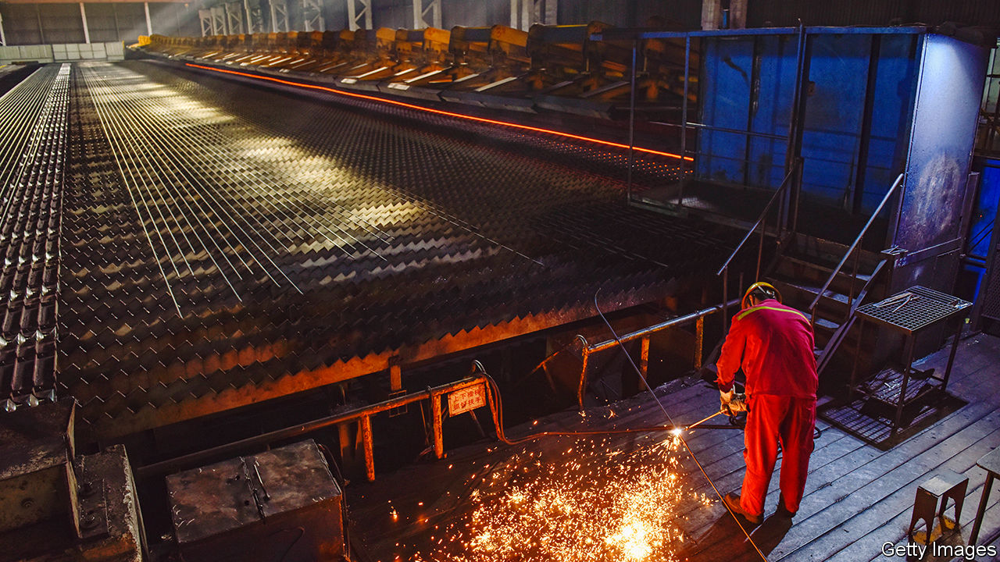
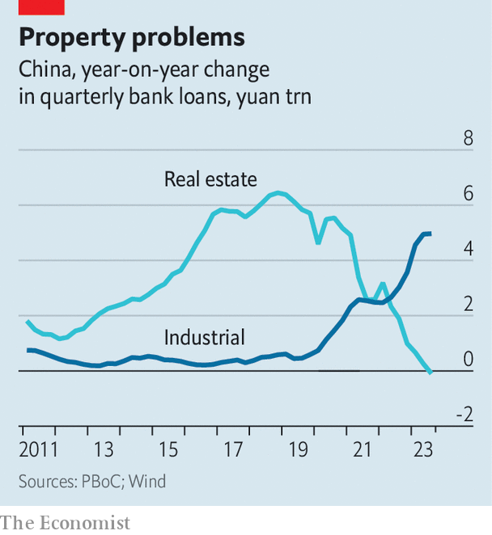
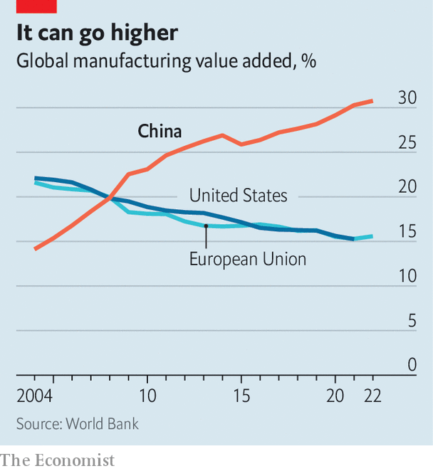

###### Steel yourself

# Xi Jinping risks setting off another trade war 

##### Why Western politicians should prepare for a second “China shock” 

 

> Jan 9th 2024 

China’s leaders are obsessed with lithium-ion batteries, electric cars and solar panels. These sorts of technologies will, Xi Jinping has proclaimed, become “pillars of the economy”. He is spending big to ensure this happens—meaning, in the years to come, that his ambitions will be felt across the world. A manufacturing export boom could very well lead to a trade war.

Mr Xi’s manufacturing obsession is explained by the need to offset China’s property slump, which is dragging on economic growth. Sales by the country’s 100 largest real-estate developers fell by 17% in 2023, and overall investment in residential buildings dropped by 8%. After a decade in which capital spending on property outstripped economic growth, officials now hope that manufacturing can pick up the slack. State-owned banks—corporate China’s main source of financing—are funnelling cash to industrial firms. In return for an extension of pandemic-era tax breaks and carve-outs for green industries, exporters in powerhouse provinces have been told to expand production. During the first 11 months of 2023 capital spending on smelting metals, manufacturing vehicles and making electrical equipment rose by 10%, 18% and 34%, respectively, compared with the same period in 2022.

Such developments will be prompting flashbacks among veteran Western policymakers. China’s rise was accompanied by an epochal shift in global trade. In the decade that followed the country’s accession to the World Trade Organisation in 2001, its exports rose by more than 460%. China became the number-one target for accusations of dumping—selling goods abroad at lower prices than at home—in industries including chemicals, metals and textiles. Although low-cost goods were great news for consumers, they were less welcome for some rich-world industrial workers. It later became fashionable to blame the “China shock”, which led to lay-offs in affected industrial areas, for contributing to Donald Trump’s electoral victory in 2016.

The coming manufacturing boom could be even larger, given the sheer scale of the Chinese economy, which has doubled in size over the past decade. Michael Pettis of Peking University notes that even if China simply were to maintain the current size of its manufacturing sector, which accounts for 28% of GDP, and were to achieve its target of 4-5% gdp growth over the next decade, its share of global manufacturing output would rise from 31% to 36%. If Mr Xi’s ambitions are fulfilled, the increase will be bigger still.

China’s capital investment, which is more than double America’s as a share of GDP, is funded by its thrifty households and their saving piles. During earlier manufacturing booms, some observers had expected the country’s consumers to use these savings to splurge on goods, only to be proved wrong. Consumers are likely to continue to prefer saving to spending. In 2023 private consumption rose by 10%, rebounding from a grim 2022. But most analysts now expect much slower overall growth, owing to tumult in the property market and the government’s wariness about borrowing to support household incomes. In the absence of higher private consumption, “policymakers would need to bring the economy down much faster to correct overcapacity”, says Alicia Garcia-Herrero of Natixis, a bank. “It would have to grow at 3-4%, not 5%.” Alternatively, if the higher rate of growth is to be sustained, more goods will have to be sold abroad. 

 


It will help that they are getting cheaper—as can be seen in the steel market, which is vital for China’s car and renewable industries. Early last year investors expected output to fall, as Chinese construction flagged. Instead, in a remarkable feat, the country’s steel giants produced more metal even as the property industry suffered. Steel mills, which have access to cheap capital, are willing to take considerable losses in order to preserve market share. 

As a result, industrial prices fell by 2% in the first 11 months of 2023, and profits by 4%. In 2012, during a previous era of manufacturing stimulus, overcapacity meant that the profit on a couple of tonnes of steel “was just about enough to buy a lollipop”, according to Yu Yongding, an economist. Many producers are now heading for a similar situation. An employee at a supplier in Shanghai estimates that some are losing about 350 yuan ($50) on each tonne of steel reinforcement they sell. Meanwhile, renewable firms, such as LONGi, the world’s largest solar-equipment manufacturer, and Goldwind, a wind-turbine maker, are also suffering. Both reported sharply lower profits in the third quarter of 2023.

 


It is not only China’s industrial prices that are falling—the country’s currency is, too. The yuan is down by 9% on a trade-weighted basis since its peak in 2022, meaning that overseas competitors face a double whammy. At the same time, Western politicians are more willing to fight on behalf of domestic firms than during the last era of Chinese manufacturing stimulus. Attitudes towards Chinese exports have hardened. Western countries are both more protective of their domestic industrial bases and more sceptical that China will eventually become a market economy. 

Frictions are already starting to develop. In November Britain launched a probe into Chinese excavators, after JCB, a local firm, alleged that Chinese rivals were flooding the market with cut-price machines. The eu is conducting an anti-subsidy probe into Chinese electric vehicles and an anti-dumping probe into Chinese biodiesel. The Biden administration has asked the eu to tax Chinese goods, offering to drop American tariffs on European steel in return. On January 5th China decided to hit Europe where it hurts, announcing an anti-dumping investigation into brandy. 

And it is not just the rich world that is getting angry. In September India imposed fresh anti-dumping duties on Chinese steel; in December it introduced new duties on industrial laser machines. Indeed, almost all the anti-dumping investigations that India’s trade authorities are now conducting concern China. On the other side of the world, Mexico is in a tricky spot. It benefits from decisions by Chinese companies to move production in order to avoid American tariffs, but it also wants to avoid domestic markets being flooded by subsidised imports. It seems the latter is now taking precedence. In December the government announced an 80% tariff on some imports of Chinese steel. 

China’s leadership has little room for manoeuvre. In December officials issued a statement calling industrial overcapacity, exacerbated by weak domestic demand, one of the biggest challenges facing the economy. Given the numerous other challenges facing the economy, they can hardly afford to alienate more of China’s trading partners with fights over dumping and subsidies. Unfortunately, the alternative—a new year with nothing to offset the property mess and lacklustre consumer spending—may be even less attractive. ■


