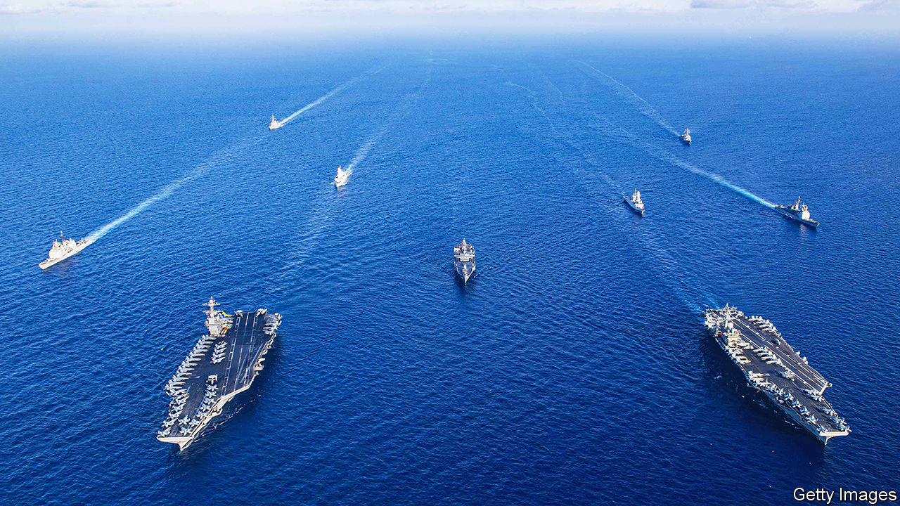
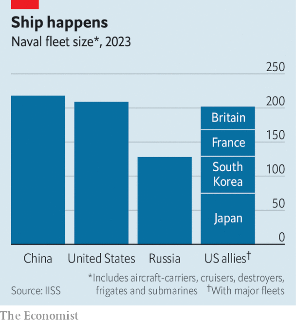
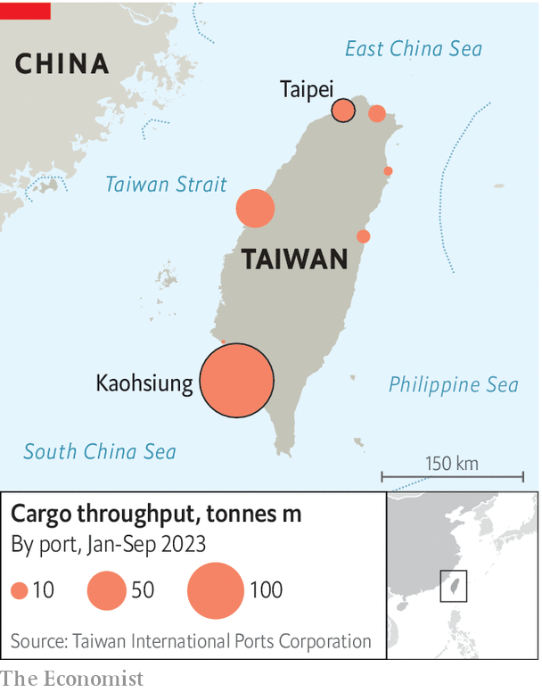

###### Gun, boat, diplomacy

# Welcome to the new era of global sea power 

##### Naval might is back at the heart of competition—and conflict 

 

> Jan 11th 2024 


THE OCEANS matter in geopolitics once more. In the Middle East the Houthi rebel group is menacing shipping in the Red Sea, disrupting global trade. On January 12th America and Britain launched strikes on over 60  in Yemen. The allies strikes are an attempt to reassert freedom of navigation in a crucial artery of world trade but also dramatically expand the geographic scope of the Middle East conflict. Taiwan stands on the cusp of an election that could shape its future. A fight over the island would involve an intense Sino-American naval war stretching well beyond the Pacific. And in Europe the war in Ukraine may turn on the maritime  and Crimea. Sea power is back.

There are bright spots for Western navies in this new era.  still possess the most advanced submarines. They are bound together in naval alliances and partnerships unmatched by Russia or China. But their naval dominance is eroding. China’s navy is now the world’s largest (see chart). American shipyards have withered. And European navies are a shadow of their former selves, having shed 28% of their submarines and 32% of frigates and destroyers between 1999 and 2018.

 


These are dismaying trends. Despite growing protectionism, the seas remain a vital conduit for the world economy. In 2023 the ClarkSea, a measure of the average daily earnings for the world’s shipping fleets, was 33% above its ten-year trend. Seaborne trade was up by 3% to 12.4bn tonnes and global shipbuilding was up by 10%: China produced over half of output for the first time. Around 80% of global trade by volume travels by sea and about 50% when measured by value. 

There is no shortage of reminders of what happens when that is disrupted. The covid-19 pandemic in 2020 caused chaos in supply chains, as did the blockage of the Suez Canal a year later by the , a container ship. Russia’s invasion of Ukraine in 2022 played havoc with the world grain market. And Houthi missile strikes in the Red Sea in recent months—a far cry from the low-tech pirate plague of the 2000s and 2010s—have caused Asia-to-Europe freight costs to triple as shipping reroutes around South Africa.

Maritime arteries do not just carry physical goods. TeleGeography, a data-analysis firm, counts more than 574 active or planned submarine telecoms cables around the world, carrying 97% of global internet traffic. The war in Ukraine and resulting tensions in Europe have underscored the geopolitical risk to this infrastructure. In 2022 the Nordstream 1 and 2 gas pipelines through the Baltic Sea were blown up by unknown assailants. A year later data cables between Estonia, Finland and Sweden were mysteriously cut. 

If the oceans are at the heart of the international order, they are also the landscape where challenges to that order are playing out. The crux of Sino-American rivalry concerns dominance over maritime Asia. America and its allies are joining hands to contest China’s claims to the South China Sea and track its growing fleet of subs and ships. The People’s Liberation Army Navy (PLAN) is building aircraft-carrier strike groups—its third homemade carrier, the , is nearly complete—and increasing the size and frequency of naval drills around Taiwan. It is also seeking a niche in ports around the world, from the Solomon Islands to Equatorial Guinea to the United Arab Emirates.

Clouds gather

Geopolitics at sea is distinctive in several ways, observes Alessio Patalano of King’s College London. Armies deploy to a particular place, carry out a mission and return. A training mission will rarely turn into a war. Warships, by contrast, deploy for open-ended voyages whose purpose can change at a moment’s notice. A ship may make a friendly port call one day and shoot down Houthi missiles the next. 

Moreover, the oceans are natural environments for competition. The high seas are international waters. The UN Convention on the Law of the Sea (UNCLOS) grants countries a 200-nautical-mile exclusive economic zone off their coasts, yet states quibble over the details. America has not signed UNCLOS; China disregards key provisions. Armies in peacetime rarely encounter each other amid such haze. 

At the same time, naval power is a supple tool of statecraft because it can resist swift escalation. In a crisis on land, armies can be reinforced quickly with fresh troops. At sea, sending forces to a flashpoint takes longer. Attribution—working out who attacked whom—also takes longer. Naval crises are thus less likely to spiral into bloodshed. Mr Patalano cites South Korea’s decision to show restraint after a North Korean submarine attacked and sank one of its warships in 2010.

Still waters run deep

The relatively slow pace of naval confrontations, and their inherent ambiguities, help explain why China has used militarised fishing fleets to bully its neighbours across the South China Sea. The most recent example is in the Philippines, where Chinese vessels have rammed and harassed Filipino ones attempting to resupply Second Thomas Shoal, a small reef which China claims. On January 3rd America responded by sending an aircraft-carrier to exercise with the Philippines.

This peacetime shadow-boxing has a minatory quality. In the post-cold-war era the oceans had become a “benign conduit for the projection of power”, says Nick Childs of the International Institute for Strategic Studies (IISS), a think-tank in London. American and allied navies bombarded Afghanistan and Iraq at leisure. Occasionally they hunted pirates. “Now,” says Mr Childs, “we’re back into a new age where people are having to prepare for the potential for warfighting at sea.” This is unfamiliar territory. The last officer to have served in the Falklands war between Britain and Argentina, the last big naval war waged by a NATO country, is long retired.

To fight hardier foes, ships are getting bigger and better armed, notes Mr Patalano, pointing to the example of the Italian navy’s —an offshore patrol vessel. These were usually small ships for coastal defence. But new ones are often the same size as 1990s-era frigates and come armed with air-defence systems and heavier weaponry. America’s next generation of destroyers might carry one-third more missiles than the current ones.

The prospect of high-intensity naval warfare is also boosting the importance of submarines. Modern surveillance and precision-guided weapons put large surface vessels increasingly at risk, particularly closer to enemy shores. Submarines are far less vulnerable to this. Though their movements and missions are usually shrouded in secrecy, they can sneak into enemy waters to collect electronic intelligence or deliver special forces, covertly track enemy fleets at sea or loiter offshore in a crisis with the capacity to fire volleys of missiles. America’s Ohio-class subs carry up to 154 cruise missiles, 26% more than America’s best-armed surface ship. 

 


Undersea warfare is particularly important because that is where the West has its sharpest technological edge over Russia and China, both of which have limited capacity to detect, track and target American and allied subs. That explains why a midsized power like Australia is willing to spend hundreds of billions of dollars over three decades on leasing American nuclear-powered subs and building new ones with Britain. The AUKUS deal was announced by the three countries back in 2021. The prospective AUKUS-class sub also shows the increasing emphasis on firepower: unlike Britain’s current attack sub, it will have a vertical launch system (VLS), upright tubes with many more missiles, and more advanced ones, than traditional torpedo tubes. 

The wars in Ukraine and the Middle East show how such arms might be put to use in a major conflict at sea. Russia has laid mines in Ukrainian waters and fired missiles at cargo ships berthed in Odessa. The Houthis have fired drones and ballistic missiles at commercial shipping, and have managed to board at least one vessel. 

Blockade tactics are of deep interest because they would be crucial to any war in Asia. “If there is a war over Taiwan,” writes Lonnie Henley, a former China analyst for the Pentagon’s Defence Intelligence Agency, “an extended Chinese blockade is likely to determine the outcome.” A paper by Michael O’Hanlon of the Brookings Institution in Washington models a conflict in which China blockades the island by requiring all ships wishing to visit Taiwan to dock on the Chinese mainland for inspection. To understand the possible challenges ahead, it is worth scrutinising the paper. 

In the scenario an American-led coalition of around a hundred warships attempts to break the blockade by clearing a shipping lane hundreds of miles to the east of Taiwan. It would take a month or more to clear minefields, estimates Mr O’Hanlon, and longer if China could deploy advanced mines capable of repositioning themselves autonomously. America or Taiwan would need to subsidise insurance payments, reflag cargo ships or promise to reimburse owners if their vessels were sunk. They would also need to find crews willing to head into a war zone. “Many thousands of personnel would likely die,” concludes the paper. 

In fact, says Mr Henley, reopening the shipping lanes east of the island would not suffice. Taiwan’s east-coast ports are isolated by high mountains and narrow roads that rely on vulnerable tunnels. Even if it were to destroy the Chinese fleet in battle, America would still have to get hundreds of tonnes of cargo into Taiwan’s main ports in the west every day, for months, “in the face of extensive mining and hostile fire, close to China and under conditions of Chinese air superiority”. Supply by air would probably be impossible, he adds. 

Samuel Paparo, the admiral nominated to be the next commander of The United States Indo-Pacific Command, has insisted that America could break through a Chinese quarantine: “The US alone has every capability to break such a blockade.” Mr O’Hanlon is less sure. His calculations suggest that the outcomes are “too close to call”. Mr Henley is gloomier still. America has created a navy built to defeat a Chinese landing on Taiwan, he warns, not one capable of penetrating a blockade of Taiwanese ports and airfields for prolonged periods: “We cannot win with the force we are currently building.” 


The ability to exploit sea power cuts both ways. Taiwan is vulnerable to blockade because it depends on seaborne imports for energy and agriculture. But China also has to ship in most of its oil as well as raw materials. One retaliatory option would be a “close-in” blockade near Chinese ports, attacking ships and laying mines just as Russia does against Ukraine. That, however, would present many of the same problems as an effort to open Taiwanese ports, including the risk of nuclear escalation arising from strikes against the Chinese mainland. 

An easier and safer approach might be a “distant” blockade: stopping China-bound ships at choke points like the Strait of Hormuz or the Strait of Malacca. Fiona Cunningham of the University of Pennsylvania calculates that America’s navy is large enough to intercept only a quarter of merchant vessels passing through South-East Asian straits. A blockade would take a month to put into effect, she reckons, and would need to be sustained for at least six months to cause shortages of civilian and military goods in China. 

Such a blockade would demonstrate two important aspects of sea power. One is that it relies on global alliances, just as in an earlier age it relied on global empires. Indonesia, Malaysia, Papua New Guinea, Singapore and other partners in the region would have to permit America to use their waters and airfields, notes Ms Cunningham. The other is that the multinational nature of modern shipping poses a severe challenge to would-be blockaders deciding what to stop and what to let through. The , for instance, was Japanese-built and owned but chartered by a Taiwanese company, crewed by Indian officers and bringing goods from China to Europe. 

Blockades also show how technology is changing naval warfare. Robotic mines can scoot around, making them easier to lay. “A lot of blockades could be done by uncrewed vehicles,” suggests Kevin Rowlands, who heads the Royal Navy’s think-tank. Cyber operations could check a ship’s documentation and route, he adds. Conversely, Ukraine has illustrated how drones can also attack a blockading fleet. 

Though Ukraine has made ample use of old-fashioned anti-ship missiles, weapons which proved their worth more than 40 years ago in the Falklands war, it has also employed  (USVs)—essentially drone boats—to repeatedly strike Russian ships in the Black Sea and ports on the Crimean and Russian coast. On January 4th a Houthi USV even came within a couple of miles of American warships and an assortment of merchant shipping before it blew up.

Almost all major navies plan to operate large USV fleets in the future, alongside crewed ships. Technology is outpacing the law. Much of the relevant law is more than a century old, says Commander Caroline Tuckett, the Royal Navy’s top adviser on international law. Even in peacetime the UNCLOS, adopted in 1982, puts obligations—such as rendering assistance to mariners in distress—on the “master” of a vessel or the commanding officer of a warship. A USV navigating autonomously has neither.

Sceptics argue that the military impact of USVs has been hyped. Basic gunfire, well aimed, could take many of them out. New weapons, like shipborne lasers, which most big navies are testing, might further tilt the advantage to the defender. Nevertheless, Captain Rowlands argues that a structural shift has taken place in the nature of naval power. “Having a navy used to be a very expensive thing,” he says. “There were great barriers to entry. Now there aren’t. You don’t need to have a baroque navy with billion-pound destroyers to exert influence at sea.” 

Perhaps not. But in a global contest for the oceans, guerrilla raiding will not suffice. Moreover, the stress on larger, better-armed and costlier warships has led to fewer of them. The Royal Navy, which once bestrode the world’s oceans, will soon fall to a paltry 16 frigates and destroyers. It has just 70 ships in total. In the space of around one year alone, 2022-23, the PLAN grew by around 30 ships, of which 15 were classed by the Pentagon as “major surface combatants”. A slide from last year produced by the Office of Naval Intelligence, which is a branch of the US Navy, showed China having 50-55% more warships than America by 2035.

Russia’s war in Ukraine has demonstrated that wars of attrition demand mass and scale. That is even more pronounced at sea. Fresh soldiers can be conscripted and tanks scraped up from warehouses. Such choices are not open to navies, says Mr Patalano; replacing a single warship takes three to five years. Replenishment is expensive, hard and slow.

If a war lasts that long, America will be at a disadvantage. Chinese shipyards have a capacity of more than 21m gross tonnes, a measure of a ship’s volume, according to American intelligence estimates. America can manage less than 100,000, though its allies Japan and South Korea would help close the gap somewhat. America’s navy suffers from “a huge disconnect” between what it needs and what it has persuaded Congress and American taxpayers to fund, says Emma Salisbury of Birkbeck College in London. She notes that the British navy’s share of the defence budget has remained steady, at about one-third, for 50 years.

Sea change

Competing in an age of sea power will require not just larger navies and the capacity to build them but also a change in mindset. Diplomacy will have to focus on ports, maritime alliances and trade routes. Sailors will need to be recruited and trained in far larger numbers. America will have to revive its merchant marine fleet to have any hope of moving sufficient troops and equipment in a Pacific war. 

In his book on the Battle of Jutland, the indecisive naval battle of the first world war, Andrew Gordon, a historian, sought to explain what went wrong for the Royal Navy. The issue, he concluded, was the “long, calm lee of Trafalgar”. Britain’s naval victory over Napoleon in 1805 gave way to a long period of complacency and drift. In 1916 none of Britain’s admirals had waged a major war. Command of the seas was taken for granted among the military elite. That resonates today. “You’re seeing the long, calm lee of the second world war,” warns Mr Childs. The churning waters of the Black Sea, Red Sea and South China Sea suggest a storm now approaches instead. ■


