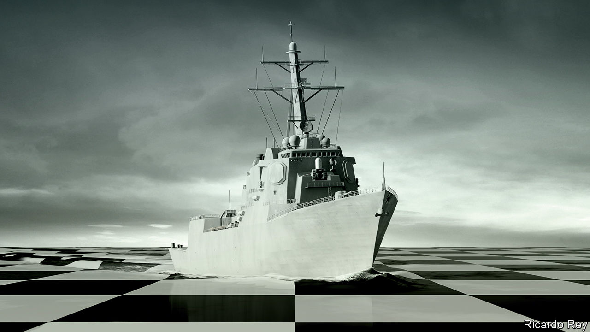

###### Red Sea, Black Sea, South China Sea

# America fights back 

##### The war against the Houthis is part of an escalating struggle for the seas 

 

> Jan 11th 2024 

Around the world a storm is building on the oceans after decades of calm. In the Red Sea Houthi militias have launched dozens of attacks on ships with drones and missiles, cutting container activity in the  by 90%. On January 12th America and Britain responded with more than 60 sea and air attacks on Houthi targets in Yemen in an attempt to restore open passage, expanding the scope of the Middle East conflict. President Joe Biden threatened further military action and said America would not allow “hostile actors to imperil freedom of navigation in one of the world’s most critical commercial routes”. 

The escalation in the Red Sea is mirrored by maritime mayhem elsewhere. The Black Sea is filling up with mines and crippled warships; this year Ukraine hopes to eject the Russian navy from Crimea, its base since Catherine the Great. The Baltic and North seas face a shadow-war of pipeline and cable sabotage. And Asia is seeing the largest build-up of naval power since the second world war, as China tries to coerce Taiwan into unifying and America seeks to deter a Chinese invasion. After Taiwan’s election on January 13th, tensions there could soar.

These events are not a coincidence, but a sign of  taking place on the planet’s oceans. The world economy is still globalised. Some 80% of trade by volume and 50% by value travels on a fleet of 105,000 container ships, tankers and freight vessels that ply the oceans day and night, taken for granted by the people whose livelihoods depend on them. Yet superpower rivalry and the decay of global rules and norms mean that geopolitical tensions are deepening. The inevitable and underappreciated consequence is that oceans are a contested zone for the first time since the cold war.

The quest for opportunity and order at sea has a long history. In the 17th century Grotius, a Dutch jurist, laid out the principle of freedom of navigation and in the 19th Britain enforced it by means of the Royal Navy and a network of ports and forts. Open oceans were enshrined in the post-1945 order and, from the 1990s, the maritime world reflected the rise of globalisation and American power. That emphasised hyper-efficiency and extreme concentration. Today 62% of containers are carried by five Asian and European firms, 93% of ships are built by China, Japan and South Korea, and 86% are scrapped in Bangladesh, India or Pakistan. The US Navy’s specialist role has been as the near-monopoly provider of security, using over 280 warships and 340,000 sailors.

This vast and intricate system faces two challenges. One is fraught geopolitics. China’s naval build-up means the US Navy’s primacy in the Pacific is being contested for the first time since 1945. There are more rogue actors. The Houthis, backed by their sponsor Iran, have proven resistant to attacks from Saudi Arabia and the United Arab Emirates, suggesting that they will not be quickly subdued by the American and British strikes. As well as the Houthis, landlocked Ethiopia’s dictator is leasing a Red Sea naval base in neighbouring Somaliland. The law of the sea is in decline. China ignores tribunal rulings that it objects to. And the West’s use of sanctions has triggered a smuggling boom: 10% of all tankers are part of an anarchic “dark fleet” operating outside mainstream laws and finance—twice the share of 18 months ago.

The geopolitical winds are being strengthened by technological and climate disruption. China has invested in anti-ship missiles, pushing US Navy vessels farther offshore. Arms proliferation means militias like the Houthis now have cruise missiles, a capability that, until recently, only states possessed. The knowledge economy—and the dominance of Wall Street and Silicon Valley—depend on 600-odd subsea data cables vulnerable to sabotage. Climate shifts are changing geography and incentives. The Panama canal is short of water (see Americas section); trade routes are expanding in the Arctic as it melts; and the green-energy boom is catalysing a scramble to mine the seabeds.

Disorder therefore looms on the high seas. One cost will be transient disruptions to commerce. Seaborne trade is worth about 16% of global gdp. The shipping system is adaptable but only up to a point. Single shocks can often be absorbed. The Houthi attacks have so far caused a spike in , but have not yet led to broader price rises, because the container and energy markets have spare capacity. But that could easily change. Oil prices rose on news of the American and British attacks and if the disruption spreads to the Strait of Hormuz, through which much of the world’s oil and gas flows, or if Iran becomes directly involved, they could rise much further. 

And when markets are tight or there are synchronous shocks, the penalty can be high. The post-lockdown shipping crunch in 2021 and the Black Sea grain disruptions in 2022 caused worldwide inflation. Although shipping is a low share of most products’ final price, unpredictability at sea would lead firms to shrink their supply chains, adding to costs. 

Large-scale conflicts at sea could be devastating. Maritime confrontations have their own distinct qualities, because the difficulty of rapidly reinforcing fleets means that escalation is less likely than on land. Still, it is easy to identify where conflict could break out. Attacks by, say, Iran or Russia on pipelines, liquefied-natural-gas routes or data cables could be crippling. Spats over strategic islands could trigger confrontation in the South China Sea and Indian Ocean (see Asia section). And embargoes of economies more sophisticated than Russia’s or Iran’s could do enormous damage. A simulation by Bloomberg shows a blockade of Taiwan and Western countermeasures cutting global gdp by 5%.

All this shows the need to deter rogue actors and hostile states. Yet there is no easy passage back to the calm waters of the 1990s. Appeals to uphold universal laws are unlikely to succeed. Trade-dependent China has much to lose, but wants to subvert Western sanctions and pursue illegal claims in the South China Sea. It does not help that America has not ratified the main global treaty on maritime law. Nor can the West quickly re-establish its naval dominance after chronic underinvestment. With a puny 5% of global shipyard capacity, it will need decades to rebuild its fleets.

Dead calm

A different response is needed. Western countries must double-down on maintaining their technological edge, in submarines and autonomous vessels, for example. Government and private-sector co-operation in monitoring vulnerable maritime infrastructure such as pipelines is critical, as are sea-based and satellite backups for data cables. 

And alliances need to be broadened in order to make more resources available for policing the seas. America is rebuilding its Asian naval pacts and the emerging response to the Houthis in the Red Sea could ultimately provide a model. While America and Britain launched the latest strikes on the Houthis, four other countries provided military support, and a much larger cast of navies, including those of Asian states, are now active in the Red Sea. Because of the stakes, sustaining a maritime order is the lowest common denominator of international co-operation. It is something that even isolationists should subscribe to. Without it, the world economy would be sunk.■

