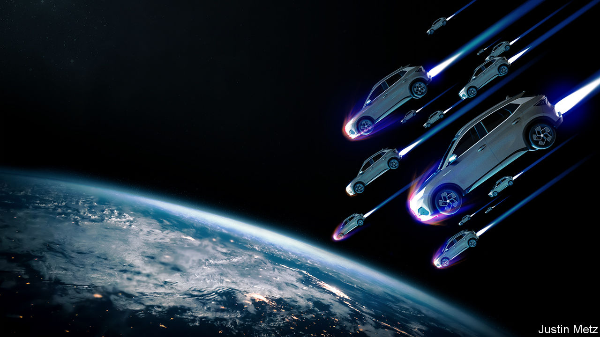

###### The Chinese EV onslaught

# An influx of Chinese cars is terrifying the West 

##### But it should keep its markets open to cheap, clean vehicles 

 

> Jan 11th 2024 

IS china about to unleash another wave of deindustrialisation on the rich world? About 1m American manufacturing workers lost their jobs to Chinese competition in 1997-2011, as the country integrated into the global trading system and began shipping cheap goods overseas. This “China shock” has since been blamed for everything from rising deaths among working-class Americans to the election of Donald Trump. The rejection of liberal attitudes to trade also explains why politicians embrace industrial policy today. Now China’s carmakers are enjoying an astonishing rise. That stokes fears of another ruinous shock. In fact, the successes of Chinese cars should be celebrated, not feared. 

Just five years ago China shipped only a quarter as many cars as Japan, then the world’s biggest exporter. This week the Chinese industry claimed to have  in 2023, exceeding the Japanese total. China’s biggest carmaker, BYD, sold 0.5m electric vehicles (EVs) in the fourth quarter, leaving Tesla in the dust. Chinese EVs are so snazzy, whizzy and—most important—cheap that the constraint on their export today is the scarcity of vessels for shipping them. As the world decarbonises, demand will rise further. By 2030 China could double its share of the global market, to a third, ending the dominance of the West’s national champions, especially in Europe.

This time it will be even easier for politicians to pin the blame for any Western job losses on Chinese foul play. A frosty geopolitical climate will feed the sentiment that subsidised production unfairly puts Western workers on the scrapheap. And there have certainly been subsidies. Since the launch of its “Made in China” agenda in 2014, China has brazenly disregarded global trading rules, showering handouts on its carmakers. It is hard to be precise about the value of the underpriced loans, equity injections, purchase subsidies and government contracts Chinese firms enjoy. But by one estimate, total public spending on the industry was in the region of a third of EV sales at the end of the 2010s. These subsidies come on top of the ransacking of technology from joint ventures with Western carmakers and Western and South Korean battery-makers.

The temptation will therefore be for rich-world policymakers to shield their carmakers from the onslaught of . In October the European Commission opened an investigation into Chinese cars. President Joe Biden is said to be considering increasing tariffs on them, even though America’s carmakers, protected by a 27.5% levy and handouts from the Inflation Reduction Act, currently face little Chinese competition. Yet locking out Chinese cars would be a mistake. The potential gains to the West from a ready supply of cheap, green vehicles are simply enormous—and dwarf the cost of disruption and the dangers it brings.

One reason is that the market for cars is going to be upended, regardless of trade with China. In 2022, 16-18% of new cars sold around the world were electric; in 2035 the EU will ban the sale of new cars with internal-combustion engines. Though firms are retaining their workers as they switch to making EVs, the process is less labour-intensive. Much as the first China shock was responsible for less than a fifth of total manufacturing job losses occurring at the time—many of which were attributable to welcome technological advances—so too there is a danger of confusing disruption caused by the shift to EVs with that caused by Chinese production of them. 

Next consider the gains from letting trade flow. Vehicles are among people’s biggest purchases, accounting for about 7% of American consumption. Cheaper cars mean more money to spend on other things, at a time when real wages have been squeezed by inflation. And Chinese cars are not only cheap; they are better-quality, particularly with respect to the smart features in EVs that are made possible by internet connectivity. Nor does the existence of a carmaking industry determine a country’s economic growth. Denmark has among the world’s highest living standards without a carmaker to speak of. Even as cars roll off Chinese assembly lines, the economy is spluttering—in part because it has been so distorted by subsidies and state control. 

Last, consider the benefits to the environment. Politicians around the world are realising just what a tall order it is to ask consumers to go green, as a backlash against costly emissions-reductions policies builds. EVs, too, are currently more expensive than gas-guzzling cars (even if their running costs are lower). Embracing Chinese cars with lower prices could therefore ease the transition to net-zero emissions. The cheapest EV sold in China by BYD costs around $12,000, compared with $39,000 for the cheapest Tesla in America.

What about the risks? The threat to industry from cheap imports is usually overblown. The lesson from the rise of Japanese and South Korean carmakers in the 1980s is that competition spurs local firms to shift up a gear, while the entrants eventually move production closer to consumers. Already, BYD is opening a factory in Hungary and many Chinese carmakers are scouting for sites in North America. Meanwhile the likes of Ford and Volkswagen are racing to catch Chinese firms. Last year Toyota said a breakthrough in its “solid state” technology would let it slash the weight and cost of its batteries.

Another worry is national security. Depending entirely on China for batteries, whose importance to electrified economies will go far beyond cars, would be risky. It is also possible that EVs, which are filled with chips, sensors and cameras could be used for surveillance. (China has banned even locally made Teslas from some government properties.) But so long as presidents and spooks can travel in vehicles made in the West or by its allies, there is little reason to fear consumers sporting Chinese wheels; they can adjudicate personal-privacy concerns themselves and locally made cars will be easier to inspect. 

Policymakers should therefore curb their protectionist instincts and worry only in the unlikely event that Western carmakers implode altogether. A hefty market share for Chinese carmakers that invigorates wider competition, however, is not to be feared. If China wants to spend taxpayers’ money subsidising global consumers and speeding up the energy transition, the best response is to welcome it. ■


