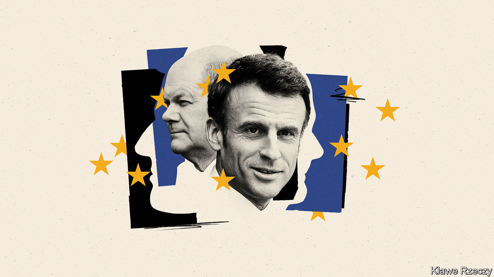

###### The hole at the heart of the old continent

# Why Olaf Scholz is no Angela Merkel 

##### Germany is unable and unwilling to lead Europe 

 

> Jan 11th 2024 

An old story, pointed if apocryphal, had the late Henry Kissinger complaining, “Who do I call if I want to call Europe?” In fact, for long periods of time (admittedly after Kissinger had left government), there was a good answer. During most of the 1980s and 1990s it was Helmut Kohl, the German chancellor, and from 2005 till the end of 2021, it was Angela Merkel. So large, rich and generally weighty is Germany that nothing important happens in Europe unless its chancellor wants it to, and what the chancellor wants, she or he usually gets. Until now.

A Google search reveals that the leader of Germany is a man called Olaf Scholz, but so colourless and unimpressive a figure does he cut that you would be forgiven for not knowing it. While the European economy stagnates, the hard right climbs in the opinion polls almost everywhere and Vladimir Putin’s rockets rain down on Ukraine, a candidate member of the European Union, Mr Scholz is all but invisible. His Social Democrats are only the third-most popular party in Germany, with a derisory 15% level of support. Most of his time has to be spent propping up his rickety .

This distracted impotence matters far beyond Germany. The EU has been left leaderless by Mr Scholz’s absence. Germany has to be the driver, whether raising cash for Ukraine, fixing migration problems, building the capital-markets union, reforming the system so that Ukraine and others can be admitted, or preparing Europe for all that a Trump victory in November would entail. Mr Kohl and Mrs Merkel knew this, and travelled and negotiated ceaselessly. Europe prospered as a result. That idea seems completely alien to the taciturn Mr Scholz, a solid supporter of Ukraine who has failed to inspire others.

Obviously, it is not all up to the chancellor. The vital adjunct to a strong Germany is a strong France. Yet Emmanuel Macron, Mr Scholz’s counterpart, has become widely disliked at home; he lost his parliamentary majority in 2022, and struggles to get legislation passed. This week he sacked his prime minister, as beleaguered French presidents are wont to do, and , a charismatic but under-experienced 34-year-old. In the past Mr Macron was a champion of reform, but these days his ability to influence Europe is diminished.

More crucially, Mr Scholz and Mr Macron are said by insiders to get on badly, partly because their personalities are so different, but also because they have irreconcilable views. Mr Macron favours more European-level spending, more independence from NATO and America and a  economic policy, yet the flinty Mr Scholz agrees with none of that. Differences of outlook can be productive if there is a willingness to work together; but there isn’t.

The news is not uniformly awful. Although the Franco-German motor that used to run Europe is broken, a few auxiliary mechanisms are still firing. One is the president of the European Commission, Ursula von der Leyen, a rather more effective German than Mr Scholz, and one who deserves reappointment in the autumn. She has used her position well, arguing for and making good use of a €800bn ($875bn) covid-recovery fund; but her powers are limited and she is no , who united European leaders to build the single market and single currency. Another motive force is Donald Tusk, Poland’s new prime minister and a former president of the European Council. Unfortunately, he will be busy attempting to gain control at home. 

Even if Joe Biden wins in November, America is pulling back from its role as Europe’s main source of security. Europe is going to have to spend and do more to keep its citizens safe. Yet instead of rising to the challenge, Europe’s leaders are looking inward. ■

