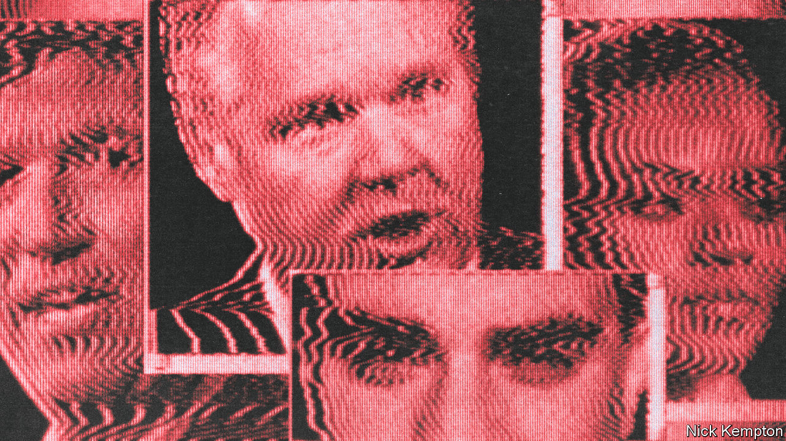
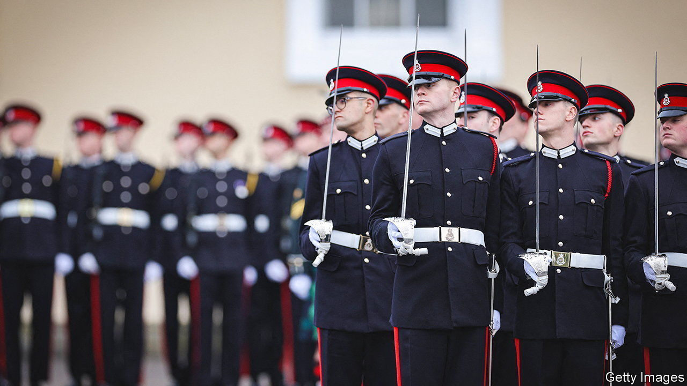

###### On America’s media, behavioural economics, Azerbaijan, London, military beards, forecasting

# Letters to the editor 

##### A selection of correspondence 

 

> Jan 11th 2024 


Media matters

Your article about the rise of conservative media (“”, December 16th) overlooked the impact of Ronald Reagan’s dismantling of the fairness doctrine. Established in 1949 by the Federal Communications Commission, the doctrine required broadcasters to air contrasting viewpoints on controversial issues of public interest. However, the policy put the government in the awkward position of policing speech and thus contained an inherent conflict with the constitution’s First Amendment. The FCC under Reagan used this argument of unconstitutionality to repeal the doctrine in 1987. Not long after, increasingly partisan conservative broadcasters, such as Rush Limbaugh, took hold of America’s conservative dialogue.

Halsey Lea


I want to express my highest gratitude to James Bennet and  for the gripping essay on his experience at the , a rare piece worth each of its 17,000 words (“”, 1843, December 14th). Reasonable people can disagree on his decision to run Tom Cotton’s op-ed, coming as it did during a fraught time under a president who was expressing cheerful willingness to dispatch the army against his political opponents. But it was an eminently defensible decision, even laudable.

Yet I was struck by the statement that “most of the  newsroom does not fact-check or copy-edit articles.” Is fact-checking and copy-editing truly out of fashion in our most august newsrooms? Such a revelation causes me to shudder as much as anything else that Mr Bennet wrote.

Matt Odette


The one thing that everyone along the political spectrum can agree on is that there is media bias. The one thing no one can agree on is who is biased and how much so. In 2012 the Al Smith dinner, a must for presidential candidates courting the Catholic vote, was attended by both Barack Obama and Mitt Romney. During his speech Mr Romney made the quip that “I’ve already seen early reports from tonight’s dinner. Headline: Obama Embraced by Catholics. Romney Dines With Rich People”. The quip got a great laugh because everyone saw the truth in it.

Paul Stutler


 


Rationality and forecasting

Behavioural economics is not the study of “irrationality” (“”, December 23rd). It is the study of the behavioural underpinnings of economics. But so is the much longer-established discipline of economic psychology. To many of us working in the area, behavioural economics appears to be a recent rebranding of the study of some of the domains examined within economic psychology. 

This rebranding has largely been carried out by those associated with the work of Richard Thaler, an economist influenced by the work of Daniel Kahneman, a psychologist who won a Nobel prize in economics. But even Mr Kahneman’s work does not aim to study irrationality. It aims to identify the heuristics that people use when making judgments. In Herbert Simon’s terms, the use of heuristics is procedurally rational because it allows optimal use of limited resources. Occasionally, their use may result in substantively irrational outcomes (biases) that illuminate the nature of the heuristics employed.

It can be difficult to define substantive rationality. To use your forecasting example, consider points randomly scattered around a linear trend line. To a statistician, it is rational to make forecasts on that trend line. To a forecaster, who knows that nothing continues on such a trajectory for ever, it is rational to use this real-world knowledge to damp the trend when making forecasts. This is what people do when using judgment to make forecasts; they forecast below upward trend lines and above downward ones. What initially appears to be biased judgment, may not be. 

Nigel Harvey

Professor of judgment and decision research

University College London

Azerbaijan responds

Wendell Steavenson is correct to point out that former separatist authorities in Azerbaijan’s Nagorno-Karabakh region refused supplies from Azerbaijan and flatly rejected its sovereignty (“”, 1843, January 1st). This was a requirement of international law, as this was a recognised part of the Republic of Azerbaijan.

Perhaps, the author, who acknowledges that hundreds of thousands of Azerbaijanis were violently displaced in the 1990s, should be a bit more clear that this was a sovereign Azerbaijani territory illegally occupied by Armenia in a late-Soviet era engineered separatism project, later replicated throughout Eurasia. For someone who has covered Ukraine extensively, Ms Steavenson is surely familiar with the consequences of ethnic separatism, so her take in this case is somewhat surprising.

More importantly, as Azerbaijan and Armenia have made some historic and unprecedented moves to reach a lasting peace and put the history of conflict behind us, the article’s focus on the legacy of conflict and division was both disappointing and misplaced.

ELIN SULEYMANOV

Ambassador of Azerbaijan


 


A city’s spirit

I was moved by your article on the enduring resilience of London (“”, December 16th). I work in the Lloyd’s insurance market, which has been trading for over 330 years. We persevered despite an almost fatal financial crash, brutal terrorism and the covid pandemic, but I am reminded of my father, George, who as a 17-year-old in 1944, started work at Lloyd’s. It was the time of the second blitz on London from September 1944 to March 1945, when thousands of V1 flying bombs and supersonic V2 rockets hit the capital. 

During regular air raids (and V1 attacks) the Lutine Bell at Lloyd’s would be rung to alert everyone to the bomb shelter under the building, where the business of underwriting would continue. There were no warnings with the supersonic V2s. My father said it was a rather unnerving time, but that everyone just carried on working. To me that sums up Lloyd’s of London and London as a city. We carry on regardless.

David Doe


 


A bushy tale

This particular (very) retired colonel has no problem with the British Army allowing its soldiers to grow beards (“”, December 23rd). Indeed, on several occasions I sported a full-set and see no reason why it should not be more widely adopted. The question arose because Grant Shapps, the defence secretary, was asked what he intended to do about poor recruiting and poor retention of armed-forces personnel. His response, in effect “Let them grow beards”, probably tells us all we need to know about him. 

As for the issues underlying deficient retention and recruiting, we heard nothing. The ongoing scandal of poor accommodation rumbles on. The “strategic pay freeze” from 2010-13 has still not been rectified. And perhaps most insidious and worrying of all, and despite the world becoming more fractured and dangerous, defence spending at just over 2% of GDP shows that the armed forces are still regarded as little better than discretionary expenditure. There is no sense that, in order to match Russian military muscle we need our own  (Chancellor Olaf Scholz’s recognition that Russia’s attack on Ukraine represents a historic turning point), let alone to establish an adequate response to meet the challenges of China and a disordered Middle East and west Africa.

It is said that one of the functions of a beard is to hide a weak chin. Mr Shapps’s new-found pogonophilia is no more than a diversion to hide a disastrously weak policy grip.

Simon Diggins

Colonel (retired)


As a former lieutenant in an American airborne infantry unit, I can tell you that hair, be it on your head or face, is a curse when you are on field exercises or deployed for any period beyond a few days. Facial hair gets dirty and causes rashes that can lead to infection and elimination from the field. When a unit is not effective, missions fail and people die. Religious grounds for beards can take a back seat to mission accomplishment and staying alive. Think of a helmet chinstrap rubbing whiskers into the skin for days or weeks (sailors do not wear helmets all day). 

Stuart Williams

 

 


It’s in the stars

The extremely wide range of forecasts from investment banks for inflation and growth in the coming year is puzzling (“”, November 25th). It reminds me of John Kenneth Galbraith’s view: “The only function of economic forecasting is to make astrology look respectable.”

Atilla Ilkson


