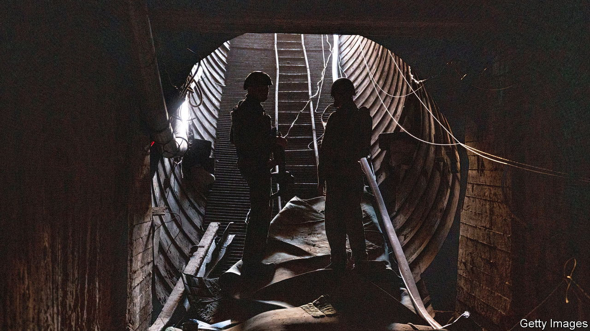

###### The dilemmas multiply

# Israel has yet to destroy even half of Gaza’s tunnels 

##### But its forces may soon have to oversee a massive humanitarian operation 

 

> Jan 11th 2024 

Destroying the network of tunnels built over the past 16 years by Hamas, the militant movement that has run Gaza since 2007, is one of Israel’s chief war aims. At the start of the conflict Israel estimated that it stretched to hundreds of kilometres. Today security officials concede that this is probably an underestimate. And while the war has been raging for over three months and Israel has killed over 23,000 Palestinians, mostly civilians, the Israel Defence Forces (idf) calculates that it has yet to destroy even half the tunnels. 

In Shujaiya, a neighbourhood in the east of Gaza city that was, until the war, home to 100,000 people, the idf has discovered a part of the network of which it was previously unaware. It is believed to belong to Palestinian Islamic Jihad, one of the smaller militant groups funded by Iran. On a recent visit to the area with Israeli forces,  saw an idf brigade find two large shafts by the wall of a school. Cables that used the school’s electricity to provide power to the tunnel could be seen running down below ground.


Israel claims the subterranean city is used solely to hide fighters, weapons and rocket launchers. The idf says it has so far discovered over a thousand tunnel shafts in Gaza city. Many are small and can be destroyed quickly. But blowing up some of the larger ones requires complex engineering and demolition operations. The tunnel in Shujaiya took over a week to find and several large explosions to demolish.

Colonel Nadav Maisels, who is in charge of the mission in Shujaiya, says that his troops have killed most of the local Hamas battalion, including its commanders, but that dozens remain who are now “in guerrilla mode”. That means the IDF is often operating under fire. With many similar tunnels remaining, Israel will have to decide for how much longer its troops carry out such dangerous work. 

The Shujaiya tunnel network is a priority for the idf because the neighbourhood is just a kilometre from the border with Israel. It overlooks the kibbutzim of Nahal Oz and Kfar Azza, where dozens of civilians were murdered on October 7th. Others were taken hostage and are still being held in Gaza. “Ultimately our mission is that people can come back and live in the kibbutzim in peace,” says Colonel Maisels. 

But senior officers admit they will not be able to destroy the entirety of Gaza’s tunnel network. The time Israel has for large-scale operations in Gaza city is running out. International pressure to scale down the war, particularly from America, is forcing Israel to begin withdrawing troops. So is the need to allow hundreds of thousands of reservists, who have been in uniform for over three months, to return to civilian life. Israel faces growing calls to allow more than 1m Palestinians displaced from northern Gaza to start returning there. That is not possible while the idf is still blowing up tunnels. 

Meanwhile, another idf division is fighting in and around Khan Younis, the second-largest city in the Gaza Strip, where Israeli intelligence believes the leader of Hamas, Yahya Sinwar, is holed up along with more than 100 Israeli hostages. The campaign in Khan Younis began on December 1st and has yet to deliver any tangible results. “The problem is that they are trying to achieve three different objectives,” says one veteran commander. “To destroy Hamas’s Khan Younis brigade; to eliminate Sinwar; and to rescue the hostages. Each of these missions requires a different tactical approach, but they’re trying to do all three at once.” 

The dilemmas faced by Israel’s generals in Gaza are only sharpening. They must now also factor in the need to facilitate an emergency humanitarian operation to prevent the real possibility of famine and an outbreak of disease among over 2m Palestinians, most of them crowded into the south of the territory. 

The generals say they need more time but ultimately these decisions—about how long operations in Gaza city and Khan Younis will continue, whether to extend humanitarian assistance to the displaced Palestinians and when to allow them to return to what little remains of their homes—lie with Israel’s politicians. Binyamin Netanyahu, the prime minister, is under conflicting pressures from America, which has so far given Israel essential military and diplomatic support, and from his far-right coalition partners who control his political fate and are threatening to bring down his government. Political paralysis in Jerusalem will mean more uncertainty on the ground in Gaza. ■

