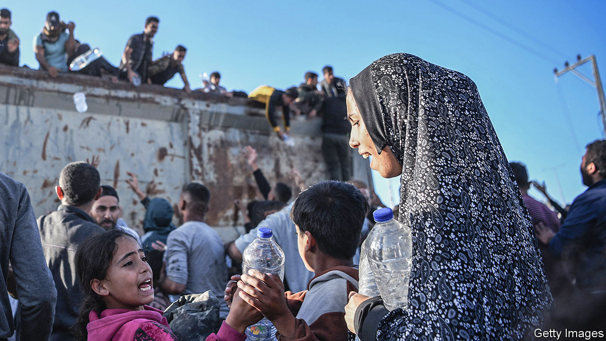
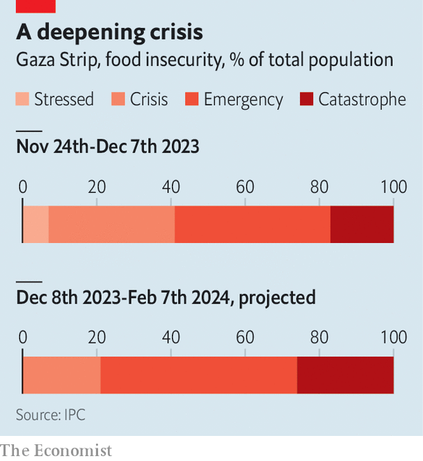
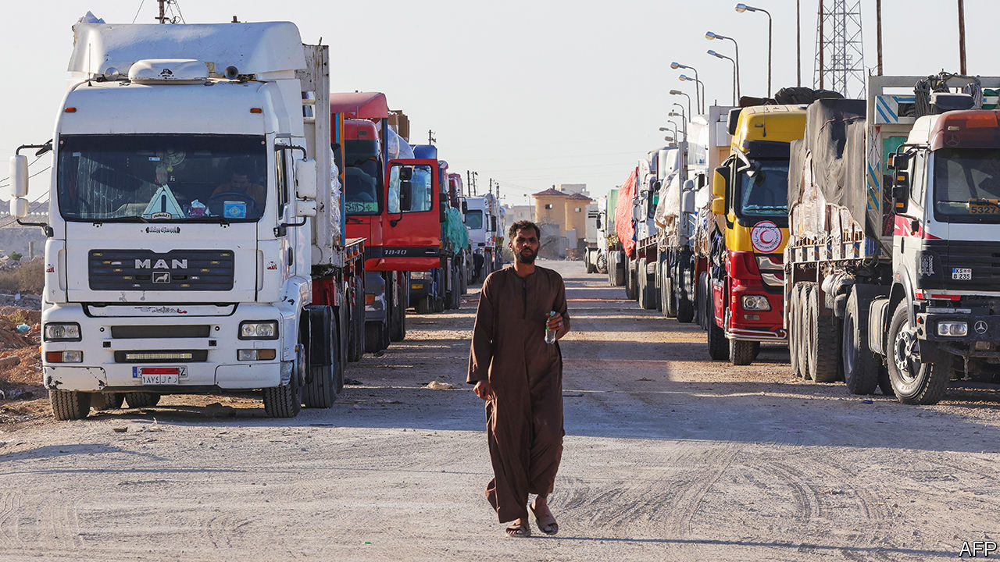

###### Inside the strip

# Just how bad is it in Gaza? 

##### As Israel is accused of genocide, we look at the humanitarian crisis 

 

> Jan 10th 2024 

BEFORE THE war, Gaza was something of a paradox. It was one of the most aid-dependent places in the world: repeated wars and an  crushed the private sector. Yet the sprawling humanitarian operation that cared for 80% of 2.2m Gazans relied on the private sector. If a charity needed flour, it rang up a trader in Gaza, who called a mill in Israel or the West Bank. Aid workers might handle the last-mile delivery to bakeries and families—but businesses took care of the rest.

It may sound absurd to talk about supply chains in the context of a war that has, in just three months, killed 1% of Gaza’s population and damaged around one-fifth of its buildings. South Africa has accused . This is a highly contentious claim. Nonetheless the deepening humanitarian crisis is among the worst of the 21st century. Aid agencies say that, if nothing changes, more Palestinians in Gaza will die this year from  than from Israeli bombardment.


But logistics are part of the problem—and the solution. Israel expects the un to oversee aid efforts. So does Hamas, the militant group that has operated a ruinous and cynical regime in Gaza since 2007. That is unrealistic. Averting a famine will require Israel to facilitate the flow of commercial goods and, perhaps, to provide supplies directly. “Aid alone will not be enough,” says Philippe Lazzarini, head of the un Relief and Works Agency (UNRWA), which helps Palestinian refugees. “We need the private sector.” Getting private businesses working could ease the distribution bottlenecks and allow for the import of more aid. unrWa says it could then shift to providing cash assistance rather than just handing out meagre rations. People could use that money to buy food.

The scale of the crisis is staggering. Around 1.9m people (85% of Gaza’s population) have been displaced. 1.4m are sheltering in schools and other facilities run by UNRWA. “Conditions are just appalling,” says Mr Lazzarini. One warehouse in the southern city of Khan Younis hosts some 30,000 people; tens of thousands more camp outside. A brutal wartime economy means many Gazans cannot even afford a nylon roof over their heads. The UN’s World Health Organisation says there is only one shower for every 4,500 people in Gaza, and one toilet for every 220.

Infrastructure has collapsed. Almost two-thirds of Gaza’s hospitals are closed; the 13 still working are overflowing, with patients being treated on blood-slicked floors. They do not have enough supplies or staff. Desalination plants that once supplied clean water have shut down for lack of fuel and spare parts. Displaced children have access to just two litres of water a day.

 


The un uses the five-step Integrated Food Security Phase Classification (IPC) scale to measure hunger. At phase 1, people are fine. At phase 5 they are starving to death, regularly skipping meals and often going 24 hours without food. Arif Husain, the chief economist at the World Food Programme, says 706,000 people around the world are at that worst level. Four out of five of them—577,000—are in Gaza (see chart). “The scale, severity and speed make this crisis unprecedented,” he says.

In interviews in recent weeks, displaced Palestinians in Rafah, at Gaza’s border with Egypt, said they receive meagre rations from aid agencies: a family might get a tin of beans for the day. Markets might have some tomatoes and aubergines, but few staples—and when they are available, they are unaffordable. A sack of flour costs ten times more than it did before the war.

Gazans fortunate enough to have savings cannot get hold of them. One man recounts a day spent in queues at six ATMs, all of which ran out of cash before he reached them. Employees from the Bank of Palestine have run risky missions to replenish a handful of ATMs in the south, using banknotes from vaults in the north. But the financial sector, like everything else in Gaza, has mostly stopped functioning.

The IPC has three criteria for declaring a famine: 20% of the population must be starving; 30% of children must be severely malnourished; and two people out of 10,000 be dying daily due to hunger. Gaza meets the first criterion. Aid agencies say they cannot assess the other two because the health system has been destroyed.

Minutes away from Gaza, just across the border in Israel, there is a Western-level health system and there are no shortages of food. The desperate conditions in Gaza are not an inevitable by-product of war; they are in part the result of political decisions made by the Israeli government.

For the first two weeks of the war Israel let nothing into the enclave, which forced businesses and families to deplete stocks of food, medicine and other essentials. On October 21st it began allowing goods to flow via the Rafah crossing with Egypt (an agreement with the Palestinian Authority in 2005 requires Israel to consent to such deliveries). Lorries have entered almost every day since then, from a low of eight on October 25th to a high of 300 on November 28th, during a week-long ceasefire meant to facilitate the release of Israeli and foreign hostages held in Gaza.

Until recently, each lorry had to drive from Rafah 50km (31 miles) south to Nitzana, on the border between Israel and Egypt, to be inspected by Israeli authorities. Then it drove back to Rafah. Last month, under American pressure, Israel said inspections could take place at Kerem Shalom, a border point between Israel and Gaza that was the main pre-war crossing for commercial goods. Still, even with a second crossing, deliveries are far short of the 500 to 600 lorries a day that entered Gaza before the war. “And that was in a situation where you also had food production happening inside of Gaza,” says Tania Hari, the director of Gisha, an Israeli NGO that lobbies for the free movement of goods and people into the strip. “Today there is almost no production to speak of, no agriculture, no fishing.”

Israeli officials insist that there is plenty of unused capacity for extra lorries at Nitzana and Kerem Shalom: if the UN wants to bring more aid to Gaza, it can. Aid workers call that disingenuous, “as if we can just wave a magic wand and make more trucks appear”, says one.

The inspections themselves are complicated. The Dutch government paid for x-ray scanners at Kerem Shalom, which have been in use since December. They should allow lorries to be checked without being unloaded and reloaded—but Israel insists on inspecting them manually, which adds hours to each delivery. The crossings have limited hours, and drivers inside Gaza are nervous about working after dark, when Israeli bombardment is often heaviest.

Israel has an ever-changing list of “dual-use items” prohibited from entering Gaza because they arguably have some military purpose. It would be more efficient to desalinate water in Gaza than truck in bottled water, but spare parts for desalination plants are on the list and thus barred from entry. So are dozens of generators donated by Kuwait, along with solar panels and solar-powered lights. Many things can be deemed dual-use: batteries, stretchers and heaters have been rejected on the grounds that Hamas fighters could use them. 

Another problem is what is being sent—and what is not. Donor countries are sending whatever they collect, which is not always what Gaza needs. “At the beginning we even saw shipments of covid vaccines, which is certainly one of the last things we need now,” says Mr Lazzarini. “What’s being sent in kind does not always match what is required on the ground.”

 


Humanitarian groups are quietly critical of Egypt’s role as the main conduit for aid. Some of the problems are logistical. But one UN official in Jerusalem also says that the Egyptian Red Crescent, which is responsible for aid deliveries at Rafah, is “not competent”. Corruption is rife. Lucrative goods disappear from warehouses while expired ones are delivered to Gaza. Keen to make a profit from the aid operation, firms in Egypt are selling non-essential products, such as chocolate, to be loaded onto aid lorries.

It is a cumbersome process for NGOs that used to work in Gaza to register in Egypt. Some are trying to set up operations in Jordan, where they can work more easily. Diplomats are talking about a , which would bypass the crowds and corruption at the Rafah crossing. Jordan has conducted several air drops, but they are costly and haphazard.

The best way to supply Gaza, however, would be through Israel, which is how around two-thirds of goods entered the enclave before October 7th. Over 90% of those shipments were ordered by private firms; just 4% were bound for aid agencies, which sourced most of their needs from Gazan businesses. Today, though, almost all the lorries reaching Gaza are destined for the UN (Israel allowed a small commercial shipment last month). It is not clear how much of Gaza’s private sector is still intact: warehouses and lorries have been bombed, drivers and traders killed. But aid workers think it is still viable.

This would require Israel to let in shipments from its own territory. “It will happen ultimately, but the politicians are dragging their feet,” admits an Israeli security official. If firms in Gaza cannot buy from Israeli companies, they could turn to suppliers in the West Bank, which before the war sent about 25% of the goods entering Gaza. Goods there are often cheaper than in Israel.

Israel could also provide aid directly. Binyamin Netanyahu’s government, which relies on far-right members of its coalition, is loth to supply Gaza with food and medicine, as are many Israelis. The prospect of any aid giving succour to terrorists is hard to stomach. Family members of some of the hostages have tried to block the road to Kerem Shalom. Still, the army has the ability and resources to bring in supplies. Israel is unarguably the occupying power in at least parts of Gaza. International law thus requires it to use all means available to ensure Gaza has enough food and medicine. One Israeli commander says the army is prepared to supply Gaza if it gets the order.

All of this assumes that the war will continue for months. A lengthy ceasefire would be the best way to flood Gaza with needed aid—but Israeli officials have made it clear they plan to fight on. “We’re talking about logistics because we have no other choice,” says Ms Hari. ■

