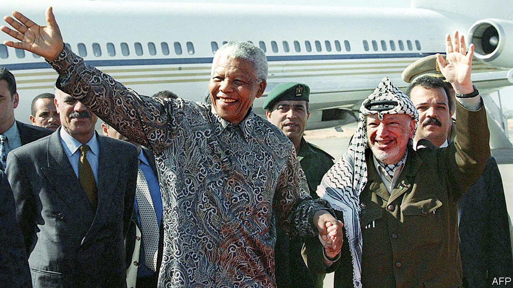

###### Struggling comrades

# South Africa’s support for the Palestinian cause has deep roots 

##### But opportunism and politics also play a part 

 

> Jan 11th 2024 

Hypocrisy has, it would seem, no limits when it comes to South Africa’s foreign policy. Exactly a week before the country was due to accuse Israel of genocide before the International Court of Justice (ICJ) on January 11th, President Cyril Ramaphosa played host to Muhammad Hamdan Dagalo, a Sudanese warlord whose Janjaweed militia and its successor are accused of genocide and war crimes in Darfur. Adding to the insult, Mr Dagalo, also known as Hemedti, later visited the genocide museum in Kigali, Rwanda.

Just as jarring was a ceremony on December 5th marking ten years since the death of Nelson Mandela, a man seen by the world as a symbol of reconciliation and peace. A Hamas delegation led by Bassem Naim, a senior official, joined Mandela’s grandson, Mandla, in a march through the streets of Pretoria, the capital. At their destination—the statue of Madiba (as Mandela is honorifically known) that stands proudly outside the president’s office—they laid a wreath with Lindiwe Zulu, the social-development minister.

As symbols of solidarity go, it does not get much stronger than that, and puts South Africa in the company of only a handful of countries that have diplomatic relations with Hamas, an outfit widely deemed to be terrorist. This designation holds little weight for the ruling African National Congress (ANC), which was itself often called a terrorist organisation before orchestrating South Africa’s largely peaceful transition to democracy. In Palestine’s plight, the ANC sees echoes of its own long fight for freedom.


Other symbols of solidarity with Palestine are visible all over South Africa. Motorway billboards proclaim “Genocide IsREAL”. Street artists have painted murals in cities, including a Palestinian flag that covers an entire apartment block in Cape Town’s historic Bo-Kaap district. Even homeless people begging at Johannesburg intersections have decorated their placards with #FreeGaza stickers.

A legacy of apartheid

The salience of the Palestinian cause in South Africa has deep roots. The ANC developed an antipathy towards Israel during the years of apartheid, or white rule, when the Jewish state supplied weapons and technology to South Africa, which had been put under a UN arms embargo. And Mandela saw in Yasser Arafat, the late leader of the Palestinians, a fellow “comrade in arms” who was also trying to win freedom for his people. 

“South Africa and Palestine share a common history of struggle,” the ANC observed in its latest policy document, referring to links with the Palestine Liberation Organisation that go back decades. The document, published in late 2022, described Israel as an “apartheid state” and called for South Africa to downgrade its diplomatic presence in Israel. Israel strongly objects to the apartheid analogy, which is in any case flawed: Arab-Israelis face discrimination, but they have full democratic rights. Even so, the denial of statehood to Palestinians in land Israel occupied in 1967 resonates. 

“South Africa’s voice has been loudest, mainly due to the fact that our liberation history and struggle is most recent, and that the system of apartheid that Israel practises against the Palestinians is eerily similar,” says Suraya Dadoo, a South African writer and pro-Palestine activist.

Perhaps more puzzling was South Africa’s enthusiastic embrace of Hamas after it attacked Israel on October 7th, even as many Arab countries sought to distance themselves from the group. The government was slow to condemn Hamas’s atrocities, though it eventually did so, and was quick to speak out against Israel’s invasion of Gaza and the high civilian death toll. 

In the immediate aftermath of the Hamas attack, even before the Israeli invasion began, the foreign minister, Naledi Pandor, had a call with Ismail Haniyeh, the leader of Hamas, ostensibly to discuss getting aid into Gaza. Hamas claimed that Ms Pandor had expressed solidarity with the group, though she denied this later. The call was followed by a whistle-stop visit to Tehran, where she discussed the issue with Ebrahim Raisi, Iran’s president.

At the same time relations between South Africa and Israel deteriorated sharply. In early November South Africa recalled all its diplomats from Tel Aviv. Later that month Parliament voted to suspend all diplomatic ties and shut down the Israeli embassy in Pretoria (the resolution has yet to be implemented, though Israel has now recalled its ambassador). At the end of December South Africa filed its suit against Israel at the ICJ.

All this is consistent with the ANC’s policy positions, but there may be more to it than that. For Mr Ramaphosa’s beleaguered government, the war could not have come at a better time. Before Hamas’s attack, the president’s approval rating was at an all-time low of 40.7%, according to a survey of registered voters by the Social Research Foundation. Voters were fed up because the economy is stalling, the blackouts keep on rolling and there has been little visible action against corruption. In the general election later this year, the ANC is expected to dip below 50% of the vote for the first time in a national election.

The war in Gaza is an opportunity to turn this around. “The ANC is trying to elevate this into an election issue, to potentially try and distract from some of the core economic issues,” says Ronak Gopaldas, a director of a South African risk-analysis firm, Signal Risk. A new poll released in November shows a four-percentage-point increase in Mr Ramaphosa’s approval rate.

South Africa’s standing abroad has been equally poor, because of its muddled response to Russia’s invasion of Ukraine. While South Africa’s diplomats insisted it was trying to avoid a new cold war, Western countries were left aghast at South Africa’s failure to condemn the invasion, and viewed its subsequent offers to mediate the conflict with suspicion. Russia did not appear to be any happier with South Africa’s stance: it bombed Kyiv just as Mr Ramaphosa and a number of other African leaders arrived for well-publicised (albeit fruitless) negotiations with Volodymyr Zelensky, Ukraine’s president.

“South Africa is attempting to regain some of the moral high ground as a voice of the global south, which it lost with its positioning over the Russia-Ukraine crisis,” says Mr Gopaldas. Although South Africa’s case before the ICJ, which was due to begin as  was going to press, has annoyed Israel’s Western allies, it has won the country kudos from emerging “middle” powers. Indonesia, Malaysia, Turkey and the Organisation of Islamic Co-operation, among others, have joined the case. ■

