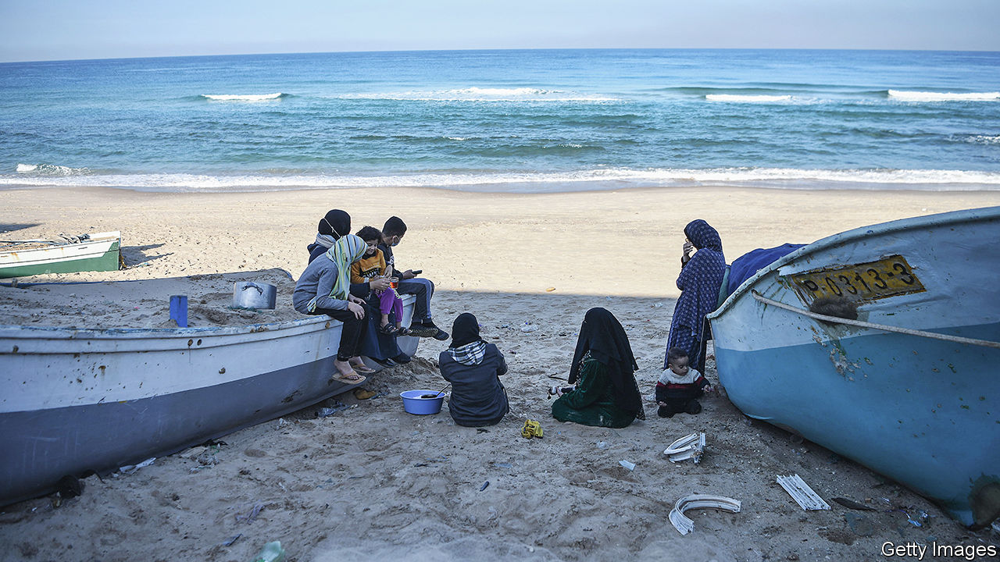

###### The hub that once was Gaza

# Under a real peace deal, Gaza could be an intercontinental crossroads 

##### The blockaded territory could be a link to everywhere 

 

> Jan 11th 2024 

For two weeks  sailed around the Mediterranean, waiting to land. Its shallow bottom made it perfect for dumping emergency supplies onto the sands. On board were almost 90 tonnes of shelters, blankets and medicine, approved by Israel for entry into Gaza. Israel’s then foreign minister, Eli Cohen, said it could land “immediately”. But after leaving the Cypriot port of Larnaca in mid-December, it sailed west instead to Malta and finally offloaded its cargo in Egypt at the start of January. “Israel could not guarantee its safety,” says a diplomat involved in the mission. 

Gaza’s 40km coastline should be ideal for landing aid. But Israel is torn between its desire to be rid of the Gaza problem and its urge to control everything that enters it. “[Aid] won’t come via Israel,” meaning by land, said Mr Cohen last month, backing a sea corridor instead. But Israel’s security bosses are loth to let anyone else decide what should go to Gaza. Their dual-use list (items banned because they could theoretically have some military use) includes fridges, water filters and apparently even lavatory seats. Egypt is ambivalent too. It fears the prospect of Gazans spilling into Egypt if the gates are opened too wide. 


Gaza was once a hub with spokes linking Europe, Asia and Africa. Its ancient port of Anthedon (Tida, as Palestinians call it) dates back to the Phoenicians 3,000 years ago. Hellenistic remains still poked out of the sands before Israel’s recent bombardment. Until 1948 it hosted a railway linking Cairo to Damascus. It had one of the Middle East’s first airports. But for the past 75 years occupation by Egypt and then Israel, with a blockade for two decades, has all but cut the old junction off from the world. 

Efforts to revive its transport links have repeatedly run aground. In 1993 the Oslo peace accords between Israel and the Palestinian Liberation Organisation promised a seaport. But Israeli restrictions on construction goods slowed progress. Israel bombed it—and a renovated airport—during the intifada (uprising) that lasted from 2000 to 2004. In 2005 Israel agreed to an American-brokered “access and movement” deal providing for a new airport, a seaport and a bus route to the West Bank. But after Hamas won Palestinian elections in 2006, putting in place a venal government in Gaza, Israel tightened the noose. 

The Palestinian Authority in the West Bank, estranged from Gaza since 2006, is also wary of a sea link, lest it disconnect the strip from the rest of Palestine. It might also give Palestinians an escape route and trigger a mass exodus.

Still, Gaza seeks a sea change. For decades it has looked to the Mediterranean for salvation through offshore gasfields, hospital ships or even an idea floated by Israel for an artificial island to host a power station and to serve as a port for ferries and cargo ships. If only.■

