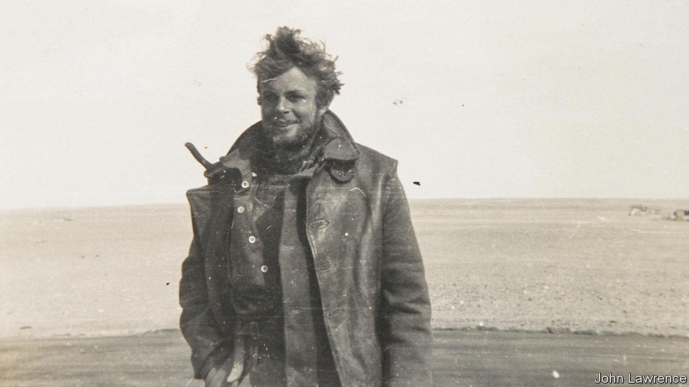

###### Wind, sand and stars

# Mike Sadler guided the first SAS raiders through the North African desert 

##### The navigator and last of the SAS “Originals” died on January 5th, aged 103 

 

> Jan 10th 2024 

To an American who met Mike Sadler in 1943 his most remarkable feature was his eyes. They were round and sky-blue, staring out of a sun-baked face grizzled with beard. They looked like the eyes of a drug-addled French poet, a man who at any minute might do some crazy thing.

In fact, he just had. For five days he had been trudging on foot through 100 miles of Tunisian desert. The SAS group he was with had been caught by the Germans, but he and two others had dropped into gullies and, by nightfall, got clear away. Knowing the lie of the land, and reading the stars, he led them through mountains and between salt lakes until they reached an area controlled by the Free French. A few dates were their only food, and their water a trickle tied in a goatskin. Now his hair was bleached and wild, his exposed skin blistered and his feet in tatters. But, as usual, he had steered his colleagues to safety. 

In the fledgling SAS, founded only two years before, his skills were essential. Their top-secret task was to destroy the Axis bases and airfields strung out along the North African coast. Their was to lurk deep in the desert to the south, presumed empty, and attack from behind the enemy lines. His job was to get them there in their customised Willys Jeeps (no top, no windscreen, open to wind, sand and sun) through a pathless landscape littered with boulders and creeping sand dunes hundreds of feet high. Without him, they would have been completely lost.

Navigation required both geometry and maths, but at school he was poor at both. He had more of a taste for sheer adventure, whetted by the stories of a classmate at Oakley Hall Prep who had been brought up in Africa with elephants and lions. When war broke out in 1939 he was working on a tobacco farm in Northern Rhodesia (later Zambia), and left it to join an artillery unit. But he was persuaded in a bar in Cairo to join the Long Range Desert Group (LRDG), which provided transport for the SAS and could train him to tell by celestial signs exactly where his position was. It seemed to him a magic art, and the desert like being on the sea in a way. Reading the stars, you could go in any direction, a great sort of freedom. When the war was over he became a keen sailor.

In the desert, he was also given maps. Some were almost blank, with sparse dotted lines for “suspected camel track”. He used the sun-compass invented by Ralph Bagnold, founder of the LRDG, which showed the sun-shadow in relation to the compass points but had to be constantly adjusted. In any case, they did not travel by day if they could help it. This meant he was up half the night finding suitable stars, taking star-readings with his theodolite, carefully recording them and then correcting the record the next day. Despite his efforts and the group’s successes, he thought he was only a passable navigator. 

He had been lured from the LRDG to the SAS (which now had its own Jeeps) by the thought of “operations”. In practice he kept back. When the SAS raided the Wadi Tamet air base in Libya, killing 30 German and Italian pilots in their mess and destroying 24 parked planes, he was waiting on the perimeter. He had got the chaps there, across 400 miles of desert; now he had to get them out. A year later he guided a convoy of 18 Jeeps 70 miles across the Tunisian desert, navigating solely by the stars, to the base at Sidi Haneish. There they let rip, roaring en masse down the tarmac, firing their Vickers guns at the maximum rate and setting 37 aircraft ablaze. He counted the tally as his too, but again, necessarily, he was not in the thick of things. 

In truth he was not gung-ho, despite his blond daredevil appearance. (He wore no headdress, letting the wind and sand blow through him.) In daytime dead-reckoning navigation he refused to go by hunches, but carefully plotted out velocity over distance to measure the convoy’s progress towards its target. When it came to fighting he had no wish to kill anyone, only to outwit them. A few of the chaps, including some he greatly admired, were a bit too fond of shooting off at things. But he still relished the occasional adrenalin rush of firing his Jeep’s guns into the dark. And in a later job, escorting SAS paratroopers to their planes, he liked to hitch a ride himself, in the bomb-aimer’s seat. 

What pleased him greatly about the SAS was its informal structure. It was not like the regular army, with all that pointless marching up and down. He liked to keep his army uniform reasonably smart, but high-polished militarism repelled him. It reminded him of the young land-workers he had seen as a teenage tourist in Nazi Germany, marching with their spades like rifles over their shoulders. He never sought promotion, either, preferring to stay with his friends. When he was made a sergeant in 1941, and fell out marginally with an officer who insisted that his men slept in their boots (quite impractical in sleeping bags), he reduced himself to the ranks rather than apologise. In the SAS, a good lot of chaps who got on well together, he felt much more at home. 

The desert commanded his love. It also greatly challenged him. On beautiful smooth patches, the Jeeps could reach 60mph; elsewhere they lurched through sharp stones that simply tore the tyres. Fleeing Tamet, he tried to mend a puncture by stuffing in blankets; rather maddeningly, the wheel disintegrated all the same. Later on that escape, with almost no water left in the other Jeep, everyone peed into the radiator to assist. At the very end, a few Stukas tried a bit of a strafe. Dust boiled up, but they got away. 

The enemy often missed them, to the point where he and his comrades often felt they faced no risk at all. That was due less to him, he thought, than to the terrifically secret nature of the SAS, which suited him. After sabotage work in France, the rest of his career was in intelligence work of some sort or another, mostly for MI6. All he would reveal about it was that it involved a lot of sailing. The SAS, of which he was the last surviving “Original”, had taught him well. 

In very old age his sky-blue eyes were blind. But endless deserts of sand or sea lay behind them, mapped by the stars. ■


