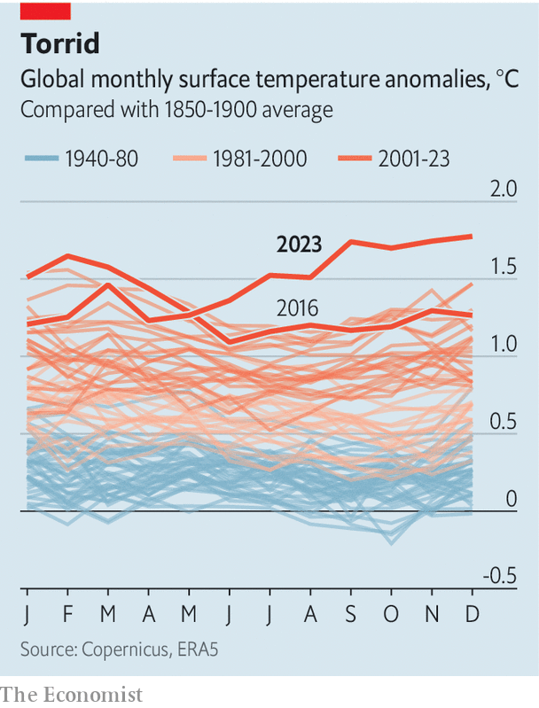

###### Climate change

# 2023 was the hottest year ever 

##### And 2024 could be warmer still 

 

> Jan 10th 2024 

 


Last year was the hottest ever recorded. Data from Copernicus, an EU climate-monitoring service, put the average global temperature for 2023 at 1.48°C above the pre-industrial average. Much of the heat came in a run of six record-breaking months. More data from American and British agencies is due on January 12th, which we will cover online. Human greenhouse-gas emissions are the main reason for the warming. But they have been amplified by El Niño, a natural climate cycle, which could make 2024 ■


