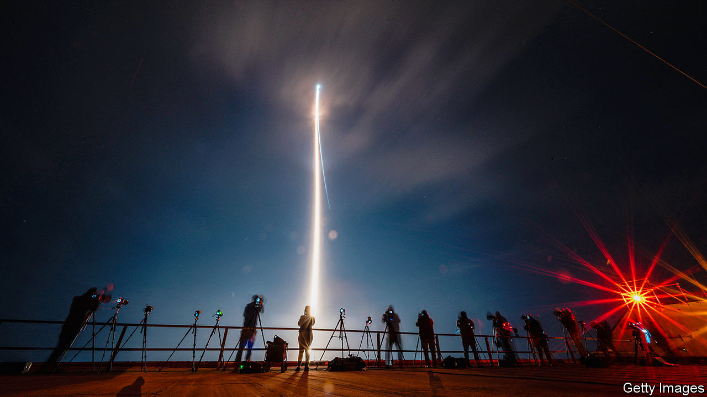

###### A lift off and a loss

# An American rocket has a fine debut; not so the Moon lander on board 

##### Private firms are on the way to putting a man back on the lunar surface 

 

> Jan 9th 2024 

ON THE MORNING of January 8th America tried for the first time in more than 50 years to launch a spacecraft designed to touch down gently on the Moon. The previous attempt, in 1972, was one of the great space-age spectaculars. The Apollo 17 mission was the only time a Saturn V, until last year the most powerful rocket ever to reach orbit, took off at night; , the lander it put on the Moon, was home to two astronauts for more than three days of lunar exploration, the longest ever such sojourn.

Compared with this, Monday’s launch of a Vulcan Centaur rocket, carrying , a robot lander less than a tenth the weight of an Apollo lunar module, was a distinctly modest affair, and with the subsequent failure of s propulsion system it was hardly an unmitigated success. But whereas the Apollo 17 launch marked the end of an era, this was about new beginnings: a new rocket, a new type of lander and a new way of doing lunar science. And whereas the 1972 mission was a monument to the extraordinary things which governments can achieve when everything goes right, this week’s events show the ever greater role that a competitive private sector is playing in space, in terms of both lower costs and greater redundancy. 

The Vulcan Centaur, which seems to have performed flawlessly, is the first rocket developed by United Launch Alliance (ULA), a joint venture between Lockheed Martin and Boeing, two American aerospace companies. ULA was formed in 2006 to bring together the two companies’ space-launch operations (Boeing had the Delta family of rockets, Lockheed the Atlas V). In 2015 ULA began developing the Vulcan Centaur as a replacement for these legacy vehicles. The first stage, Vulcan, is powered by engines developed by Blue Origin, a rocket company owned by Jeff Bezos, the founder of Amazon. The second stage, Centaur, is the latest revamp of a design that has been flying since the days of Apollo. 

The Vulcan Centaur’s success will have been a relief to both ULA and its customers, foremost among them the American government. The company will be happy because Boeing and Lockheed are looking to sell ULA and a failure would have put a crimp in its plans. The military and spooky customers will be happy because the only established American means of launching large satellites are currently the Falcon 9s and Falcon Heavies provided by . Having an alternative supplier in matters of national security is always a good idea; when the incumbent is the mercurial Mr Musk, doubly so. 

Another alternative is on the horizon. Blue Origin will also use its engines in its own launcher, New Glenn, the first flight of which is scheduled this year. Unlike Vulcan Centaur—but like SpaceX’s Falcons—New Glenn has a reusable first stage, and its design allows it to deliver a lot of mass to the low orbits favoured by satellite-internet services such as SpaceX’s Starlink and Amazon’s not-yet-deployed Kuiper. Vulcan Centaur is optimised for the higher orbits favoured for some national-security payloads. The two are thus to some extent complementary, which is one of the reasons Blue Origin has bid for ULA. 

If Vulcan Centaur behaved impeccably, though,  was soon in trouble. The lander is the first spacecraft built by Astrobotic, a company based in Pittsburgh. Its flight was the opening mission of a new initiative through which NASA hopes to make lunar science more affordable. Under the Commercial Lunar Payload Services (CLPS) initiative the space agency plans to pay companies to deliver scientific payloads to the Moon, just as it has come to pay companies to deliver supplies and crew to the international Space Station. There were five such NASA payloads on .

Shortly after the Centaur upper stage placed  on its moonwards trajectory the lander’s solar panels stopped facing the Sun, forcing it to rely on battery power. Engineers on Earth found a way to fix the problem, but in doing so also diagnosed its underlying cause as a loss of propellant. By a day after launch it was clear that though the spacecraft might be kept operational for a day or two, and thus get close to the Moon, it was not going to be able to land.

The loss of  comes less than a year after , suffered a software failure in the last moments before it was to have landed on the Moon. But the current pace of lunar exploration is such that countervailing good news should follow soon. On January 19th SLIM, a mission launched by JAXA, a Japanese government agency, last September will attempt a pinpoint landing on the edge of Shioli, a very young crater on the Moon’s nearside. In February a second CLPS mission, undertaken by Intuitive Machines, a startup in Houston, will lift off on a Falcon 9; it could reach its destination close to the Moon’s South Pole as early as February 22nd. There are currently three more CLPS missions scheduled this year; one more by Intuitive Machines, another by Astrobotic and one by a third company, Firefly, which is also a Texas-based startup. Takeshi Hakamada, the boss of ispace, has said the company hopes to fly  by the end of the year. With so many attempts, there will surely come a point at which a private company finally succeeds in doing what America, the Soviet Union, China, India and, if all goes well later this month, Japan have done before. And once companies learn to deliver things to the lunar surface, they will go on doing so for as long as governments are willing to pay them to.

In the fullness of time, commercial companies will deliver people to the lunar surface, too. The Artemis II mission NASA has scheduled for later this year will send a crew of four around the Moon and back to Earth, the first time men will have gone beyond low orbit since Apollo 17 and the first time a woman will have ever done so. To actually land on the Moon, though, astronauts will need a new spacecraft. SpaceX has the contract to provide the first such landing craft, with a team led by Blue Origin working on an alternative system for later missions. The Moon is going corporate. ■


