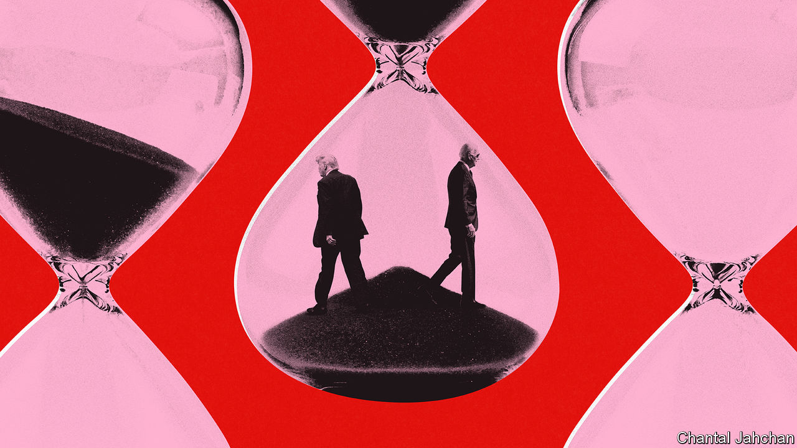

###### Slippers in the Oval Office

# Heart attacks, strokes, dementia—can Biden and Trump beat the odds? 

##### What the science of ageing has to say about the presidential election 

 

> Jan 9th 2024 

AGE, THEY say, brings wisdom. But it also brings decrepitude. When the latter begins to outweigh the former, perhaps it is time for even the most ambitious to consider retiring into slippered ease. 

If either Joe Biden or Donald Trump has contemplated such retirement, though, they have clearly rejected the idea. Instead, both are proposing themselves as candidates for second stints doing one of the most gruelling jobs on the planet. Mr Trump is now 77 and will be 78 come the general election. Mr Biden is 81, and would be 86 at the end of his term, if he won. 


The most popular scientific explanation of ageing, disposable-soma theory, holds that natural selection hones youth at the expense of age, since this best serves the task of passing genes to the next generation. In both candidates’ cases, that has happened. Mr Biden fathered four children and has seven grandchildren; Mr Trump fathered five, and has ten. But the evolutionary flip-side, in the view of many commentators, is becoming apparent in slips, verbal and physical, being made by both, but especially by Mr Biden. Perhaps, some suggest, the slippers should beckon after all.

When it comes to age Mr Biden and Mr Trump are outliers compared both with other American presidents and with the present heads of government in other countries (see chart 1). When he became president in 2017 Mr Trump was the oldest person to have done so. That record was superseded in 2021 by Mr Biden. 

American exceptionalism

An analysis published last year by the Pew Research Centre, an American think-tank (also on chart 1), showed that of the 187 countries for which data are available, only eight had leaders older than Mr Biden. (The oldest is Paul Biya of Cameroon, who is 90.) Among the rich democracies of the OECD, the trend since 1950 has been for heads of government to get younger. The average age upon taking up the top job has fallen from 60.2 to 55.5 in the past half-century. How likely are Mr Biden or Mr Trump to last the course? 

That is a matter with many variables. Not all of the relevant personal data are in the public domain. And the science of ageing is uncertain. Some studies, for example, suggest that running a country takes its toll. One published in 2015 by researchers at Harvard Medical School and Case Western Reserve University School of Medicine looked at elections for head of government in 17 rich countries, going back as far as 1722. It concluded that winners lived 4.4 fewer years after their last election than did runners-up who never held the top job. On the other hand, presidents top the social hierarchy. That can be lifespan-enhancing, as numerous investigations, starting with the Whitehall studies conducted between 1967 and 1988 by Michael Marmot of University College London (UCL), of British civil servants, show. 

Possibly, the effects balance out. Work published in 2011 by Jay Olshansky, a gerontologist at the University of Illinois, estimated the expected mean lifespan for male contemporaries of America’s presidents, based on data from the time, to be 73.3 years. The actual lifespans of those presidents who had died of natural causes averaged 73.0. This suggests either that the job takes no toll, contradicting the Harvard/Case Western Reserve study (and also other work), or that incumbents would otherwise have had more than the average number of years to live. Dr Olshansky’s explanation, favouring the latter, is that presidents have tended to hail from privileged backgrounds (all but ten, he says, had been college-educated), with the health advantages that brings. 

Death, however, is not the only term-shortening medical event an incumbent might suffer. A debilitating heart attack or stroke might force a resignation or require the invocation of the 25th amendment to America’s constitution, which deals with presidential incapacity. Broadly speaking, the risk of stroke doubles with each passing decade. That is a worry. Then there is the question of mental wellbeing. Strokes aside, the passing years bring two threats to the brain: specific dementias such as Alzheimer’s disease, and a more general slowing of the wheels—though recent research suggests the two may overlap.

Medical imaging makes it possible to examine the brains of those without symptoms of dementia for the clumps of misshapen proteins that are one of Alzheimer’s characteristics. A study from 2019, by Jonathan Schott, a neurologist at UCL, and his colleagues showed that such plaques still seem to cause harm, even in those without a formal diagnosis of Alzheimer’s. 

Conversely, work published in 2022 by a team from Northwestern University, in Chicago, looked at neurofibrillary tangles, another Alzheimer’s marker. It reported that so-called “super-agers”—those lucky enough in the disposable-soma genetic lottery to maintain healthy minds in healthy bodies long after others’ decrepitude—had fewer of these tangles than did apparently disease-free non-super-agers.

 


Regardless of its cause, though, cognitive decline is the age-related symptom most widely discussed about the candidates, especially in the context of apparent “senior moments” displayed by both men. In 2021, for instance, Mr Biden seemed to forget the name of Lloyd Austin, his defence secretary. Mr Trump has confused Xi Jinping, the Chinese president, with Kim Jong Un, who leads North Korea. 

Research suggests mental powers change with age in different ways—some declining while others improve, at least for a time. Work by Joshua Hartshorne and Laura Germine, of Harvard and the Massachusetts General Hospital respectively, supports the idea that wisdom does indeed increase with age, up to a point. Arithmetical and comprehension skills, as well as vocabulary, improve until 50, though they start to decline thereafter (see chart 2). 

However, for tasks involving short-term memory (remembering things immediately after presentation) and working memory (remembering them half an hour later), it is downhill from the age of 20 or so. Some scores fall by as much as half a standard deviation below the population mean by the time someone is 85.

Not all men are created equal

All this might be grounds for caution when faced with elderly candidates. But Dr Olshansky, at the University of Illinois, is having none of it, for two reasons. One is the general point he makes about most candidates’ privileged backgrounds granting them a health-promoting environment in which to grow up. The other, specific to Mr Biden and Mr Trump, is that he thinks they may be made from sterner genetic stuff than most of their fellow beings—in other words, that they are super-agers. 

Mr Trump is unquestionably a child of privilege. His father was a multimillionaire businessman. Mr Biden’s family fortunes were more mixed. But he still had the leg-up of being sent to a private school as a teenager. So far, so typical. The super-ager argument is more intriguing. Four years ago, during the previous Biden-Trump contest, Dr Olshansky and five colleagues analysed what relevant data they could collect pertaining to the two men. 

Both come from long-lived families, with an octogenarian and a nonagenarian parent each. That is a good predictor of longevity. But Mr Trump’s brothers died at the ages of 42 and 71 and his father developed Alzheimer’s. Both count against him in the calculation—as do his weight and lack of exercise compared with Mr Biden. 

Nevertheless, Dr Olshansky concluded from these sorts of data, combined with what is publicly available about the men’s medical records, that both had a higher than average probability of surviving the following four years. Mr Biden, they reckoned, had a 95% chance compared with 82% for a typical man of his age; for Mr Trump the figures were 90% compared with 86% for his contemporaries. Notably, then, their calculations gave Mr Trump, the younger man, a worse prognosis. 

They have not yet fully pronounced on the matter this time around. But Dr Olshansky stated on January 7th, in an article in the , a Washington-based newspaper, that, “Today his [Mr Biden’s] chances of surviving through a second term in office are close to 75% (about 10% better survival than for an average man his age). Similar, although slightly less favourable survival prospects are present for Trump.”

As to senior moments, Dr Olshansky is inclined to write at least some of them off as sampling errors resulting from relentless scrutiny. Of an incident in June 2022 in which Mr Biden fell off his bicycle, for example, he observes that the president had caught his foot in a pedal strap, rather than losing his balance, an accident that might happen to anyone. More pertinent, he says, is the fact that a 79-year-old (as Mr Biden then was) was cycling in the first place. ■


