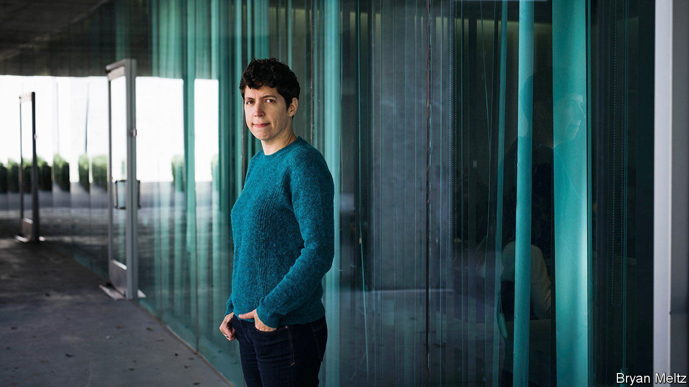

###### Power prose

# Simine Vazire hopes to fix psychology’s credibility crisis 

##### Her new job editing the field’s most prestigious journal should help 

 

> Jan 10th 2024 

IT IS EASY to be sceptical about the state of behavioural science. The biggest story in the field in 2023 involved two frequent collaborators, Dan Ariely of the Duke Fuqua School of Business and Francesca Gino at Harvard Business School, who both face charges of research misconduct.

Both have studied how to fight dishonesty. Ironically, they have been accused of fiddling their data. Harvard has put Dr Gino on leave and is trying to revoke her academic tenure. She has filed a lawsuit against her accusers and the university. Both scientists deny the allegations. (Neither responded to requests for comment.) 

It was another embarrassment for a field that has been mired for years in a “replication crisis”, in which researchers have proved unable to recreate a string of supposedly robust, headline-grabbing findings, such as power-posing (the idea that assertive poses can improve performance in negotiation or public speaking) and social priming (which holds that exposure to tiny stimuli can significantly change people’s later behaviour).

A movement to try to fix things began more than a decade ago. Now, one of its leading lights has ascended to one of the most powerful positions in the field. On January 1st Simine Vazire took over as editor-in-chief of , the discipline’s most prestigious journal. 

Dr Vazire is a psychologist at the University of Melbourne who helps run a research group focused on metascience, or the study of science’s processes. She has been a mainstay of the movement to fix psychological science for years. “Appointing her as EIC is putting someone who’s at the forefront of methods reform in charge of one of our most important institutions,” says Yoel Inbar, a psychologist at the University of Toronto, and an associate editor at the journal who has done a good deal of work on methodological wobbliness. 

Worries about fraud make the biggest headlines. But it probably accounts for a small fraction of the problem. “The bigger issue in my opinion is all the spin, including statistical practices…that bias results in favour of researchers’ beliefs,” says Uli Schimmack of the University of Toronto-Mississauga, whose website, Replicability-Index, helped force psychology to take its methods problems seriously.

Dr Vazire’s new perch makes her well-placed to crack down on such “questionable research practices” (QRPs). Although the details are complicated, the basic ideas are simple. QRPs are often about cherry-picking: re-running statistical tests until chance throws up something strong enough to publish; quietly binning results that contradict pet hypotheses while publishing those that support them, and so on. 

Psychologists started taking QRPs more seriously around 2011. A now notorious paper published that year appeared to present evidence for extrasensory perception. Today, the paper is viewed as a case study in how QRPs can allow researchers to “prove” just about anything. Another paper, published around the same time and this time deliberately impish, used widely accepted practices in experimental psychology to “prove” the obviously impossible result that the Beatles’ song “When I’m Sixty-Four” made listeners younger. The researchers behind the second paper would later establish Data Colada, a website that has made a name for itself questioning research, including papers by Dr Ariely and Dr Gino.

Reformers argue for several countermeasures. Having scientists register their research plans in advance, including which variables they think will move in which directions, leaves less room for cherry-picking. “Registered Reports” are a more radical idea, in which journals accept articles before their findings are known. That puts more emphasis on strong methodology, and helps ensure negative results are published alongside positive ones.

Dr Vazire’s debut editorial promised changes along those lines at . “By default, we now expect all primary data, original research materials, and analysis scripts to be made publicly available in a trusted third-party repository,” she wrote. Pre-registration will not be required, but it will improve the chances of a paper being accepted. Authors who deviate from their stated plans will need to explain why. (Dr Vazire did not respond to requests for an interview.)

She may be pushing at an open door. At first there was resistance to the idea that there was a problem, says Dr Inbar. “I think part of it was a sense that when you criticise published research or you replicate studies, that you’re picking on the people who published those papers.” Much of the agitation for reform happened on blogs and social media, which made it easier for the old guard to dismiss.

But attitudes have been changing. “Ten years ago, Simine was perceived as a radical in her advocacy for reforms to increase transparency and [the] credibility of research,” says Brian Nosek of the University of Virginia, who co-founded the Society for the Improvement of Psychological Science with her in 2016. “She is no longer seen as a radical. But she hasn’t changed a bit.” ■


