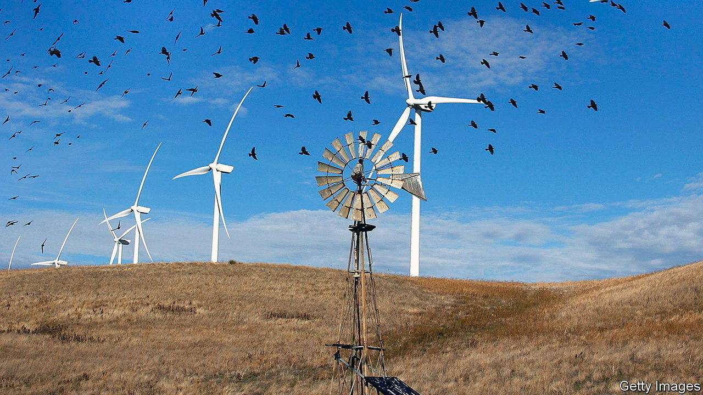

###### Sharing the skies

# Wind turbines are friendlier to birds than oil-and-gas drilling 

##### Contrary to what opponents of wind farms fear 

 

> Jan 10th 2024 

BIRDERS GET nervous when they see landscapes covered in wind turbines. When the wind gets going, their blades can spin at well over 200km per hour. It is easy to imagine careless birds getting chopped to bits. Campaigners often point to the possibility when opposing the building of new wind farms.

No one doubts that wind turbines do indeed kill at least some birds. But a new analysis of American data, published in , suggests the numbers are negligible, and have little impact on bird populations. 

Wind power has expanded dramatically in America over the past 20 years, from 2.6 gigawatts of installed capacity on land in 2000 to 122 gigawatts in 2020. Many studies have analysed the effects in specific locations or on specific bird species. But few have looked at the effects on wildlife at the population level. Enter Erik Katovich, an economist at the University of Geneva. Dr Katovich made use of the Christmas Bird Count, a citizen-science project run by the National Audubon Society, an American non-profit outfit. Volunteers count birds they spot over Christmas, and the society compiles the numbers. Its records stretch back over a century. 

Dr Katovich assumed, reasonably, that if wind turbines harmed bird populations, then the numbers seen in the Christmas Bird Count would drop in places where new turbines had been built. He combined bird population and species maps with the locations and construction dates of all wind turbines in the United States, with the exceptions of Alaska and Hawaii, between 2000 and 2020. He found that building turbines had no discernible effect on bird populations. That reassuring finding held even when he looked specifically at large birds like hawks, vultures and eagles that many people believe are particularly vulnerable to being struck. 

But Dr Katovich did not confine his analysis to wind power alone. He also examined oil-and-gas extraction. Like wind power, this has  in America over the past couple of decades, with the rise of shale gas produced by hydraulic fracturing, or fracking, of rocks. Production rose from 37m cubic metres in 2007 to 740m cubic metres in 2020. 

Comparing bird populations to the locations of new gas wells revealed an average 15% drop in bird numbers when new wells were drilled, probably due to a combination of noise, air pollution and the disturbance of rivers and ponds that many birds rely upon. When drilling happened in places designated by the National Audubon Society as “important bird areas”, bird numbers instead dropped by 25%. Such places are typically migration hubs, feeding grounds or breeding locations. 

Wind power, in other words, not only produces far less planet-heating carbon dioxide and methane than do fossil fuels. It appears to be significantly less damaging to wildlife, too. Yet that is not the impression you would get from reading the news. Dr Katovich found 173 stories in major American news outlets reporting the supposed negative effects that wind turbines had on birds in 2020, compared with only 46 stories discussing the effects of oil-and-gas wells. Wind turbines might look dramatic. But their effect on birds is not. ■


