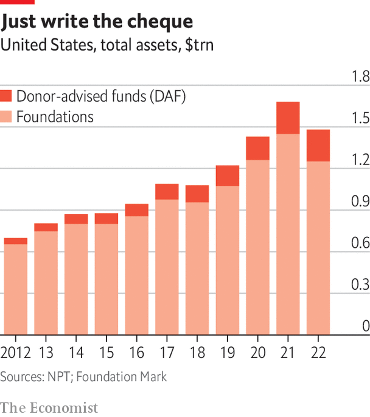

###### Giving it away

# A growing industry is emerging to make philanthropy simpler 

##### Donors want a quicker, easier way to give 

 

> Jan 10th 2024 

Philipp Mohr sold his first software company to King, the maker of “Candy Crush Saga”, an online game, in 2014. He sold his second to Apple a few years later. The London-based entrepreneur has made a small fortune. Somewhere along the way, he met the team at Founders Pledge, a global non-profit group that pushes entrepreneurs to commit a share of their future earnings to philanthropy. If they sell their business and the money materialises, Founders Pledge can help them make good on their promise. 

Just as Bridgespan, a consultancy, has helped several billionaires disburse money since the outset of the pandemic, Founders Pledge has allowed people like Mr Mohr to outsource a lot of the work that a private foundation would do. The group has a research team that produces detailed analysis on good causes, like climate change and education, and checks out potential recipients. It can set up funds for donors, take care of audits and process grants on their behalf. 

The ultra-rich have plenty of excuses for not giving money away. One of the most common—that it requires a lot of time and effort—no longer holds. There have long been big-name consultancies, like Bridgespan, Rockefeller Philanthropy Advisors and Arabella Advisors, that specialise in philanthropy. One of the many benefits of philanthrocapitalism is that it has, over the past 20 years, created a whole ecosystem to help take the grunt work off donors’ hands, and that ecosystem is now being used by the no-strings crowd. Banks such as Goldman Sachs and ubs are offering rich clients philanthropy advisers as well as the usual suite of wealth managers and accountants. Donors’ networks and boutique advisory firms have emerged, too. They do everything, from offering donor education to connecting big funders to each other. There are even firms that loan out staff with grant-making expertise. “At every pain point in the process there is someone you can outsource to,” says Alexa Cortés Culwell, founder of Open Impact, a San Francisco-based adviser.

 


The first step for a fledgling philanthropist is to pick a vehicle through which to give. Donor-advised funds (daf), a sort of savings account for charitable giving, are becoming popular, particularly in America. There was $230bn in American dafs at last count in 2022, according to the National Philanthropic Trust, a charity. That is still small compared with the $1.2trn in private foundations. But the gap is closing fast (see chart). 

dafs make giving quick and easy. An account can be set up within seconds. Funds are managed by a non-profit group, often linked to a money manager, like Fidelity or Vanguard, or a community foundation. In exchange for a fee, usually 0.5-1.5% of assets, these “sponsors” take care of the back-end of grant-making, like audits and tax filings. They often share research on popular causes and create pooled funds to which donors can contribute. It helps that, whereas American foundations have to disburse 5% of assets every year, there is no pressure to spend down money in a daf. “These are vehicles designed to make it so you just have to write a cheque,” explains Thad Calabrese at New York University. “The mechanics of it all are taken care of.” 

Vehicular access

dafs are just one option. Another is to establish a limited-liability company (llc), and bundle giving to ngos with for-profit investment and political advocacy. Donors who give via llcs forgo charitable tax deductions but get flexibility in return. Meta’s Mark Zuckerberg and his wife have, through their llc, the Chan-Zuckerberg Initiative, been able to make venture investments in digital learning programmes, while also giving grants to education charities, biomedical research and more. Laurene Powell Jobs, the widow of Apple’s Steve Jobs, has, through Emerson Collective, her llc, funded the , a for-profit magazine, and , a non-profit one. In an example of the ways in which donors mix and match different vehicles, Ms Powell Jobs also set up the Waverley Street Foundation in 2021 as a “spend-down fund” that will put $3.5bn into fighting climate change over a ten-year period.


Once a donor has chosen a financial vehicle, intermediaries set about helping them choose projects to support. In the case of Mr Mohr, Founders Pledge helped him set up a daf and identified malaria as a cause he cares about. The serial entrepreneur, who is busy building his third business, is now funding research into the disease. The appeal of Founders Pledge, Mr Mohr explains, is that donors can be as hands-on or hands-off as they like.

Intermediaries don’t just take work off the hands of busy donors. The idea, according to David Goldberg, who created Founders Pledge, is to share the work, so that there are no longer countless private foundations, all with their own team, doing their own research and running their own back-end. “There is less overhead, less duplication and less waste,” he says.

Donors work together, too. Lever for Change is a group that helps donors run open calls to find organisations they want to fund through an application process, not simply by selection. Once a client has taken their pick from a shortlist of applicants, it markets the runners-up to other donors in what chief executive, Cecilia Conrad, calls a “secondary market”, sharing the due diligence for free. For example, Lever for Change ran the $40m Equality Can’t Wait challenge for Melinda French Gates and other donors in 2020, looking for new ideas on women’s empowerment in America. Once it had selected the recipients, it created a microsite with information on the other applicants, including video interviews with non-profit leaders and data on their impact. 

Since it was set up in 2019, Lever for Change has dished out $730m via its challenges and another $934m on that secondary market. “I have never had a donor who has sponsored one of our challenges not want us to share,” says Ms Conrad. 

Donors are also increasingly working more formally with each other via collaborative platforms. Some get philanthropists together to share research on a topic or hear pitches from potential recipients. Others go a step further and pool funds. There are over 400 such groups worldwide, half of which were set up since 2010. 

Two donor collaborations stand out for their scale. Blue Meridian Partners, set up in 2016, has raised $4bn from the likes of Steve Ballmer, former head of Microsoft, and Sergey Brin, co-founder of Google. Co-Impact, started a year later, has raised $800m and also has a starry roster. Both have highly qualified staff who aggregate capital, set strategy and re-grant money. Donors can get involved as little or as much as they like. 

According to Olivia Leland, founder of Co-Impact, individual donors with one or two advisers want to come together because they are looking for a “lighter touch” way to give, whereas big foundations with hundreds of staff like joining together because they believe that, with big issues like poverty and women’s empowerment, “You can’t go it alone.”

Wealth is wasted on the young

When donors collaborate they share work but also share risk. Many “donor collaboratives” are experimenting with a new sort of no-strings giving. According to a survey of 200 such groups by Bridgespan, almost half provide unrestricted funding, which gives ngos discretion to spend money as they like. That is still relatively unusual among foundations. Nearly 40% take a participatory approach to grant-making, involving non-profit leaders and community groups rather than relying on their own internal committee to decide which organisations should receive their funds. Devolving decision-making power in this way is still rare among private foundations, too. 

All this means wealthy donors can get on with their lives without getting bogged down in the details of giving. That fits the lifestyle of busy tycoons, many of whom are coming into fortunes while their careers are in full swing. When Bill Gates, the founder of Microsoft, became a billionaire at the age of 31 in the late 1980s, he was the youngest person in history to join the so-called three-comma club. Today, there are 15 billionaires aged 30 or under. There are too many millionaires in their teens and 20s to count. For many, like Mr Mohr, the last thing they want is another big organisation and lots more employees to manage. ■ 

