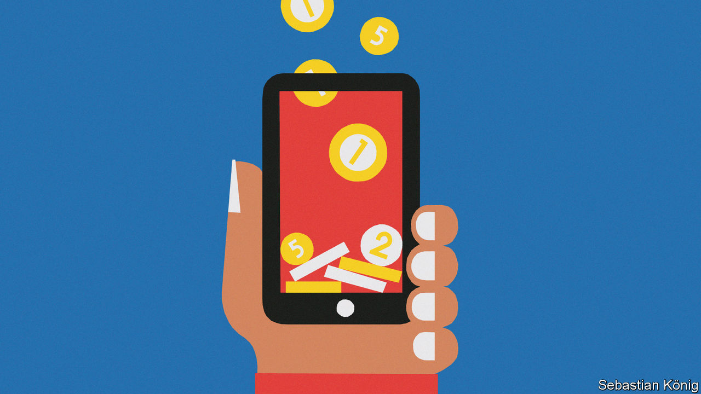

###### Cut out the middle man

# GiveDirectly does what it says on the tin 

##### Cash hand-outs can transform communities 

 

> Jan 10th 2024 

There are signs of new wealth all around Baringo county in western Kenya. Water tanks are propped up against corrugated-iron homes. A few young men have bought motorcycles and run a taxi service in the area. The local goat market is doing a roaring trade. 

This is what happens when GiveDirectly, a New York-based ngo, comes to town. The group puts donations straight into the hands of the poor, using electronic payment services such as m-Pesa, a Kenyan mobile-money system, allowing them to buy goods and services they could not otherwise afford. The organisation identifies needy households using door-to-door interviews, satellite data to spot cheap housing, and artificial intelligence to study mobile-phone usage. 

The attraction of GiveDirectly is its scalability. Once payment systems are set up in a community, the charity can ramp up handouts as it sees fit. GiveDirectly has dished out over $700m since 2009 in poor countries like Kenya, and also in America. Families in Baringo county, for example, have received a total of 110,000 Kenyan shillings ($738) over three transfers, a mighty sum in a country where about a quarter of the population lives on less than $2.15 per day. This simple model is disrupting the traditional charity sector by cutting out the ngo middle man. 

Many studies have shown that unconditional cash transfers raise income levels and lead to improvements in other poverty indicators, like health, nutrition and education. The first such study, published in 2016, found that, in homes that received a transfer, the number of children going without food for a day fell by over a third and livestock holdings rose by half. Another study in 2022 led by scholars at the University of California, Berkeley, calculated that, for every $1,000 given to Kenyan households, the surrounding economy grew by $2,500, without significantly pushing up prices in local markets.

There are, of course, risks to free money. GiveDirectly staff call recipients to ask how they are spending it. They keep in touch with village chiefs, who report cases of waste. Where necessary, they organise town-hall meetings to encourage productive uses of the money. 

In 2023 GiveDirectly reported that the group’s own staff had stolen $900,000 over six months from one of its projects in the Democratic Republic of the Congo. It changed the rules that had allowed a complex cartel to form within its ranks. 

There are also questions of what happens when the handouts stop. Here, the evidence is patchier. But Rory Stewart, a British former mp who used to run GiveDirectly and is now an adviser to it, points out that the protection a vaccination provides against disease diminishes over time, too. That is not an argument against jabs, he argues.

Poor households know they need to make handouts last. In Baringo county, a group of GiveDirectly recipients has started “table banking”. Each puts 3,000 shillings into a kitty every month. Anyone in the group can then borrow. One man took a loan to buy shelves for his store. A woman did so to buy eggs she sold on for a profit. Borrowers are required to return the cash in a month with 10% interest. The group splits the profit. Long after the handouts ended, the community bank continues.

Unconditional cash transfers are not enough on their own. It is no good giving a sick man cash if there is no hospital for him to go to, points out Danny Sriskandarajah, former head of Oxfam gb, an ngo. Donors are right to spend on advocacy, too, given many of the biggest improvements in the lives of the poor are triggered by policy change. “If you believe in the science of delivery, cash is great,” he says. “But if you believe in the art of transformation, it is not enough.”■

